# [📈 Live Status](https://volfclub.github.io/travellings-upptime): <!--live status--> **🟧 Partial outage**

This repository contains the open-source uptime monitor and status page for [逊狼](volf.club), powered by [Upptime](https://github.com/upptime/upptime).

With [Upptime](https://upptime.js.org), you can get your own unlimited and free uptime monitor and status page, powered entirely by a GitHub repository. We use [Issues](https://github.com/volfclub/travellings-upptime/issues) as incident reports, [Actions](https://github.com/volfclub/travellings-upptime/actions) as uptime monitors, and [Pages](https://volfclub.github.io/travellings-upptime) for the status page.

<!--start: status pages-->
<!-- This summary is generated by Upptime (https://github.com/upptime/upptime) -->
<!-- Do not edit this manually, your changes will be overwritten -->
<!-- prettier-ignore -->
| URL | Status | History | Response Time | Uptime |
| --- | ------ | ------- | ------------- | ------ |
|  [开往](https://github.com/volfclub/travelling) | 🟩 Up | [.yml](https://github.com/volfclub/travellings-upptime/commits/HEAD/history/.yml) | 

 1743ms
     
 | 

<a href="https://volfclub.github.io/travellings-upptime/history/">0.00%</a>
    

|  [狼牌工作网址导航](https://www.volf.club) | 🟩 Up | [.yml](https://github.com/volfclub/travellings-upptime/commits/HEAD/history/.yml) | 

 1743ms
     
 | 

<a href="https://volfclub.github.io/travellings-upptime/history/">0.00%</a>
    

|  [音速装机](https://sonic.volf.club) | 🟩 Up | [.yml](https://github.com/volfclub/travellings-upptime/commits/HEAD/history/.yml) | 

 1743ms
     
 | 

<a href="https://volfclub.github.io/travellings-upptime/history/">0.00%</a>
    

|  [原谅糖](https://yltang.cn) | 🟩 Up | [.yml](https://github.com/volfclub/travellings-upptime/commits/HEAD/history/.yml) | 

 1743ms
     
 | 

<a href="https://volfclub.github.io/travellings-upptime/history/">0.00%</a>
    

|  [Barkure](https://guguga.cn) | 🟩 Up | [barkure.yml](https://github.com/volfclub/travellings-upptime/commits/HEAD/history/barkure.yml) | 

 1316ms
     
 | 

<a href="https://volfclub.github.io/travellings-upptime/history/barkure">100.00%</a>
    

|  [Yamdr](https://www.yamdr.cn) | 🟩 Up | [yamdr.yml](https://github.com/volfclub/travellings-upptime/commits/HEAD/history/yamdr.yml) | 

 1371ms
     
 | 

<a href="https://volfclub.github.io/travellings-upptime/history/yamdr">100.00%</a>
    

|  [Arect和他的](https://www.kanofans.com) | 🟩 Up | [arect.yml](https://github.com/volfclub/travellings-upptime/commits/HEAD/history/arect.yml) | 

 1881ms
     
 | 

<a href="https://volfclub.github.io/travellings-upptime/history/arect">100.00%</a>
    

|  [Ryan Wang's Blog](https://ryanc.cc) | 🟩 Up | [ryan-wang-s-blog.yml](https://github.com/volfclub/travellings-upptime/commits/HEAD/history/ryan-wang-s-blog.yml) | 

 922ms
     
 | 

<a href="https://volfclub.github.io/travellings-upptime/history/ryan-wang-s-blog">100.00%</a>
    

|  [Seija](https://seija.me) | 🟥 Down | [seija.yml](https://github.com/volfclub/travellings-upptime/commits/HEAD/history/seija.yml) | 

 0ms
     
 | 

<a href="https://volfclub.github.io/travellings-upptime/history/seija">76.04%</a>
    

|  [致远博客](https://blog.uniartisan.com) | 🟩 Up | [.yml](https://github.com/volfclub/travellings-upptime/commits/HEAD/history/.yml) | 

 1743ms
     
 | 

<a href="https://volfclub.github.io/travellings-upptime/history/">0.00%</a>
    

|  [JQM's Site](https://jinqimu.github.io) | 🟩 Up | [jqm-s-site.yml](https://github.com/volfclub/travellings-upptime/commits/HEAD/history/jqm-s-site.yml) | 

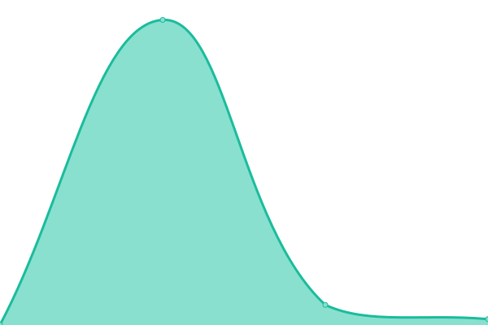 417ms
     
 | 

<a href="https://volfclub.github.io/travellings-upptime/history/jqm-s-site">100.00%</a>
    

|  [CrownDaisy](https://crowndaisy.com) | 🟩 Up | [crown-daisy.yml](https://github.com/volfclub/travellings-upptime/commits/HEAD/history/crown-daisy.yml) | 

 1281ms
     
 | 

<a href="https://volfclub.github.io/travellings-upptime/history/crown-daisy">100.00%</a>
    

|  [殆己](https://heycmm.cn) | 🟩 Up | [.yml](https://github.com/volfclub/travellings-upptime/commits/HEAD/history/.yml) | 

 1743ms
     
 | 

<a href="https://volfclub.github.io/travellings-upptime/history/">0.00%</a>
    

|  [Legroft](https://jinjis.cn) | 🟩 Up | [legroft.yml](https://github.com/volfclub/travellings-upptime/commits/HEAD/history/legroft.yml) | 

 2229ms
     
 | 

<a href="https://volfclub.github.io/travellings-upptime/history/legroft">100.00%</a>
    

|  [FANTASY](https://blog.tigerxly.com) | 🟩 Up | [fantasy.yml](https://github.com/volfclub/travellings-upptime/commits/HEAD/history/fantasy.yml) | 

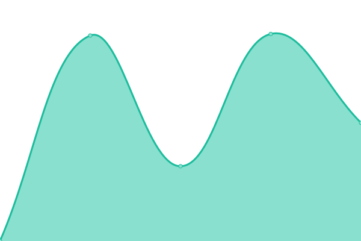 2359ms
     
 | 

<a href="https://volfclub.github.io/travellings-upptime/history/fantasy">100.00%</a>
    

|  [DIego's Blog](http://blog.diego.plus:5800) | 🟩 Up | [d-iego-s-blog.yml](https://github.com/volfclub/travellings-upptime/commits/HEAD/history/d-iego-s-blog.yml) | 

 1123ms
     
 | 

<a href="https://volfclub.github.io/travellings-upptime/history/d-iego-s-blog">100.00%</a>
    

|  [果子小酱](https://sublimerui.top) | 🟩 Up | [.yml](https://github.com/volfclub/travellings-upptime/commits/HEAD/history/.yml) | 

 1743ms
     
 | 

<a href="https://volfclub.github.io/travellings-upptime/history/">0.00%</a>
    

|  [Sakura](https://cwxyr.me) | 🟩 Up | [sakura.yml](https://github.com/volfclub/travellings-upptime/commits/HEAD/history/sakura.yml) | 

 984ms
     
 | 

<a href="https://volfclub.github.io/travellings-upptime/history/sakura">100.00%</a>
    

|  [五叶魔法书](https://grimoire.cn) | 🟩 Up | [.yml](https://github.com/volfclub/travellings-upptime/commits/HEAD/history/.yml) | 

 1743ms
     
 | 

<a href="https://volfclub.github.io/travellings-upptime/history/">0.00%</a>
    

|  [风渐远](https://www.naraku.cn) | 🟩 Up | [.yml](https://github.com/volfclub/travellings-upptime/commits/HEAD/history/.yml) | 

 1743ms
     
 | 

<a href="https://volfclub.github.io/travellings-upptime/history/">0.00%</a>
    

|  [XiYo吧](https://www.xiyo8.cn) | 🟥 Down | [xi-yo.yml](https://github.com/volfclub/travellings-upptime/commits/HEAD/history/xi-yo.yml) | 

 0ms
     
 | 

<a href="https://volfclub.github.io/travellings-upptime/history/xi-yo">78.97%</a>
    

|  [锴](https://www.wangkai88.com) | 🟩 Up | [.yml](https://github.com/volfclub/travellings-upptime/commits/HEAD/history/.yml) | 

 1743ms
     
 | 

<a href="https://volfclub.github.io/travellings-upptime/history/">0.00%</a>
    

|  [Zeruns's Blog](https://blog.zeruns.tech) | 🟩 Up | [zeruns-s-blog.yml](https://github.com/volfclub/travellings-upptime/commits/HEAD/history/zeruns-s-blog.yml) | 

 1431ms
     
 | 

<a href="https://volfclub.github.io/travellings-upptime/history/zeruns-s-blog">100.00%</a>
    

|  [Guqing's Blog](https://guqing.xyz) | 🟩 Up | [guqing-s-blog.yml](https://github.com/volfclub/travellings-upptime/commits/HEAD/history/guqing-s-blog.yml) | 

 1719ms
     
 | 

<a href="https://volfclub.github.io/travellings-upptime/history/guqing-s-blog">100.00%</a>
    

|  [非礼勿言](https://feiliwuyan.com) | 🟩 Up | [.yml](https://github.com/volfclub/travellings-upptime/commits/HEAD/history/.yml) | 

 1743ms
     
 | 

<a href="https://volfclub.github.io/travellings-upptime/history/">0.00%</a>
    

|  [星云C馆](https://www.m78.co) | 🟩 Up | [c.yml](https://github.com/volfclub/travellings-upptime/commits/HEAD/history/c.yml) | 

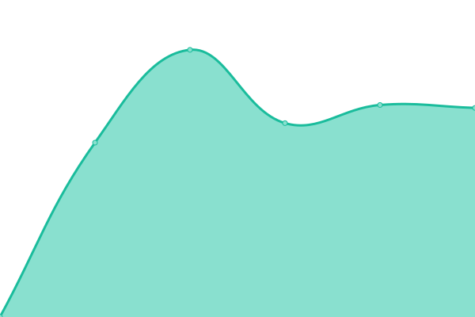 1670ms
     
 | 

<a href="https://volfclub.github.io/travellings-upptime/history/c">100.00%</a>
    

|  [Cheung](https://icheung.net) | 🟩 Up | [cheung.yml](https://github.com/volfclub/travellings-upptime/commits/HEAD/history/cheung.yml) | 

 1935ms
     
 | 

<a href="https://volfclub.github.io/travellings-upptime/history/cheung">100.00%</a>
    

|  [雁陎的自耕地](https://www.sitstars.com) | 🟩 Up | [.yml](https://github.com/volfclub/travellings-upptime/commits/HEAD/history/.yml) | 

 1743ms
     
 | 

<a href="https://volfclub.github.io/travellings-upptime/history/">0.00%</a>
    

|  [阿猫阿狗](https://ionssource.cn) | 🟩 Up | [.yml](https://github.com/volfclub/travellings-upptime/commits/HEAD/history/.yml) | 

 1743ms
     
 | 

<a href="https://volfclub.github.io/travellings-upptime/history/">0.00%</a>
    

|  [风也温柔](https://blog.kaygb.com) | 🟩 Up | [.yml](https://github.com/volfclub/travellings-upptime/commits/HEAD/history/.yml) | 

 1743ms
     
 | 

<a href="https://volfclub.github.io/travellings-upptime/history/">0.00%</a>
    

|  [云游君的小站](https://www.yunyoujun.cn) | 🟩 Up | [.yml](https://github.com/volfclub/travellings-upptime/commits/HEAD/history/.yml) | 

 1743ms
     
 | 

<a href="https://volfclub.github.io/travellings-upptime/history/">0.00%</a>
    

|  [Eltrac's Track](https://blog.guhub.cn) | 🟩 Up | [eltrac-s-track.yml](https://github.com/volfclub/travellings-upptime/commits/HEAD/history/eltrac-s-track.yml) | 

 760ms
     
 | 

<a href="https://volfclub.github.io/travellings-upptime/history/eltrac-s-track">100.00%</a>
    

|  [yuaneuro的博客](https://yuaneuro.cn) | 🟩 Up | [yuaneuro.yml](https://github.com/volfclub/travellings-upptime/commits/HEAD/history/yuaneuro.yml) | 

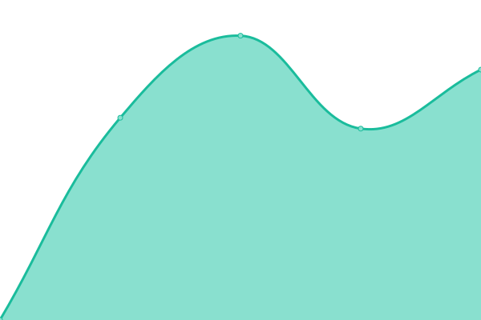 1765ms
     
 | 

<a href="https://volfclub.github.io/travellings-upptime/history/yuaneuro">100.00%</a>
    

|  [krau'blog](https://krau.top) | 🟩 Up | [krau-blog.yml](https://github.com/volfclub/travellings-upptime/commits/HEAD/history/krau-blog.yml) | 

 1784ms
     
 | 

<a href="https://volfclub.github.io/travellings-upptime/history/krau-blog">100.00%</a>
    

|  [Weifeng's Blog](https://wfblog.net) | 🟩 Up | [weifeng-s-blog.yml](https://github.com/volfclub/travellings-upptime/commits/HEAD/history/weifeng-s-blog.yml) | 

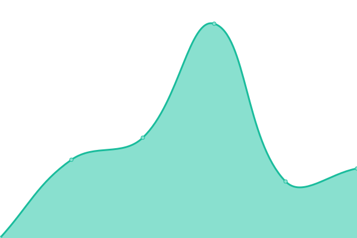 6603ms
     
 | 

<a href="https://volfclub.github.io/travellings-upptime/history/weifeng-s-blog">100.00%</a>
    

|  [ajian](https://blog.yegetables.cn) | 🟩 Up | [ajian.yml](https://github.com/volfclub/travellings-upptime/commits/HEAD/history/ajian.yml) | 

 1594ms
     
 | 

<a href="https://volfclub.github.io/travellings-upptime/history/ajian">100.00%</a>
    

|  [freejishu的美丽世界](https://www.freejishu.com) | 🟥 Down | [freejishu.yml](https://github.com/volfclub/travellings-upptime/commits/HEAD/history/freejishu.yml) | 

 0ms
     
 | 

<a href="https://volfclub.github.io/travellings-upptime/history/freejishu">100.00%</a>
    

|  [小太の游乐园](https://baka.fun) | 🟩 Up | [.yml](https://github.com/volfclub/travellings-upptime/commits/HEAD/history/.yml) | 

 1743ms
     
 | 

<a href="https://volfclub.github.io/travellings-upptime/history/">0.00%</a>
    

|  [Zhou‘s Blog](https://idream.ink) | 🟩 Up | [zhou-s-blog.yml](https://github.com/volfclub/travellings-upptime/commits/HEAD/history/zhou-s-blog.yml) | 

 1370ms
     
 | 

<a href="https://volfclub.github.io/travellings-upptime/history/zhou-s-blog">100.00%</a>
    

|  [地皮-DefiedParty](https://dpii.club) | 🟩 Up | [defied-party.yml](https://github.com/volfclub/travellings-upptime/commits/HEAD/history/defied-party.yml) | 

 3884ms
     
 | 

<a href="https://volfclub.github.io/travellings-upptime/history/defied-party">100.00%</a>
    

|  [CORE](https://core.moe) | 🟩 Up | [core.yml](https://github.com/volfclub/travellings-upptime/commits/HEAD/history/core.yml) | 

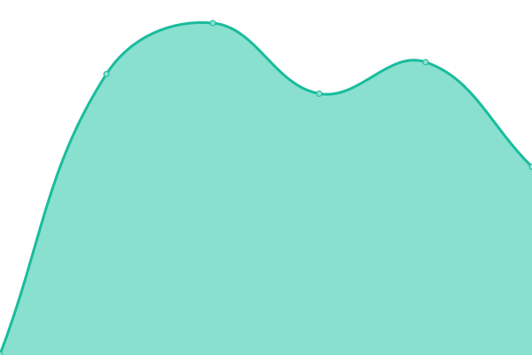 657ms
     
 | 

<a href="https://volfclub.github.io/travellings-upptime/history/core">100.00%</a>
    

|  [Lin. 's Blog](https://www.lin03.cn) | 🟩 Up | [lin-s-blog.yml](https://github.com/volfclub/travellings-upptime/commits/HEAD/history/lin-s-blog.yml) | 

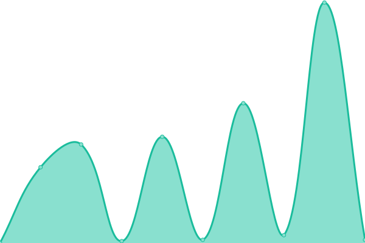 1410ms
     
 | 

<a href="https://volfclub.github.io/travellings-upptime/history/lin-s-blog">100.00%</a>
    

|  [TigerRoot](https://blog.tigerroot.cn) | 🟩 Up | [tiger-root.yml](https://github.com/volfclub/travellings-upptime/commits/HEAD/history/tiger-root.yml) | 

 1969ms
     
 | 

<a href="https://volfclub.github.io/travellings-upptime/history/tiger-root">100.00%</a>
    

|  [蝶恋花](https://kylin.dev) | 🟩 Up | [.yml](https://github.com/volfclub/travellings-upptime/commits/HEAD/history/.yml) | 

 1743ms
     
 | 

<a href="https://volfclub.github.io/travellings-upptime/history/">0.00%</a>
    

|  [Pluveto](https://www.pluvet.com) | 🟩 Up | [pluveto.yml](https://github.com/volfclub/travellings-upptime/commits/HEAD/history/pluveto.yml) | 

 1383ms
     
 | 

<a href="https://volfclub.github.io/travellings-upptime/history/pluveto">100.00%</a>
    

|  [艺术长廊](https://www.6zgm.com) | 🟩 Up | [.yml](https://github.com/volfclub/travellings-upptime/commits/HEAD/history/.yml) | 

 1743ms
     
 | 

<a href="https://volfclub.github.io/travellings-upptime/history/">0.00%</a>
    

|  [Ojhdt's Blog](https://blog.ojhdt.com) | 🟩 Up | [ojhdt-s-blog.yml](https://github.com/volfclub/travellings-upptime/commits/HEAD/history/ojhdt-s-blog.yml) | 

 1327ms
     
 | 

<a href="https://volfclub.github.io/travellings-upptime/history/ojhdt-s-blog">100.00%</a>
    

|  [萌豚 Moechu](https://moechu.cn) | 🟩 Up | [moechu.yml](https://github.com/volfclub/travellings-upptime/commits/HEAD/history/moechu.yml) | 

 1617ms
     
 | 

<a href="https://volfclub.github.io/travellings-upptime/history/moechu">100.00%</a>
    

|  [ncc的个人网站](https://www.zqcnc.cn) | 🟥 Down | [ncc.yml](https://github.com/volfclub/travellings-upptime/commits/HEAD/history/ncc.yml) | 

 0ms
     
 | 

<a href="https://volfclub.github.io/travellings-upptime/history/ncc">100.00%</a>
    

|  [刀客](https://blog.mboker.cn) | 🟩 Up | [.yml](https://github.com/volfclub/travellings-upptime/commits/HEAD/history/.yml) | 

 1743ms
     
 | 

<a href="https://volfclub.github.io/travellings-upptime/history/">0.00%</a>
    

|  [及时行乐](https://www.jsxlo.com) | 🟩 Up | [.yml](https://github.com/volfclub/travellings-upptime/commits/HEAD/history/.yml) | 

 1743ms
     
 | 

<a href="https://volfclub.github.io/travellings-upptime/history/">0.00%</a>
    

|  [iSwl's Blog](https://blog.iswl.vip) | 🟩 Up | [i-swl-s-blog.yml](https://github.com/volfclub/travellings-upptime/commits/HEAD/history/i-swl-s-blog.yml) | 

 1683ms
     
 | 

<a href="https://volfclub.github.io/travellings-upptime/history/i-swl-s-blog">100.00%</a>
    

|  [顾盼の记事本](https://gupan.site) | 🟩 Up | [.yml](https://github.com/volfclub/travellings-upptime/commits/HEAD/history/.yml) | 

 1743ms
     
 | 

<a href="https://volfclub.github.io/travellings-upptime/history/">0.00%</a>
    

|  [爆胎的博客](https://www.itggg.cn) | 🟩 Up | [.yml](https://github.com/volfclub/travellings-upptime/commits/HEAD/history/.yml) | 

 1743ms
     
 | 

<a href="https://volfclub.github.io/travellings-upptime/history/">0.00%</a>
    

|  [花开陌上](https://moshanghua.net) | 🟩 Up | [.yml](https://github.com/volfclub/travellings-upptime/commits/HEAD/history/.yml) | 

 1743ms
     
 | 

<a href="https://volfclub.github.io/travellings-upptime/history/">0.00%</a>
    

|  [炎忍的博客](https://blog.imyan.ren) | 🟩 Up | [.yml](https://github.com/volfclub/travellings-upptime/commits/HEAD/history/.yml) | 

 1743ms
     
 | 

<a href="https://volfclub.github.io/travellings-upptime/history/">0.00%</a>
    

|  [青行三の个人博客](https://blog.jiehua1995.xyz) | 🟩 Up | [.yml](https://github.com/volfclub/travellings-upptime/commits/HEAD/history/.yml) | 

 1743ms
     
 | 

<a href="https://volfclub.github.io/travellings-upptime/history/">0.00%</a>
    

|  [有次博客](https://you.ci) | 🟩 Up | [.yml](https://github.com/volfclub/travellings-upptime/commits/HEAD/history/.yml) | 

 1743ms
     
 | 

<a href="https://volfclub.github.io/travellings-upptime/history/">0.00%</a>
    

|  [SkyWT](https://skywt.cn) | 🟩 Up | [sky-wt.yml](https://github.com/volfclub/travellings-upptime/commits/HEAD/history/sky-wt.yml) | 

 1267ms
     
 | 

<a href="https://volfclub.github.io/travellings-upptime/history/sky-wt">100.00%</a>
    

|  [执手对影成双](https://www.lipk.org) | 🟩 Up | [.yml](https://github.com/volfclub/travellings-upptime/commits/HEAD/history/.yml) | 

 1743ms
     
 | 

<a href="https://volfclub.github.io/travellings-upptime/history/">0.00%</a>
    

|  [MySpace](https://www.zkl2333.com) | 🟥 Down | [my-space.yml](https://github.com/volfclub/travellings-upptime/commits/HEAD/history/my-space.yml) | 

 2104ms
     
 | 

<a href="https://volfclub.github.io/travellings-upptime/history/my-space">100.00%</a>
    

|  [皮毛技术君](https://www.whoit.top) | 🟩 Up | [.yml](https://github.com/volfclub/travellings-upptime/commits/HEAD/history/.yml) | 

 1743ms
     
 | 

<a href="https://volfclub.github.io/travellings-upptime/history/">0.00%</a>
    

|  [Passer](https://takuron.top) | 🟩 Up | [passer.yml](https://github.com/volfclub/travellings-upptime/commits/HEAD/history/passer.yml) | 

 305ms
     
 | 

<a href="https://volfclub.github.io/travellings-upptime/history/passer">100.00%</a>
    

|  [山葵酱](https://www.wasabi.fun) | 🟩 Up | [.yml](https://github.com/volfclub/travellings-upptime/commits/HEAD/history/.yml) | 

 1743ms
     
 | 

<a href="https://volfclub.github.io/travellings-upptime/history/">0.00%</a>
    

|  [Ying](https://blog.luvying.com) | 🟩 Up | [ying.yml](https://github.com/volfclub/travellings-upptime/commits/HEAD/history/ying.yml) | 

 1661ms
     
 | 

<a href="https://volfclub.github.io/travellings-upptime/history/ying">100.00%</a>
    

|  [风之暇想](https://www.fzxx.xyz) | 🟩 Up | [.yml](https://github.com/volfclub/travellings-upptime/commits/HEAD/history/.yml) | 

 1743ms
     
 | 

<a href="https://volfclub.github.io/travellings-upptime/history/">0.00%</a>
    

|  [今今今生](https://noheart.cn) | 🟩 Up | [.yml](https://github.com/volfclub/travellings-upptime/commits/HEAD/history/.yml) | 

 1743ms
     
 | 

<a href="https://volfclub.github.io/travellings-upptime/history/">0.00%</a>
    

|  [ADD-SP‘s Blog](https://www.addesp.com) | 🟩 Up | [add-sp-s-blog.yml](https://github.com/volfclub/travellings-upptime/commits/HEAD/history/add-sp-s-blog.yml) | 

 1085ms
     
 | 

<a href="https://volfclub.github.io/travellings-upptime/history/add-sp-s-blog">100.00%</a>
    

|  [游轶的小站](https://blog.devyi.com) | 🟩 Up | [.yml](https://github.com/volfclub/travellings-upptime/commits/HEAD/history/.yml) | 

 1743ms
     
 | 

<a href="https://volfclub.github.io/travellings-upptime/history/">0.00%</a>
    

|  [MHuiG's Blog](https://blog.mhuig.top) | 🟥 Down | [m-hui-g-s-blog.yml](https://github.com/volfclub/travellings-upptime/commits/HEAD/history/m-hui-g-s-blog.yml) | 

 1222ms
     
 | 

<a href="https://volfclub.github.io/travellings-upptime/history/m-hui-g-s-blog">100.00%</a>
    

|  [JalenChuh](https://blog.jalenchuh.cn) | 🟩 Up | [jalen-chuh.yml](https://github.com/volfclub/travellings-upptime/commits/HEAD/history/jalen-chuh.yml) | 

 251ms
     
 | 

<a href="https://volfclub.github.io/travellings-upptime/history/jalen-chuh">100.00%</a>
    

|  [LiuYun](https://blog.6yfz.cn) | 🟩 Up | [liu-yun.yml](https://github.com/volfclub/travellings-upptime/commits/HEAD/history/liu-yun.yml) | 

 560ms
     
 | 

<a href="https://volfclub.github.io/travellings-upptime/history/liu-yun">100.00%</a>
    

|  [Geek Era](https://www.geekera.cn) | 🟩 Up | [geek-era.yml](https://github.com/volfclub/travellings-upptime/commits/HEAD/history/geek-era.yml) | 

 2192ms
     
 | 

<a href="https://volfclub.github.io/travellings-upptime/history/geek-era">100.00%</a>
    

|  [Oo笑容太甜oO](https://kissbaofish.cn) | 🟥 Down | [oo-o-o.yml](https://github.com/volfclub/travellings-upptime/commits/HEAD/history/oo-o-o.yml) | 

 783ms
     
 | 

<a href="https://volfclub.github.io/travellings-upptime/history/oo-o-o">100.00%</a>
    

|  [F君的博客](https://blog.fkun.tech) | 🟩 Up | [f.yml](https://github.com/volfclub/travellings-upptime/commits/HEAD/history/f.yml) | 

 1004ms
     
 | 

<a href="https://volfclub.github.io/travellings-upptime/history/f">100.00%</a>
    

|  [Chr_小屋](https://blog.chrxw.com) | 🟩 Up | [chr.yml](https://github.com/volfclub/travellings-upptime/commits/HEAD/history/chr.yml) | 

 777ms
     
 | 

<a href="https://volfclub.github.io/travellings-upptime/history/chr">100.00%</a>
    

|  [tabris的遥远星系](https://www.tabirstrees.top) | 🟩 Up | [tabris.yml](https://github.com/volfclub/travellings-upptime/commits/HEAD/history/tabris.yml) | 

 325ms
     
 | 

<a href="https://volfclub.github.io/travellings-upptime/history/tabris">100.00%</a>
    

|  [螓首蛾眉](https://jsun969.cn) | 🟩 Up | [.yml](https://github.com/volfclub/travellings-upptime/commits/HEAD/history/.yml) | 

 1743ms
     
 | 

<a href="https://volfclub.github.io/travellings-upptime/history/">0.00%</a>
    

|  [服务猿's 学习笔记](https://www.ishells.cn) | 🟩 Up | [s.yml](https://github.com/volfclub/travellings-upptime/commits/HEAD/history/s.yml) | 

 1228ms
     
 | 

<a href="https://volfclub.github.io/travellings-upptime/history/s">100.00%</a>
    

|  [尼采般地抒情](https://www.wztlink1013.com) | 🟩 Up | [.yml](https://github.com/volfclub/travellings-upptime/commits/HEAD/history/.yml) | 

 1743ms
     
 | 

<a href="https://volfclub.github.io/travellings-upptime/history/">0.00%</a>
    

|  [Zkpeace](https://zkpeace.com) | 🟩 Up | [zkpeace.yml](https://github.com/volfclub/travellings-upptime/commits/HEAD/history/zkpeace.yml) | 

 333ms
     
 | 

<a href="https://volfclub.github.io/travellings-upptime/history/zkpeace">100.00%</a>
    

|  [Guang's blog](https://code016.com) | 🟩 Up | [guang-s-blog.yml](https://github.com/volfclub/travellings-upptime/commits/HEAD/history/guang-s-blog.yml) | 

 3266ms
     
 | 

<a href="https://volfclub.github.io/travellings-upptime/history/guang-s-blog">100.00%</a>
    

|  [挨拍的儿](https://jimmyqin.cn) | 🟩 Up | [.yml](https://github.com/volfclub/travellings-upptime/commits/HEAD/history/.yml) | 

 1743ms
     
 | 

<a href="https://volfclub.github.io/travellings-upptime/history/">0.00%</a>
    

|  [Guyi’s Blog](https://www.y2jq.com) | 🟩 Up | [guyi-s-blog.yml](https://github.com/volfclub/travellings-upptime/commits/HEAD/history/guyi-s-blog.yml) | 

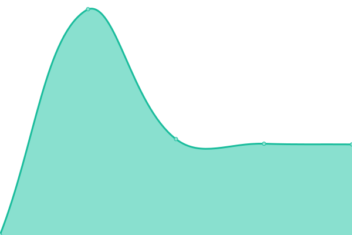 1711ms
     
 | 

<a href="https://volfclub.github.io/travellings-upptime/history/guyi-s-blog">100.00%</a>
    

|  [七米蓝](https://www.chirmyram.top) | 🟩 Up | [.yml](https://github.com/volfclub/travellings-upptime/commits/HEAD/history/.yml) | 

 1743ms
     
 | 

<a href="https://volfclub.github.io/travellings-upptime/history/">0.00%</a>
    

|  [MZRME‘S](https://mzrme.com) | 🟩 Up | [mzrme-s.yml](https://github.com/volfclub/travellings-upptime/commits/HEAD/history/mzrme-s.yml) | 

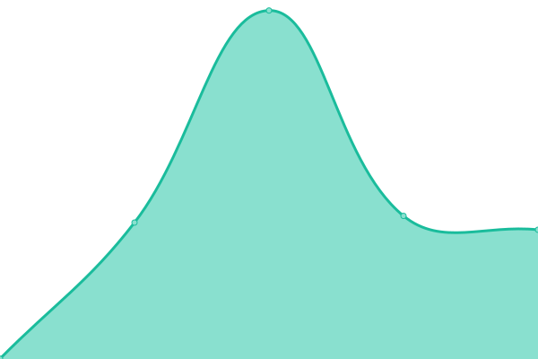 946ms
     
 | 

<a href="https://volfclub.github.io/travellings-upptime/history/mzrme-s">100.00%</a>
    

|  [归舟棹远](https://www.tanknee.cn) | 🟩 Up | [.yml](https://github.com/volfclub/travellings-upptime/commits/HEAD/history/.yml) | 

 1743ms
     
 | 

<a href="https://volfclub.github.io/travellings-upptime/history/">0.00%</a>
    

|  [人家故里](https://fx7.top) | 🟩 Up | [.yml](https://github.com/volfclub/travellings-upptime/commits/HEAD/history/.yml) | 

 1743ms
     
 | 

<a href="https://volfclub.github.io/travellings-upptime/history/">0.00%</a>
    

|  [丁丁の店](https://blog.butanediol.me) | 🟩 Up | [.yml](https://github.com/volfclub/travellings-upptime/commits/HEAD/history/.yml) | 

 1743ms
     
 | 

<a href="https://volfclub.github.io/travellings-upptime/history/">0.00%</a>
    

|  [饿龙不是龙哩](https://loafing.cn) | 🟩 Up | [.yml](https://github.com/volfclub/travellings-upptime/commits/HEAD/history/.yml) | 

 1743ms
     
 | 

<a href="https://volfclub.github.io/travellings-upptime/history/">0.00%</a>
    

|  [低调阁](https://www.ddg.ink) | 🟩 Up | [.yml](https://github.com/volfclub/travellings-upptime/commits/HEAD/history/.yml) | 

 1743ms
     
 | 

<a href="https://volfclub.github.io/travellings-upptime/history/">0.00%</a>
    

|  [SWJ](https://blog.zggsong.cn) | 🟩 Up | [swj.yml](https://github.com/volfclub/travellings-upptime/commits/HEAD/history/swj.yml) | 

 1772ms
     
 | 

<a href="https://volfclub.github.io/travellings-upptime/history/swj">100.00%</a>
    

|  [Sanarous's Blog](https://bestzuo.cn) | 🟩 Up | [sanarous-s-blog.yml](https://github.com/volfclub/travellings-upptime/commits/HEAD/history/sanarous-s-blog.yml) | 

 2001ms
     
 | 

<a href="https://volfclub.github.io/travellings-upptime/history/sanarous-s-blog">100.00%</a>
    

|  [HandSonic‘s Blog](https://handsonic.top) | 🟩 Up | [hand-sonic-s-blog.yml](https://github.com/volfclub/travellings-upptime/commits/HEAD/history/hand-sonic-s-blog.yml) | 

 2254ms
     
 | 

<a href="https://volfclub.github.io/travellings-upptime/history/hand-sonic-s-blog">100.00%</a>
    

|  [Sorryfu](https://fushaolei.github.io) | 🟩 Up | [sorryfu.yml](https://github.com/volfclub/travellings-upptime/commits/HEAD/history/sorryfu.yml) | 

 52ms
     
 | 

<a href="https://volfclub.github.io/travellings-upptime/history/sorryfu">100.00%</a>
    

|  [TAOG's Blog](https://iktao.cn) | 🟥 Down | [taog-s-blog.yml](https://github.com/volfclub/travellings-upptime/commits/HEAD/history/taog-s-blog.yml) | 

 0ms
     
 | 

<a href="https://volfclub.github.io/travellings-upptime/history/taog-s-blog">100.00%</a>
    

|  [静かな森](https://innei.ren) | 🟩 Up | [.yml](https://github.com/volfclub/travellings-upptime/commits/HEAD/history/.yml) | 

 1743ms
     
 | 

<a href="https://volfclub.github.io/travellings-upptime/history/">0.00%</a>
    

|  [杜老师说](https://dusays.com) | 🟩 Up | [.yml](https://github.com/volfclub/travellings-upptime/commits/HEAD/history/.yml) | 

 1743ms
     
 | 

<a href="https://volfclub.github.io/travellings-upptime/history/">0.00%</a>
    

|  [独人欣赏](https://www.wangyusong.cn) | 🟩 Up | [.yml](https://github.com/volfclub/travellings-upptime/commits/HEAD/history/.yml) | 

 1743ms
     
 | 

<a href="https://volfclub.github.io/travellings-upptime/history/">0.00%</a>
    

|  [zcmimi's blog](https://blog.zcmimi.top) | 🟩 Up | [zcmimi-s-blog.yml](https://github.com/volfclub/travellings-upptime/commits/HEAD/history/zcmimi-s-blog.yml) | 

 898ms
     
 | 

<a href="https://volfclub.github.io/travellings-upptime/history/zcmimi-s-blog">100.00%</a>
    

|  [TF的博客](https://blog.tengfei.website) | 🟩 Up | [tf.yml](https://github.com/volfclub/travellings-upptime/commits/HEAD/history/tf.yml) | 

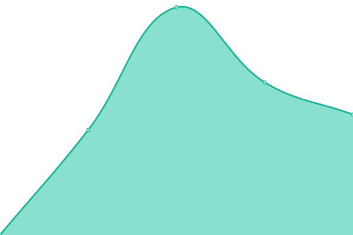 2125ms
     
 | 

<a href="https://volfclub.github.io/travellings-upptime/history/tf">100.00%</a>
    

|  [简兮小站](https://www.zk1220.com) | 🟩 Up | [.yml](https://github.com/volfclub/travellings-upptime/commits/HEAD/history/.yml) | 

 1743ms
     
 | 

<a href="https://volfclub.github.io/travellings-upptime/history/">0.00%</a>
    

|  [Colsrch'Blog](https://colsrch.cn) | 🟩 Up | [colsrch-blog.yml](https://github.com/volfclub/travellings-upptime/commits/HEAD/history/colsrch-blog.yml) | 

 2614ms
     
 | 

<a href="https://volfclub.github.io/travellings-upptime/history/colsrch-blog">100.00%</a>
    

|  [AzuSemisa's Blog](https://azusemisa.top) | 🟥 Down | [azu-semisa-s-blog.yml](https://github.com/volfclub/travellings-upptime/commits/HEAD/history/azu-semisa-s-blog.yml) | 

 0ms
     
 | 

<a href="https://volfclub.github.io/travellings-upptime/history/azu-semisa-s-blog">17.19%</a>
    

|  [倚栏听风](https://www.yilantingfeng.site) | 🟩 Up | [.yml](https://github.com/volfclub/travellings-upptime/commits/HEAD/history/.yml) | 

 1743ms
     
 | 

<a href="https://volfclub.github.io/travellings-upptime/history/">0.00%</a>
    

|  [Xu's Blog](https://hasaik.com) | 🟩 Up | [xu-s-blog.yml](https://github.com/volfclub/travellings-upptime/commits/HEAD/history/xu-s-blog.yml) | 

 353ms
     
 | 

<a href="https://volfclub.github.io/travellings-upptime/history/xu-s-blog">100.00%</a>
    

|  [優萌初華](https://shoka.lostyu.me) | 🟩 Up | [.yml](https://github.com/volfclub/travellings-upptime/commits/HEAD/history/.yml) | 

 1743ms
     
 | 

<a href="https://volfclub.github.io/travellings-upptime/history/">0.00%</a>
    

|  [MES](https://rain.moimo.me) | 🟩 Up | [mes.yml](https://github.com/volfclub/travellings-upptime/commits/HEAD/history/mes.yml) | 

 757ms
     
 | 

<a href="https://volfclub.github.io/travellings-upptime/history/mes">100.00%</a>
    

|  [ZigZagK的博客](https://zigzagk.top) | 🟩 Up | [zig-zag-k.yml](https://github.com/volfclub/travellings-upptime/commits/HEAD/history/zig-zag-k.yml) | 

 2057ms
     
 | 

<a href="https://volfclub.github.io/travellings-upptime/history/zig-zag-k">100.00%</a>
    

|  [JsOnGmAX-博客](https://jsongx.com) | 🟩 Up | [js-on-gm-ax.yml](https://github.com/volfclub/travellings-upptime/commits/HEAD/history/js-on-gm-ax.yml) | 

 1659ms
     
 | 

<a href="https://volfclub.github.io/travellings-upptime/history/js-on-gm-ax">100.00%</a>
    

|  [Kiritoghy's Blog](https://www.kiritoghy.cn) | 🟩 Up | [kiritoghy-s-blog.yml](https://github.com/volfclub/travellings-upptime/commits/HEAD/history/kiritoghy-s-blog.yml) | 

 1194ms
     
 | 

<a href="https://volfclub.github.io/travellings-upptime/history/kiritoghy-s-blog">100.00%</a>
    

|  [BORBER](https://www.cnblogs.com/borber) | 🟩 Up | [borber.yml](https://github.com/volfclub/travellings-upptime/commits/HEAD/history/borber.yml) | 

 1555ms
     
 | 

<a href="https://volfclub.github.io/travellings-upptime/history/borber">100.00%</a>
    

|  [若非](https://loafing.cn) | 🟩 Up | [.yml](https://github.com/volfclub/travellings-upptime/commits/HEAD/history/.yml) | 

 1743ms
     
 | 

<a href="https://volfclub.github.io/travellings-upptime/history/">0.00%</a>
    

|  [不淡定的实验室](https://xd.sh.cn) | 🟩 Up | [.yml](https://github.com/volfclub/travellings-upptime/commits/HEAD/history/.yml) | 

 1743ms
     
 | 

<a href="https://volfclub.github.io/travellings-upptime/history/">0.00%</a>
    

|  [Micah](https://realmicah.xyz) | 🟩 Up | [micah.yml](https://github.com/volfclub/travellings-upptime/commits/HEAD/history/micah.yml) | 

 1618ms
     
 | 

<a href="https://volfclub.github.io/travellings-upptime/history/micah">100.00%</a>
    

|  [提莫酱的博客](https://www.timochan.cn) | 🟩 Up | [.yml](https://github.com/volfclub/travellings-upptime/commits/HEAD/history/.yml) | 

 1743ms
     
 | 

<a href="https://volfclub.github.io/travellings-upptime/history/">0.00%</a>
    

|  [COOL](https://www.coolku.cc) | 🟩 Up | [cool.yml](https://github.com/volfclub/travellings-upptime/commits/HEAD/history/cool.yml) | 

 3255ms
     
 | 

<a href="https://volfclub.github.io/travellings-upptime/history/cool">100.00%</a>
    

|  [夏日鱼塘](https://www.summerpond.cn) | 🟩 Up | [.yml](https://github.com/volfclub/travellings-upptime/commits/HEAD/history/.yml) | 

 1743ms
     
 | 

<a href="https://volfclub.github.io/travellings-upptime/history/">0.00%</a>
    

|  [异国迷宫的十字路口](https://blog.fivezha.cn) | 🟩 Up | [.yml](https://github.com/volfclub/travellings-upptime/commits/HEAD/history/.yml) | 

 1743ms
     
 | 

<a href="https://volfclub.github.io/travellings-upptime/history/">0.00%</a>
    

|  [可定博客](https://wnag.com.cn) | 🟩 Up | [.yml](https://github.com/volfclub/travellings-upptime/commits/HEAD/history/.yml) | 

 1743ms
     
 | 

<a href="https://volfclub.github.io/travellings-upptime/history/">0.00%</a>
    

|  [新漫猫](https://www.acg19.top) | 🟩 Up | [.yml](https://github.com/volfclub/travellings-upptime/commits/HEAD/history/.yml) | 

 1743ms
     
 | 

<a href="https://volfclub.github.io/travellings-upptime/history/">0.00%</a>
    

|  [Paddylin的博客](https://www.paddylin.top) | 🟥 Down | [paddylin.yml](https://github.com/volfclub/travellings-upptime/commits/HEAD/history/paddylin.yml) | 

 0ms
     
 | 

<a href="https://volfclub.github.io/travellings-upptime/history/paddylin">100.00%</a>
    

|  [小孔成像](https://kurumit3.top) | 🟩 Up | [.yml](https://github.com/volfclub/travellings-upptime/commits/HEAD/history/.yml) | 

 1743ms
     
 | 

<a href="https://volfclub.github.io/travellings-upptime/history/">0.00%</a>
    

|  [Lime Network Blog](https://blog.limecho.net) | 🟥 Down | [lime-network-blog.yml](https://github.com/volfclub/travellings-upptime/commits/HEAD/history/lime-network-blog.yml) | 

 1473ms
     
 | 

<a href="https://volfclub.github.io/travellings-upptime/history/lime-network-blog">100.00%</a>
    

|  [Panedioic's blog](https://blog.pppane.com) | 🟩 Up | [panedioic-s-blog.yml](https://github.com/volfclub/travellings-upptime/commits/HEAD/history/panedioic-s-blog.yml) | 

 1489ms
     
 | 

<a href="https://volfclub.github.io/travellings-upptime/history/panedioic-s-blog">100.00%</a>
    

|  [大海的页面](https://ccccc.cyou) | 🟩 Up | [.yml](https://github.com/volfclub/travellings-upptime/commits/HEAD/history/.yml) | 

 1743ms
     
 | 

<a href="https://volfclub.github.io/travellings-upptime/history/">0.00%</a>
    

|  [56Kb/s](https://www.funix.cn) | 🟩 Up | [56-kb-s.yml](https://github.com/volfclub/travellings-upptime/commits/HEAD/history/56-kb-s.yml) | 

 2534ms
     
 | 

<a href="https://volfclub.github.io/travellings-upptime/history/56-kb-s">100.00%</a>
    

|  [林克的编程小记](https://www.codinglink.tech) | 🟩 Up | [.yml](https://github.com/volfclub/travellings-upptime/commits/HEAD/history/.yml) | 

 1743ms
     
 | 

<a href="https://volfclub.github.io/travellings-upptime/history/">0.00%</a>
    

|  [BD的小窝](https://www.bluesdawn.top) | 🟩 Up | [bd.yml](https://github.com/volfclub/travellings-upptime/commits/HEAD/history/bd.yml) | 

 3345ms
     
 | 

<a href="https://volfclub.github.io/travellings-upptime/history/bd">100.00%</a>
    

|  [LBTSTO自由商店](https://www.libertystore.one) | 🟥 Down | [lbtsto.yml](https://github.com/volfclub/travellings-upptime/commits/HEAD/history/lbtsto.yml) | 

 0ms
     
 | 

<a href="https://volfclub.github.io/travellings-upptime/history/lbtsto">27.27%</a>
    

|  [ChenYFanの博客](https://blog.cyfan.top) | 🟩 Up | [chen-y-fan.yml](https://github.com/volfclub/travellings-upptime/commits/HEAD/history/chen-y-fan.yml) | 

 366ms
     
 | 

<a href="https://volfclub.github.io/travellings-upptime/history/chen-y-fan">100.00%</a>
    

|  [江风引雨の小站](https://blog.luzy.top) | 🟩 Up | [.yml](https://github.com/volfclub/travellings-upptime/commits/HEAD/history/.yml) | 

 1743ms
     
 | 

<a href="https://volfclub.github.io/travellings-upptime/history/">0.00%</a>
    

|  [睿先森](https://senorui.top) | 🟩 Up | [.yml](https://github.com/volfclub/travellings-upptime/commits/HEAD/history/.yml) | 

 1743ms
     
 | 

<a href="https://volfclub.github.io/travellings-upptime/history/">0.00%</a>
    

|  [神州部落格](https://www.szfc13.cn) | 🟩 Up | [.yml](https://github.com/volfclub/travellings-upptime/commits/HEAD/history/.yml) | 

 1743ms
     
 | 

<a href="https://volfclub.github.io/travellings-upptime/history/">0.00%</a>
    

|  [Declan's Blog](https://blog.lihaojin.cn) | 🟩 Up | [declan-s-blog.yml](https://github.com/volfclub/travellings-upptime/commits/HEAD/history/declan-s-blog.yml) | 

 2372ms
     
 | 

<a href="https://volfclub.github.io/travellings-upptime/history/declan-s-blog">100.00%</a>
    

|  [鲸一](https://www.saroin.com) | 🟩 Up | [.yml](https://github.com/volfclub/travellings-upptime/commits/HEAD/history/.yml) | 

 1743ms
     
 | 

<a href="https://volfclub.github.io/travellings-upptime/history/">0.00%</a>
    

|  [JaneWu's Blog](https://zhenwu99.gitee.io) | 🟩 Up | [jane-wu-s-blog.yml](https://github.com/volfclub/travellings-upptime/commits/HEAD/history/jane-wu-s-blog.yml) | 

 1913ms
     
 | 

<a href="https://volfclub.github.io/travellings-upptime/history/jane-wu-s-blog">100.00%</a>
    

|  [Johnson的博客](https://johnsonlee.site) | 🟩 Up | [johnson.yml](https://github.com/volfclub/travellings-upptime/commits/HEAD/history/johnson.yml) | 

 567ms
     
 | 

<a href="https://volfclub.github.io/travellings-upptime/history/johnson">100.00%</a>
    

|  [LeeBlog](https://www.leejean.top) | 🟩 Up | [lee-blog.yml](https://github.com/volfclub/travellings-upptime/commits/HEAD/history/lee-blog.yml) | 

 2473ms
     
 | 

<a href="https://volfclub.github.io/travellings-upptime/history/lee-blog">100.00%</a>
    

|  [忆星辰](https://www.extingstudio.com) | 🟩 Up | [.yml](https://github.com/volfclub/travellings-upptime/commits/HEAD/history/.yml) | 

 1743ms
     
 | 

<a href="https://volfclub.github.io/travellings-upptime/history/">0.00%</a>
    

|  [YunShu'Blog](https://www.yunshu.site) | 🟩 Up | [yun-shu-blog.yml](https://github.com/volfclub/travellings-upptime/commits/HEAD/history/yun-shu-blog.yml) | 

 1624ms
     
 | 

<a href="https://volfclub.github.io/travellings-upptime/history/yun-shu-blog">100.00%</a>
    

|  [小康的个人主页](https://xiaokang.me) | 🟩 Up | [.yml](https://github.com/volfclub/travellings-upptime/commits/HEAD/history/.yml) | 

 1743ms
     
 | 

<a href="https://volfclub.github.io/travellings-upptime/history/">0.00%</a>
    

|  [威廉伯爵](https://megatontech.github.io) | 🟩 Up | [.yml](https://github.com/volfclub/travellings-upptime/commits/HEAD/history/.yml) | 

 1743ms
     
 | 

<a href="https://volfclub.github.io/travellings-upptime/history/">0.00%</a>
    

|  [hewith他和她](https://heshun.run) | 🟩 Up | [hewith.yml](https://github.com/volfclub/travellings-upptime/commits/HEAD/history/hewith.yml) | 

 1634ms
     
 | 

<a href="https://volfclub.github.io/travellings-upptime/history/hewith">100.00%</a>
    

|  [Huiris's Log](https://huiris.com) | 🟩 Up | [huiris-s-log.yml](https://github.com/volfclub/travellings-upptime/commits/HEAD/history/huiris-s-log.yml) | 

 1722ms
     
 | 

<a href="https://volfclub.github.io/travellings-upptime/history/huiris-s-log">100.00%</a>
    

|  [iVampireSP的物语](https://ivampiresp.com) | 🟩 Up | [i-vampire-sp.yml](https://github.com/volfclub/travellings-upptime/commits/HEAD/history/i-vampire-sp.yml) | 

 1587ms
     
 | 

<a href="https://volfclub.github.io/travellings-upptime/history/i-vampire-sp">100.00%</a>
    

|  [UTOPIA](https://ishya.top) | 🟩 Up | [utopia.yml](https://github.com/volfclub/travellings-upptime/commits/HEAD/history/utopia.yml) | 

 633ms
     
 | 

<a href="https://volfclub.github.io/travellings-upptime/history/utopia">100.00%</a>
    

|  [MBR的博客](https://blog.mbrjun.cn) | 🟩 Up | [mbr.yml](https://github.com/volfclub/travellings-upptime/commits/HEAD/history/mbr.yml) | 

 2814ms
     
 | 

<a href="https://volfclub.github.io/travellings-upptime/history/mbr">100.00%</a>
    

|  [阿成儿Online](https://youdef.com) | 🟩 Up | [online.yml](https://github.com/volfclub/travellings-upptime/commits/HEAD/history/online.yml) | 

 235ms
     
 | 

<a href="https://volfclub.github.io/travellings-upptime/history/online">100.00%</a>
    

|  [黑石博客](https://www.heson10.com) | 🟩 Up | [.yml](https://github.com/volfclub/travellings-upptime/commits/HEAD/history/.yml) | 

 1743ms
     
 | 

<a href="https://volfclub.github.io/travellings-upptime/history/">0.00%</a>
    

|  [云帆沧海](https://yunfanch.com) | 🟩 Up | [.yml](https://github.com/volfclub/travellings-upptime/commits/HEAD/history/.yml) | 

 1743ms
     
 | 

<a href="https://volfclub.github.io/travellings-upptime/history/">0.00%</a>
    

|  [飞刀博客](https://www.feidaoboke.com) | 🟩 Up | [.yml](https://github.com/volfclub/travellings-upptime/commits/HEAD/history/.yml) | 

 1743ms
     
 | 

<a href="https://volfclub.github.io/travellings-upptime/history/">0.00%</a>
    

|  [优速VPSUR测评](https://vpsur.com) | 🟩 Up | [vpsur.yml](https://github.com/volfclub/travellings-upptime/commits/HEAD/history/vpsur.yml) | 

 2111ms
     
 | 

<a href="https://volfclub.github.io/travellings-upptime/history/vpsur">100.00%</a>
    

|  [野肆的生活分享](https://yexsi.com) | 🟩 Up | [.yml](https://github.com/volfclub/travellings-upptime/commits/HEAD/history/.yml) | 

 1743ms
     
 | 

<a href="https://volfclub.github.io/travellings-upptime/history/">0.00%</a>
    

|  [Juch 的导航](https://vmert.com) | 🟥 Down | [juch.yml](https://github.com/volfclub/travellings-upptime/commits/HEAD/history/juch.yml) | 

 92ms
     
 | 

<a href="https://volfclub.github.io/travellings-upptime/history/juch">29.17%</a>
    

|  [Openwit启智](https://openwit.net) | 🟩 Up | [openwit.yml](https://github.com/volfclub/travellings-upptime/commits/HEAD/history/openwit.yml) | 

 8590ms
     
 | 

<a href="https://volfclub.github.io/travellings-upptime/history/openwit">100.00%</a>
    

|  [The F Word](https://fiammanda.github.io) | 🟩 Up | [the-f-word.yml](https://github.com/volfclub/travellings-upptime/commits/HEAD/history/the-f-word.yml) | 

 79ms
     
 | 

<a href="https://volfclub.github.io/travellings-upptime/history/the-f-word">100.00%</a>
    

|  [Re Life](https://www.xiangshu233.cn) | 🟩 Up | [re-life.yml](https://github.com/volfclub/travellings-upptime/commits/HEAD/history/re-life.yml) | 

 1631ms
     
 | 

<a href="https://volfclub.github.io/travellings-upptime/history/re-life">100.00%</a>
    

|  [qinxs小站](https://7bxing.com) | 🟩 Up | [qinxs.yml](https://github.com/volfclub/travellings-upptime/commits/HEAD/history/qinxs.yml) | 

 115ms
     
 | 

<a href="https://volfclub.github.io/travellings-upptime/history/qinxs">100.00%</a>
    

|  [鱼跃此时海](https://www.overme.cn) | 🟩 Up | [.yml](https://github.com/volfclub/travellings-upptime/commits/HEAD/history/.yml) | 

 1743ms
     
 | 

<a href="https://volfclub.github.io/travellings-upptime/history/">0.00%</a>
    

|  [Vinking的小站](https://vinking.top) | 🟩 Up | [vinking.yml](https://github.com/volfclub/travellings-upptime/commits/HEAD/history/vinking.yml) | 

 2416ms
     
 | 

<a href="https://volfclub.github.io/travellings-upptime/history/vinking">100.00%</a>
    

|  [MineCraft爱好者](https://www.mmcee.cn) | 🟩 Up | [mine-craft.yml](https://github.com/volfclub/travellings-upptime/commits/HEAD/history/mine-craft.yml) | 

 1791ms
     
 | 

<a href="https://volfclub.github.io/travellings-upptime/history/mine-craft">100.00%</a>
    

|  [anonymous's blog](https://www.wenbin.org.cn) | 🟥 Down | [anonymous-s-blog.yml](https://github.com/volfclub/travellings-upptime/commits/HEAD/history/anonymous-s-blog.yml) | 

 0ms
     
 | 

<a href="https://volfclub.github.io/travellings-upptime/history/anonymous-s-blog">100.00%</a>
    

|  [阿方的博客](https://fang.blog.miri.site) | 🟩 Up | [.yml](https://github.com/volfclub/travellings-upptime/commits/HEAD/history/.yml) | 

 1743ms
     
 | 

<a href="https://volfclub.github.io/travellings-upptime/history/">0.00%</a>
    

|  [见字如面](https://hiwannz.com) | 🟩 Up | [.yml](https://github.com/volfclub/travellings-upptime/commits/HEAD/history/.yml) | 

 1743ms
     
 | 

<a href="https://volfclub.github.io/travellings-upptime/history/">0.00%</a>
    

|  [徐泽林的博客](https://www.zlinblog.cn) | 🟩 Up | [.yml](https://github.com/volfclub/travellings-upptime/commits/HEAD/history/.yml) | 

 1743ms
     
 | 

<a href="https://volfclub.github.io/travellings-upptime/history/">0.00%</a>
    

|  [RhythmLian's Blog](https://rhythmlian.cn) | 🟥 Down | [rhythm-lian-s-blog.yml](https://github.com/volfclub/travellings-upptime/commits/HEAD/history/rhythm-lian-s-blog.yml) | 

 0ms
     
 | 

<a href="https://volfclub.github.io/travellings-upptime/history/rhythm-lian-s-blog">100.00%</a>
    

|  [alpaca++](https://alpaca.plus) | 🟩 Up | [alpaca.yml](https://github.com/volfclub/travellings-upptime/commits/HEAD/history/alpaca.yml) | 

 2559ms
     
 | 

<a href="https://volfclub.github.io/travellings-upptime/history/alpaca">100.00%</a>
    

|  [越行勤‘s Blog](https://yingwiki.top) | 🟩 Up | [s-blog.yml](https://github.com/volfclub/travellings-upptime/commits/HEAD/history/s-blog.yml) | 

 1936ms
     
 | 

<a href="https://volfclub.github.io/travellings-upptime/history/s-blog">100.00%</a>
    

|  [云生博客](https://qikaile.tk) | 🟩 Up | [.yml](https://github.com/volfclub/travellings-upptime/commits/HEAD/history/.yml) | 

 1743ms
     
 | 

<a href="https://volfclub.github.io/travellings-upptime/history/">0.00%</a>
    

|  [Funs Life](https://funs.life) | 🟩 Up | [funs-life.yml](https://github.com/volfclub/travellings-upptime/commits/HEAD/history/funs-life.yml) | 

 257ms
     
 | 

<a href="https://volfclub.github.io/travellings-upptime/history/funs-life">100.00%</a>
    

|  [听得入迷空间](https://www.tdrme.cn) | 🟩 Up | [.yml](https://github.com/volfclub/travellings-upptime/commits/HEAD/history/.yml) | 

 1743ms
     
 | 

<a href="https://volfclub.github.io/travellings-upptime/history/">0.00%</a>
    

|  [hongCYu's Blog](https://hongcyu.cn) | 🟩 Up | [hong-c-yu-s-blog.yml](https://github.com/volfclub/travellings-upptime/commits/HEAD/history/hong-c-yu-s-blog.yml) | 

 1345ms
     
 | 

<a href="https://volfclub.github.io/travellings-upptime/history/hong-c-yu-s-blog">100.00%</a>
    

|  [nEo](https://neo00.top) | 🟩 Up | [n-eo.yml](https://github.com/volfclub/travellings-upptime/commits/HEAD/history/n-eo.yml) | 

 1493ms
     
 | 

<a href="https://volfclub.github.io/travellings-upptime/history/n-eo">100.00%</a>
    

|  [TomyJan的博客](https://blog.tomys.top) | 🟩 Up | [tomy-jan.yml](https://github.com/volfclub/travellings-upptime/commits/HEAD/history/tomy-jan.yml) | 

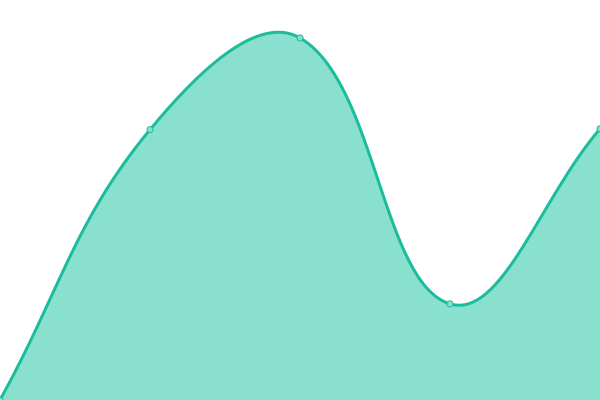 7115ms
     
 | 

<a href="https://volfclub.github.io/travellings-upptime/history/tomy-jan">100.00%</a>
    

|  [一点快乐](https://www.yidiankuaile.com) | 🟩 Up | [.yml](https://github.com/volfclub/travellings-upptime/commits/HEAD/history/.yml) | 

 1743ms
     
 | 

<a href="https://volfclub.github.io/travellings-upptime/history/">0.00%</a>
    

|  [白日梦研究所](https://blog.angustar.com) | 🟩 Up | [.yml](https://github.com/volfclub/travellings-upptime/commits/HEAD/history/.yml) | 

 1743ms
     
 | 

<a href="https://volfclub.github.io/travellings-upptime/history/">0.00%</a>
    

|  [十二博客](https://blog.shiertx.com) | 🟩 Up | [.yml](https://github.com/volfclub/travellings-upptime/commits/HEAD/history/.yml) | 

 1743ms
     
 | 

<a href="https://volfclub.github.io/travellings-upptime/history/">0.00%</a>
    

|  [MoYi's Blog](https://blog.nekomoyi.com) | 🟩 Up | [mo-yi-s-blog.yml](https://github.com/volfclub/travellings-upptime/commits/HEAD/history/mo-yi-s-blog.yml) | 

 469ms
     
 | 

<a href="https://volfclub.github.io/travellings-upptime/history/mo-yi-s-blog">100.00%</a>
    

|  [Troy & Chloe](https://www.yotroy.cool) | 🟩 Up | [troy-and-chloe.yml](https://github.com/volfclub/travellings-upptime/commits/HEAD/history/troy-and-chloe.yml) | 

 1847ms
     
 | 

<a href="https://volfclub.github.io/travellings-upptime/history/troy-and-chloe">100.00%</a>
    

|  [林中小屋](https://imszz.com) | 🟩 Up | [.yml](https://github.com/volfclub/travellings-upptime/commits/HEAD/history/.yml) | 

 1743ms
     
 | 

<a href="https://volfclub.github.io/travellings-upptime/history/">0.00%</a>
    

|  [Ender's Blog](https://ender.fun) | 🟩 Up | [ender-s-blog.yml](https://github.com/volfclub/travellings-upptime/commits/HEAD/history/ender-s-blog.yml) | 

 119ms
     
 | 

<a href="https://volfclub.github.io/travellings-upptime/history/ender-s-blog">100.00%</a>
    

|  [拾忆小站](https://www.syzhan.cn) | 🟩 Up | [.yml](https://github.com/volfclub/travellings-upptime/commits/HEAD/history/.yml) | 

 1743ms
     
 | 

<a href="https://volfclub.github.io/travellings-upptime/history/">0.00%</a>
    

|  [嚣张的灯塔](https://www.liuzhimin.vip) | 🟩 Up | [.yml](https://github.com/volfclub/travellings-upptime/commits/HEAD/history/.yml) | 

 1743ms
     
 | 

<a href="https://volfclub.github.io/travellings-upptime/history/">0.00%</a>
    

|  [W4J1e's blog](https://www.hin.cool) | 🟩 Up | [w4-j1e-s-blog.yml](https://github.com/volfclub/travellings-upptime/commits/HEAD/history/w4-j1e-s-blog.yml) | 

 237ms
     
 | 

<a href="https://volfclub.github.io/travellings-upptime/history/w4-j1e-s-blog">100.00%</a>
    

|  [轻风记](https://www.3328bk.cn) | 🟩 Up | [.yml](https://github.com/volfclub/travellings-upptime/commits/HEAD/history/.yml) | 

 1743ms
     
 | 

<a href="https://volfclub.github.io/travellings-upptime/history/">0.00%</a>
    

|  [Ganto的个人主页](https://www.ganto.cn) | 🟩 Up | [ganto.yml](https://github.com/volfclub/travellings-upptime/commits/HEAD/history/ganto.yml) | 

 723ms
     
 | 

<a href="https://volfclub.github.io/travellings-upptime/history/ganto">100.00%</a>
    

|  [Weidows の Nest](https://weidows.github.io) | 🟩 Up | [weidows-nest.yml](https://github.com/volfclub/travellings-upptime/commits/HEAD/history/weidows-nest.yml) | 

 68ms
     
 | 

<a href="https://volfclub.github.io/travellings-upptime/history/weidows-nest">100.00%</a>
    

|  [Magma Ink](https://magma.ink) | 🟥 Down | [magma-ink.yml](https://github.com/volfclub/travellings-upptime/commits/HEAD/history/magma-ink.yml) | 

 779ms
     
 | 

<a href="https://volfclub.github.io/travellings-upptime/history/magma-ink">31.06%</a>
    

|  [幼稚园园长](https://yzyyz.top) | 🟩 Up | [.yml](https://github.com/volfclub/travellings-upptime/commits/HEAD/history/.yml) | 

 1743ms
     
 | 

<a href="https://volfclub.github.io/travellings-upptime/history/">0.00%</a>
    

|  [飞云师兄的主页](www.idasx.com) | 🟩 Up | [.yml](https://github.com/volfclub/travellings-upptime/commits/HEAD/history/.yml) | 

 1743ms
     
 | 

<a href="https://volfclub.github.io/travellings-upptime/history/">0.00%</a>
    

|  [Xecades's Blog](https://blog.xecades.xyz) | 🟩 Up | [xecades-s-blog.yml](https://github.com/volfclub/travellings-upptime/commits/HEAD/history/xecades-s-blog.yml) | 

 166ms
     
 | 

<a href="https://volfclub.github.io/travellings-upptime/history/xecades-s-blog">100.00%</a>
    

|  [Amos‘blog](https://blog.amoswu.cn) | 🟩 Up | [amos-blog.yml](https://github.com/volfclub/travellings-upptime/commits/HEAD/history/amos-blog.yml) | 

 3349ms
     
 | 

<a href="https://volfclub.github.io/travellings-upptime/history/amos-blog">100.00%</a>
    

|  [Mr_God's Note](https://www.mrgod.cn) | 🟩 Up | [mr-god-s-note.yml](https://github.com/volfclub/travellings-upptime/commits/HEAD/history/mr-god-s-note.yml) | 

 3098ms
     
 | 

<a href="https://volfclub.github.io/travellings-upptime/history/mr-god-s-note">100.00%</a>
    

|  [月光中的污点](https://www.extlight.com) | 🟩 Up | [.yml](https://github.com/volfclub/travellings-upptime/commits/HEAD/history/.yml) | 

 1743ms
     
 | 

<a href="https://volfclub.github.io/travellings-upptime/history/">0.00%</a>
    

|  [Sekiro's Blog](https://666wxy666.github.io) | 🟩 Up | [sekiro-s-blog.yml](https://github.com/volfclub/travellings-upptime/commits/HEAD/history/sekiro-s-blog.yml) | 

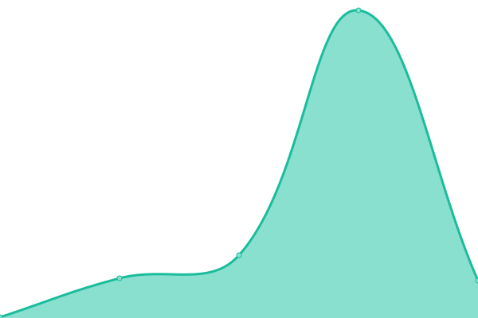 65ms
     
 | 

<a href="https://volfclub.github.io/travellings-upptime/history/sekiro-s-blog">100.00%</a>
    

|  [Err0r](https://err0r.top) | 🟩 Up | [err0r.yml](https://github.com/volfclub/travellings-upptime/commits/HEAD/history/err0r.yml) | 

 512ms
     
 | 

<a href="https://volfclub.github.io/travellings-upptime/history/err0r">100.00%</a>
    

|  [余生 ' Blog](https://www.ysazw.cn) | 🟥 Down | [blog.yml](https://github.com/volfclub/travellings-upptime/commits/HEAD/history/blog.yml) | 

 0ms
     
 | 

<a href="https://volfclub.github.io/travellings-upptime/history/blog">34.30%</a>
    

|  [墨染 の 博客](https://www.roaing.com) | 🟩 Up | [.yml](https://github.com/volfclub/travellings-upptime/commits/HEAD/history/.yml) | 

 1743ms
     
 | 

<a href="https://volfclub.github.io/travellings-upptime/history/">0.00%</a>
    

|  [萌！萝莉](https://loliloli.moe) | 🟩 Up | [.yml](https://github.com/volfclub/travellings-upptime/commits/HEAD/history/.yml) | 

 1743ms
     
 | 

<a href="https://volfclub.github.io/travellings-upptime/history/">0.00%</a>
    

|  [秉性之松](https://blog.iucky.cn) | 🟩 Up | [.yml](https://github.com/volfclub/travellings-upptime/commits/HEAD/history/.yml) | 

 1743ms
     
 | 

<a href="https://volfclub.github.io/travellings-upptime/history/">0.00%</a>
    

|  [7WATE`S Blog](https://blog.7wate.com) | 🟩 Up | [7-wate-s-blog.yml](https://github.com/volfclub/travellings-upptime/commits/HEAD/history/7-wate-s-blog.yml) | 

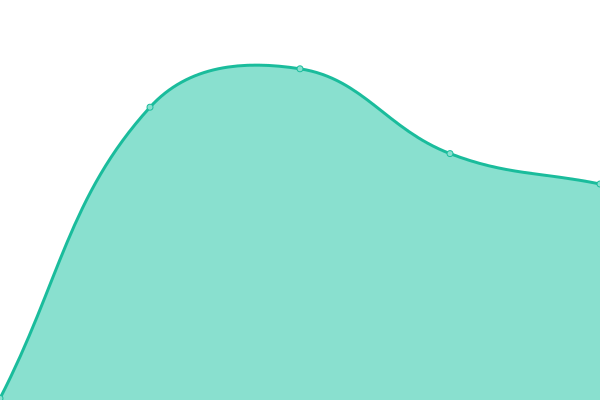 195ms
     
 | 

<a href="https://volfclub.github.io/travellings-upptime/history/7-wate-s-blog">100.00%</a>
    

|  [吴李曾](https://www.wulinzeng.vip) | 🟩 Up | [.yml](https://github.com/volfclub/travellings-upptime/commits/HEAD/history/.yml) | 

 1743ms
     
 | 

<a href="https://volfclub.github.io/travellings-upptime/history/">0.00%</a>
    

|  [斯莫笔记](https://notes.zhangxiaocai.cn) | 🟩 Up | [.yml](https://github.com/volfclub/travellings-upptime/commits/HEAD/history/.yml) | 

 1743ms
     
 | 

<a href="https://volfclub.github.io/travellings-upptime/history/">0.00%</a>
    

|  [且听书吟](https://yufan.me) | 🟩 Up | [.yml](https://github.com/volfclub/travellings-upptime/commits/HEAD/history/.yml) | 

 1743ms
     
 | 

<a href="https://volfclub.github.io/travellings-upptime/history/">0.00%</a>
    

|  [Tony's blog](https://www.tonylsl.top) | 🟩 Up | [tony-s-blog.yml](https://github.com/volfclub/travellings-upptime/commits/HEAD/history/tony-s-blog.yml) | 

 1884ms
     
 | 

<a href="https://volfclub.github.io/travellings-upptime/history/tony-s-blog">100.00%</a>
    

|  [科学ADV整合站](https://sciadv.mcseekeri.top) | 🟥 Down | [adv.yml](https://github.com/volfclub/travellings-upptime/commits/HEAD/history/adv.yml) | 

 1052ms
     
 | 

<a href="https://volfclub.github.io/travellings-upptime/history/adv">34.79%</a>
    

|  [御坂の地下室](https://misakaloli.com) | 🟩 Up | [.yml](https://github.com/volfclub/travellings-upptime/commits/HEAD/history/.yml) | 

 1743ms
     
 | 

<a href="https://volfclub.github.io/travellings-upptime/history/">0.00%</a>
    

|  [Steve Li's Blog](https://blog.stevelbr.top) | 🟥 Down | [steve-li-s-blog.yml](https://github.com/volfclub/travellings-upptime/commits/HEAD/history/steve-li-s-blog.yml) | 

 429ms
     
 | 

<a href="https://volfclub.github.io/travellings-upptime/history/steve-li-s-blog">44.27%</a>
    

|  [凌维三度](https://www.fwder.cn) | 🟩 Up | [.yml](https://github.com/volfclub/travellings-upptime/commits/HEAD/history/.yml) | 

 1743ms
     
 | 

<a href="https://volfclub.github.io/travellings-upptime/history/">0.00%</a>
    

|  [当神奇降临](https://blog.toutop.cn) | 🟩 Up | [.yml](https://github.com/volfclub/travellings-upptime/commits/HEAD/history/.yml) | 

 1743ms
     
 | 

<a href="https://volfclub.github.io/travellings-upptime/history/">0.00%</a>
    

|  [Hi,ghostsf](https://ghostsf.com) | 🟥 Down | [hi-ghostsf.yml](https://github.com/volfclub/travellings-upptime/commits/HEAD/history/hi-ghostsf.yml) | 

 0ms
     
 | 

<a href="https://volfclub.github.io/travellings-upptime/history/hi-ghostsf">100.00%</a>
    

|  [小白 の 博客](https://www.xiaobai666.top) | 🟩 Up | [.yml](https://github.com/volfclub/travellings-upptime/commits/HEAD/history/.yml) | 

 1743ms
     
 | 

<a href="https://volfclub.github.io/travellings-upptime/history/">0.00%</a>
    

|  [MoLeft's Blog](https://www.moleft.cn) | 🟥 Down | [mo-left-s-blog.yml](https://github.com/volfclub/travellings-upptime/commits/HEAD/history/mo-left-s-blog.yml) | 

 0ms
     
 | 

<a href="https://volfclub.github.io/travellings-upptime/history/mo-left-s-blog">100.00%</a>
    

|  [Crash-Logs](https://crash-logs.cn) | 🟩 Up | [crash-logs.yml](https://github.com/volfclub/travellings-upptime/commits/HEAD/history/crash-logs.yml) | 

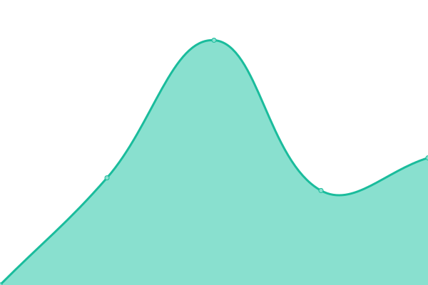 2161ms
     
 | 

<a href="https://volfclub.github.io/travellings-upptime/history/crash-logs">100.00%</a>
    

|  [空域](https://blog.moeworld.tech) | 🟩 Up | [.yml](https://github.com/volfclub/travellings-upptime/commits/HEAD/history/.yml) | 

 1743ms
     
 | 

<a href="https://volfclub.github.io/travellings-upptime/history/">0.00%</a>
    

|  [lzlz000](https://blog.lzlz.site) | 🟩 Up | [lzlz000.yml](https://github.com/volfclub/travellings-upptime/commits/HEAD/history/lzlz000.yml) | 

 350ms
     
 | 

<a href="https://volfclub.github.io/travellings-upptime/history/lzlz000">100.00%</a>
    

|  [Sakurai Kaede's Blog](https://sakurai.in) | 🟩 Up | [sakurai-kaede-s-blog.yml](https://github.com/volfclub/travellings-upptime/commits/HEAD/history/sakurai-kaede-s-blog.yml) | 

 89ms
     
 | 

<a href="https://volfclub.github.io/travellings-upptime/history/sakurai-kaede-s-blog">100.00%</a>
    

|  [Beelake's blog](https://beelake.github.io) | 🟩 Up | [beelake-s-blog.yml](https://github.com/volfclub/travellings-upptime/commits/HEAD/history/beelake-s-blog.yml) | 

 68ms
     
 | 

<a href="https://volfclub.github.io/travellings-upptime/history/beelake-s-blog">100.00%</a>
    

|  [Caviar-X的博客](https://caviar-x.top) | 🟩 Up | [caviar-x.yml](https://github.com/volfclub/travellings-upptime/commits/HEAD/history/caviar-x.yml) | 

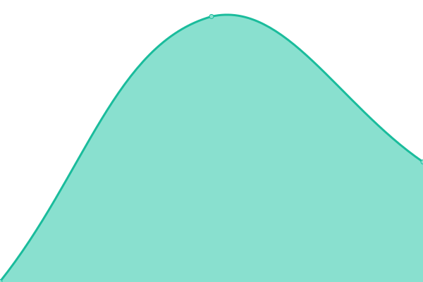 479ms
     
 | 

<a href="https://volfclub.github.io/travellings-upptime/history/caviar-x">100.00%</a>
    

|  [不可方思](https://irr.ink) | 🟩 Up | [.yml](https://github.com/volfclub/travellings-upptime/commits/HEAD/history/.yml) | 

 1743ms
     
 | 

<a href="https://volfclub.github.io/travellings-upptime/history/">0.00%</a>
    

|  [Ljcbaby 的 网络小屋](https://blog.ljcbaby.top) | 🟩 Up | [ljcbaby.yml](https://github.com/volfclub/travellings-upptime/commits/HEAD/history/ljcbaby.yml) | 

 570ms
     
 | 

<a href="https://volfclub.github.io/travellings-upptime/history/ljcbaby">100.00%</a>
    

|  [Caveolae - 乔治](https://www.flagg.cn) | 🟩 Up | [caveolae.yml](https://github.com/volfclub/travellings-upptime/commits/HEAD/history/caveolae.yml) | 

 1442ms
     
 | 

<a href="https://volfclub.github.io/travellings-upptime/history/caveolae">100.00%</a>
    

|  [爱极客](https://www.aigeek.top) | 🟩 Up | [.yml](https://github.com/volfclub/travellings-upptime/commits/HEAD/history/.yml) | 

 1743ms
     
 | 

<a href="https://volfclub.github.io/travellings-upptime/history/">0.00%</a>
    

|  [Fox Home](https://foolishfox.cn) | 🟥 Down | [fox-home.yml](https://github.com/volfclub/travellings-upptime/commits/HEAD/history/fox-home.yml) | 

 0ms
     
 | 

<a href="https://volfclub.github.io/travellings-upptime/history/fox-home">100.00%</a>
    

|  [Jin Yuhan's Blog](https://jin-yuhan.github.io) | 🟩 Up | [jin-yuhan-s-blog.yml](https://github.com/volfclub/travellings-upptime/commits/HEAD/history/jin-yuhan-s-blog.yml) | 

 49ms
     
 | 

<a href="https://volfclub.github.io/travellings-upptime/history/jin-yuhan-s-blog">100.00%</a>
    

|  [GOOPHER’s Blog](https://goopher.tk) | 🟩 Up | [goopher-s-blog.yml](https://github.com/volfclub/travellings-upptime/commits/HEAD/history/goopher-s-blog.yml) | 

 640ms
     
 | 

<a href="https://volfclub.github.io/travellings-upptime/history/goopher-s-blog">100.00%</a>
    

|  [颢天图文](https://www.zouht.com) | 🟩 Up | [.yml](https://github.com/volfclub/travellings-upptime/commits/HEAD/history/.yml) | 

 1743ms
     
 | 

<a href="https://volfclub.github.io/travellings-upptime/history/">0.00%</a>
    

|  [水嗷博客](https://www.shuiao.top) | 🟩 Up | [.yml](https://github.com/volfclub/travellings-upptime/commits/HEAD/history/.yml) | 

 1743ms
     
 | 

<a href="https://volfclub.github.io/travellings-upptime/history/">0.00%</a>
    

|  [探索子](https://exploro.one) | 🟩 Up | [.yml](https://github.com/volfclub/travellings-upptime/commits/HEAD/history/.yml) | 

 1743ms
     
 | 

<a href="https://volfclub.github.io/travellings-upptime/history/">0.00%</a>
    

|  [Java_S](https://syjun.vip) | 🟩 Up | [java-s.yml](https://github.com/volfclub/travellings-upptime/commits/HEAD/history/java-s.yml) | 

 2472ms
     
 | 

<a href="https://volfclub.github.io/travellings-upptime/history/java-s">100.00%</a>
    

|  [RS-Nocsi--博客论坛](https://www.rsnocsi.cn) | 🟩 Up | [rs-nocsi.yml](https://github.com/volfclub/travellings-upptime/commits/HEAD/history/rs-nocsi.yml) | 

 2792ms
     
 | 

<a href="https://volfclub.github.io/travellings-upptime/history/rs-nocsi">100.00%</a>
    

|  [肥虫汽水摊](https://blog.bugcola.com/note) | 🟩 Up | [.yml](https://github.com/volfclub/travellings-upptime/commits/HEAD/history/.yml) | 

 1743ms
     
 | 

<a href="https://volfclub.github.io/travellings-upptime/history/">0.00%</a>
    

|  [Debug客栈](https://www.debuginn.cn) | 🟩 Up | [debug.yml](https://github.com/volfclub/travellings-upptime/commits/HEAD/history/debug.yml) | 

 1760ms
     
 | 

<a href="https://volfclub.github.io/travellings-upptime/history/debug">100.00%</a>
    

|  [Lin's Blog](https://linzeyin.github.io) | 🟩 Up | [lin-s-blog.yml](https://github.com/volfclub/travellings-upptime/commits/HEAD/history/lin-s-blog.yml) | 

 1410ms
     
 | 

<a href="https://volfclub.github.io/travellings-upptime/history/lin-s-blog">100.00%</a>
    

|  [杰瑞日志](https://blog.jerryiweb.com) | 🟩 Up | [.yml](https://github.com/volfclub/travellings-upptime/commits/HEAD/history/.yml) | 

 1743ms
     
 | 

<a href="https://volfclub.github.io/travellings-upptime/history/">0.00%</a>
    

|  [Fadai's Blog](https://www.niuwx.cn) | 🟩 Up | [fadai-s-blog.yml](https://github.com/volfclub/travellings-upptime/commits/HEAD/history/fadai-s-blog.yml) | 

 482ms
     
 | 

<a href="https://volfclub.github.io/travellings-upptime/history/fadai-s-blog">100.00%</a>
    

|  [帮开心](https://www.bangkaixin.com) | 🟩 Up | [.yml](https://github.com/volfclub/travellings-upptime/commits/HEAD/history/.yml) | 

 1743ms
     
 | 

<a href="https://volfclub.github.io/travellings-upptime/history/">0.00%</a>
    

|  [灰域行者的罐头盒](https://hacbox.me) | 🟩 Up | [.yml](https://github.com/volfclub/travellings-upptime/commits/HEAD/history/.yml) | 

 1743ms
     
 | 

<a href="https://volfclub.github.io/travellings-upptime/history/">0.00%</a>
    

|  [阈](https://www.limina.top) | 🟩 Up | [.yml](https://github.com/volfclub/travellings-upptime/commits/HEAD/history/.yml) | 

 1743ms
     
 | 

<a href="https://volfclub.github.io/travellings-upptime/history/">0.00%</a>
    

|  [E=mc²](https://lxh2006.tk) | 🟩 Up | [e-mc.yml](https://github.com/volfclub/travellings-upptime/commits/HEAD/history/e-mc.yml) | 

 939ms
     
 | 

<a href="https://volfclub.github.io/travellings-upptime/history/e-mc">100.00%</a>
    

|  [Foxhole](https://blog.southfox.tk) | 🟩 Up | [foxhole.yml](https://github.com/volfclub/travellings-upptime/commits/HEAD/history/foxhole.yml) | 

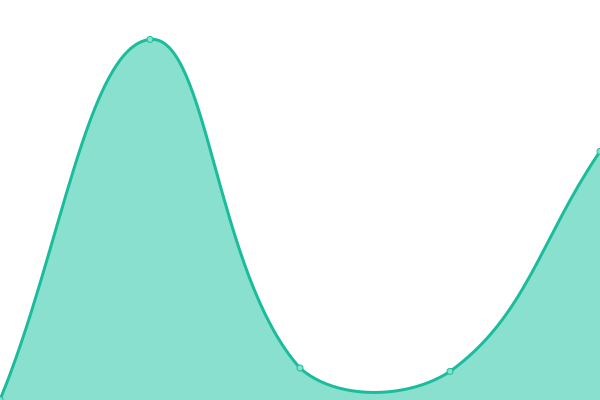 687ms
     
 | 

<a href="https://volfclub.github.io/travellings-upptime/history/foxhole">100.00%</a>
    

|  [Hello! I’m 中二病晚期](https://imfurry.com) | 🟩 Up | [hello-i-m.yml](https://github.com/volfclub/travellings-upptime/commits/HEAD/history/hello-i-m.yml) | 

 1530ms
     
 | 

<a href="https://volfclub.github.io/travellings-upptime/history/hello-i-m">100.00%</a>
    

|  [萌新杰少の秘密基地](https://imcys.com) | 🟩 Up | [.yml](https://github.com/volfclub/travellings-upptime/commits/HEAD/history/.yml) | 

 1743ms
     
 | 

<a href="https://volfclub.github.io/travellings-upptime/history/">0.00%</a>
    

|  [希望的博客](https://xiwangly.top) | 🟩 Up | [.yml](https://github.com/volfclub/travellings-upptime/commits/HEAD/history/.yml) | 

 1743ms
     
 | 

<a href="https://volfclub.github.io/travellings-upptime/history/">0.00%</a>
    

|  [WishMeLz](https://blog.itsse.cn) | 🟩 Up | [wish-me-lz.yml](https://github.com/volfclub/travellings-upptime/commits/HEAD/history/wish-me-lz.yml) | 

 2126ms
     
 | 

<a href="https://volfclub.github.io/travellings-upptime/history/wish-me-lz">100.00%</a>
    

|  [凝雀](https://blog.gatesx.cn) | 🟩 Up | [.yml](https://github.com/volfclub/travellings-upptime/commits/HEAD/history/.yml) | 

 1743ms
     
 | 

<a href="https://volfclub.github.io/travellings-upptime/history/">0.00%</a>
    

|  [新加卷的小宇宙](https://www.hzq.life) | 🟩 Up | [.yml](https://github.com/volfclub/travellings-upptime/commits/HEAD/history/.yml) | 

 1743ms
     
 | 

<a href="https://volfclub.github.io/travellings-upptime/history/">0.00%</a>
    

|  [CAYZLH](https://cayzlh.com) | 🟩 Up | [cayzlh.yml](https://github.com/volfclub/travellings-upptime/commits/HEAD/history/cayzlh.yml) | 

 739ms
     
 | 

<a href="https://volfclub.github.io/travellings-upptime/history/cayzlh">100.00%</a>
    

|  [咖里De](https://blog.garryde.com) | 🟩 Up | [de.yml](https://github.com/volfclub/travellings-upptime/commits/HEAD/history/de.yml) | 

 2827ms
     
 | 

<a href="https://volfclub.github.io/travellings-upptime/history/de">100.00%</a>
    

|  [贼ㄨ船](https://blog.thiefship.com) | 🟩 Up | [.yml](https://github.com/volfclub/travellings-upptime/commits/HEAD/history/.yml) | 

 1743ms
     
 | 

<a href="https://volfclub.github.io/travellings-upptime/history/">0.00%</a>
    

|  [Eritque arcus's blog](https://eritque-arcus.tech) | 🟩 Up | [eritque-arcus-s-blog.yml](https://github.com/volfclub/travellings-upptime/commits/HEAD/history/eritque-arcus-s-blog.yml) | 

 509ms
     
 | 

<a href="https://volfclub.github.io/travellings-upptime/history/eritque-arcus-s-blog">100.00%</a>
    

|  [kirito41dd's blog](https://www.kirito41dd.cn) | 🟩 Up | [kirito41dd-s-blog.yml](https://github.com/volfclub/travellings-upptime/commits/HEAD/history/kirito41dd-s-blog.yml) | 

 484ms
     
 | 

<a href="https://volfclub.github.io/travellings-upptime/history/kirito41dd-s-blog">100.00%</a>
    

|  [墨泽](https://blog.imzy.ink) | 🟩 Up | [.yml](https://github.com/volfclub/travellings-upptime/commits/HEAD/history/.yml) | 

 1743ms
     
 | 

<a href="https://volfclub.github.io/travellings-upptime/history/">0.00%</a>
    

|  [见字如晤](https://www.jianziruw.com) | 🟩 Up | [.yml](https://github.com/volfclub/travellings-upptime/commits/HEAD/history/.yml) | 

 1743ms
     
 | 

<a href="https://volfclub.github.io/travellings-upptime/history/">0.00%</a>
    

|  [繁星小站](https://www.moeor.com) | 🟩 Up | [.yml](https://github.com/volfclub/travellings-upptime/commits/HEAD/history/.yml) | 

 1743ms
     
 | 

<a href="https://volfclub.github.io/travellings-upptime/history/">0.00%</a>
    

|  [听闻](https://sangxuesheng.com) | 🟩 Up | [.yml](https://github.com/volfclub/travellings-upptime/commits/HEAD/history/.yml) | 

 1743ms
     
 | 

<a href="https://volfclub.github.io/travellings-upptime/history/">0.00%</a>
    

|  [南风的博客](https://www.nfxwblog.com) | 🟩 Up | [.yml](https://github.com/volfclub/travellings-upptime/commits/HEAD/history/.yml) | 

 1743ms
     
 | 

<a href="https://volfclub.github.io/travellings-upptime/history/">0.00%</a>
    

|  [沐の空间](https://muspace.top) | 🟩 Up | [.yml](https://github.com/volfclub/travellings-upptime/commits/HEAD/history/.yml) | 

 1743ms
     
 | 

<a href="https://volfclub.github.io/travellings-upptime/history/">0.00%</a>
    

|  [0.0个人博客](https://wangdabao.js.cool) | 🟩 Up | [0-0.yml](https://github.com/volfclub/travellings-upptime/commits/HEAD/history/0-0.yml) | 

 143ms
     
 | 

<a href="https://volfclub.github.io/travellings-upptime/history/0-0">100.00%</a>
    

|  [小毅博客](https://xeblog.cn) | 🟩 Up | [.yml](https://github.com/volfclub/travellings-upptime/commits/HEAD/history/.yml) | 

 1743ms
     
 | 

<a href="https://volfclub.github.io/travellings-upptime/history/">0.00%</a>
    

|  [膨胀的面包](https://blog.error.work) | 🟩 Up | [.yml](https://github.com/volfclub/travellings-upptime/commits/HEAD/history/.yml) | 

 1743ms
     
 | 

<a href="https://volfclub.github.io/travellings-upptime/history/">0.00%</a>
    

|  [演员UyoAhz](https://uyoahz.cn) | 🟩 Up | [uyo-ahz.yml](https://github.com/volfclub/travellings-upptime/commits/HEAD/history/uyo-ahz.yml) | 

 445ms
     
 | 

<a href="https://volfclub.github.io/travellings-upptime/history/uyo-ahz">100.00%</a>
    

|  [惜时如命](https://iamazing.cn) | 🟩 Up | [.yml](https://github.com/volfclub/travellings-upptime/commits/HEAD/history/.yml) | 

 1743ms
     
 | 

<a href="https://volfclub.github.io/travellings-upptime/history/">0.00%</a>
    

|  [zisu.dev](https://zisu.dev) | 🟩 Up | [zisu-dev.yml](https://github.com/volfclub/travellings-upptime/commits/HEAD/history/zisu-dev.yml) | 

 778ms
     
 | 

<a href="https://volfclub.github.io/travellings-upptime/history/zisu-dev">100.00%</a>
    

|  [Revincx的小破站](https://blog.revincx.icu) | 🟩 Up | [revincx.yml](https://github.com/volfclub/travellings-upptime/commits/HEAD/history/revincx.yml) | 

 527ms
     
 | 

<a href="https://volfclub.github.io/travellings-upptime/history/revincx">100.00%</a>
    

|  [东方幻梦](https://blog.badapple.pro) | 🟩 Up | [.yml](https://github.com/volfclub/travellings-upptime/commits/HEAD/history/.yml) | 

 1743ms
     
 | 

<a href="https://volfclub.github.io/travellings-upptime/history/">0.00%</a>
    

|  [xuanzhi33的小站](https://www.xuanzhi33.cn) | 🟩 Up | [xuanzhi33.yml](https://github.com/volfclub/travellings-upptime/commits/HEAD/history/xuanzhi33.yml) | 

 1143ms
     
 | 

<a href="https://volfclub.github.io/travellings-upptime/history/xuanzhi33">100.00%</a>
    

|  [Xzy® Homepage](https://xzy.one) | 🟩 Up | [xzy-homepage.yml](https://github.com/volfclub/travellings-upptime/commits/HEAD/history/xzy-homepage.yml) | 

 1361ms
     
 | 

<a href="https://volfclub.github.io/travellings-upptime/history/xzy-homepage">100.00%</a>
    

|  [星路博客](https://www.ariels.xyz) | 🟩 Up | [.yml](https://github.com/volfclub/travellings-upptime/commits/HEAD/history/.yml) | 

 1743ms
     
 | 

<a href="https://volfclub.github.io/travellings-upptime/history/">0.00%</a>
    

|  [K'Blog](https://www.amazingk.cn) | 🟩 Up | [k-blog.yml](https://github.com/volfclub/travellings-upptime/commits/HEAD/history/k-blog.yml) | 

 1416ms
     
 | 

<a href="https://volfclub.github.io/travellings-upptime/history/k-blog">100.00%</a>
    

|  [阿苏可の小博客](https://asuko.icu) | 🟩 Up | [.yml](https://github.com/volfclub/travellings-upptime/commits/HEAD/history/.yml) | 

 1743ms
     
 | 

<a href="https://volfclub.github.io/travellings-upptime/history/">0.00%</a>
    

|  [Godapex](https://www.godapex.com) | 🟩 Up | [godapex.yml](https://github.com/volfclub/travellings-upptime/commits/HEAD/history/godapex.yml) | 

 1287ms
     
 | 

<a href="https://volfclub.github.io/travellings-upptime/history/godapex">100.00%</a>
    

|  [GZTime's Blog](https://blog.gztime.cc) | 🟩 Up | [gz-time-s-blog.yml](https://github.com/volfclub/travellings-upptime/commits/HEAD/history/gz-time-s-blog.yml) | 

 1511ms
     
 | 

<a href="https://volfclub.github.io/travellings-upptime/history/gz-time-s-blog">100.00%</a>
    

|  [TIR: Today I Read](https://tir.cool) | 🟩 Up | [tir-today-i-read.yml](https://github.com/volfclub/travellings-upptime/commits/HEAD/history/tir-today-i-read.yml) | 

 242ms
     
 | 

<a href="https://volfclub.github.io/travellings-upptime/history/tir-today-i-read">100.00%</a>
    

|  [Sakura_Team](https://sakurasep.club) | 🟩 Up | [sakura-team.yml](https://github.com/volfclub/travellings-upptime/commits/HEAD/history/sakura-team.yml) | 

 2126ms
     
 | 

<a href="https://volfclub.github.io/travellings-upptime/history/sakura-team">100.00%</a>
    

|  [HKK's Diary](https://ihkk.net) | 🟩 Up | [hkk-s-diary.yml](https://github.com/volfclub/travellings-upptime/commits/HEAD/history/hkk-s-diary.yml) | 

 3780ms
     
 | 

<a href="https://volfclub.github.io/travellings-upptime/history/hkk-s-diary">100.00%</a>
    

|  [BBing's Blog](https://bbing.com.cn) | 🟩 Up | [b-bing-s-blog.yml](https://github.com/volfclub/travellings-upptime/commits/HEAD/history/b-bing-s-blog.yml) | 

 449ms
     
 | 

<a href="https://volfclub.github.io/travellings-upptime/history/b-bing-s-blog">100.00%</a>
    

|  [雨临Lewis的博客](https://lewky.cn) | 🟩 Up | [lewis.yml](https://github.com/volfclub/travellings-upptime/commits/HEAD/history/lewis.yml) | 

 626ms
     
 | 

<a href="https://volfclub.github.io/travellings-upptime/history/lewis">100.00%</a>
    

|  [Cusalt!](https://cusalt.com) | 🟥 Down | [cusalt.yml](https://github.com/volfclub/travellings-upptime/commits/HEAD/history/cusalt.yml) | 

 0ms
     
 | 

<a href="https://volfclub.github.io/travellings-upptime/history/cusalt">100.00%</a>
    

|  [雨中的博客](https://www.wenchong.space) | 🟩 Up | [.yml](https://github.com/volfclub/travellings-upptime/commits/HEAD/history/.yml) | 

 1743ms
     
 | 

<a href="https://volfclub.github.io/travellings-upptime/history/">0.00%</a>
    

|  [陈鑫磊的博客](https://www.cxl2020mc.top) | 🟩 Up | [.yml](https://github.com/volfclub/travellings-upptime/commits/HEAD/history/.yml) | 

 1743ms
     
 | 

<a href="https://volfclub.github.io/travellings-upptime/history/">0.00%</a>
    

|  [冻符「Minus-K」](https://www.kawashiros.club) | 🟩 Up | [minus-k.yml](https://github.com/volfclub/travellings-upptime/commits/HEAD/history/minus-k.yml) | 

 170ms
     
 | 

<a href="https://volfclub.github.io/travellings-upptime/history/minus-k">100.00%</a>
    

|  [Laugh](https://blog.laugh12321.cn) | 🟩 Up | [laugh.yml](https://github.com/volfclub/travellings-upptime/commits/HEAD/history/laugh.yml) | 

 710ms
     
 | 

<a href="https://volfclub.github.io/travellings-upptime/history/laugh">100.00%</a>
    

|  [小理的小窝](https://xiaolii.com) | 🟩 Up | [.yml](https://github.com/volfclub/travellings-upptime/commits/HEAD/history/.yml) | 

 1743ms
     
 | 

<a href="https://volfclub.github.io/travellings-upptime/history/">0.00%</a>
    

|  [996 worker's ICU](https://www.996workers.icu) | 🟩 Up | [996-worker-s-icu.yml](https://github.com/volfclub/travellings-upptime/commits/HEAD/history/996-worker-s-icu.yml) | 

 1223ms
     
 | 

<a href="https://volfclub.github.io/travellings-upptime/history/996-worker-s-icu">100.00%</a>
    

|  [Moyok的小屋](https://blog.moyok.xyz) | 🟩 Up | [moyok.yml](https://github.com/volfclub/travellings-upptime/commits/HEAD/history/moyok.yml) | 

 1722ms
     
 | 

<a href="https://volfclub.github.io/travellings-upptime/history/moyok">100.00%</a>
    

|  [Hicool嗨酷](https://www.hicool.icu) | 🟩 Up | [hicool.yml](https://github.com/volfclub/travellings-upptime/commits/HEAD/history/hicool.yml) | 

 2547ms
     
 | 

<a href="https://volfclub.github.io/travellings-upptime/history/hicool">100.00%</a>
    

|  [云梦 ╮不浅の部落阁](https://blog.adworld.top) | 🟩 Up | [.yml](https://github.com/volfclub/travellings-upptime/commits/HEAD/history/.yml) | 

 1743ms
     
 | 

<a href="https://volfclub.github.io/travellings-upptime/history/">0.00%</a>
    

|  [李本伟的博客](https://blog.libw.cc) | 🟩 Up | [.yml](https://github.com/volfclub/travellings-upptime/commits/HEAD/history/.yml) | 

 1743ms
     
 | 

<a href="https://volfclub.github.io/travellings-upptime/history/">0.00%</a>
    

|  [Po7mn1's Blog](https://blog.icecliffs.cn) | 🟩 Up | [po7mn1-s-blog.yml](https://github.com/volfclub/travellings-upptime/commits/HEAD/history/po7mn1-s-blog.yml) | 

 3717ms
     
 | 

<a href="https://volfclub.github.io/travellings-upptime/history/po7mn1-s-blog">100.00%</a>
    

|  [人人都是艺术家](https://here.sy) | 🟩 Up | [.yml](https://github.com/volfclub/travellings-upptime/commits/HEAD/history/.yml) | 

 1743ms
     
 | 

<a href="https://volfclub.github.io/travellings-upptime/history/">0.00%</a>
    

|  [求索日记](https://shuxhan.com) | 🟩 Up | [.yml](https://github.com/volfclub/travellings-upptime/commits/HEAD/history/.yml) | 

 1743ms
     
 | 

<a href="https://volfclub.github.io/travellings-upptime/history/">0.00%</a>
    

|  [Hey,Joker](https://jokerdig.com) | 🟩 Up | [hey-joker.yml](https://github.com/volfclub/travellings-upptime/commits/HEAD/history/hey-joker.yml) | 

 190ms
     
 | 

<a href="https://volfclub.github.io/travellings-upptime/history/hey-joker">100.00%</a>
    

|  [Morcat Blog](https://www.morcat.cn) | 🟩 Up | [morcat-blog.yml](https://github.com/volfclub/travellings-upptime/commits/HEAD/history/morcat-blog.yml) | 

 1295ms
     
 | 

<a href="https://volfclub.github.io/travellings-upptime/history/morcat-blog">100.00%</a>
    

|  [ldo's blog](https://ldo.one) | 🟩 Up | [ldo-s-blog.yml](https://github.com/volfclub/travellings-upptime/commits/HEAD/history/ldo-s-blog.yml) | 

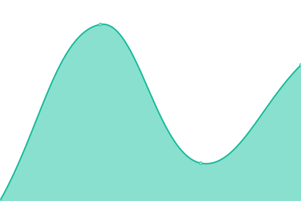 320ms
     
 | 

<a href="https://volfclub.github.io/travellings-upptime/history/ldo-s-blog">100.00%</a>
    

|  [KatCloud](https://katcloud.cn) | 🟩 Up | [kat-cloud.yml](https://github.com/volfclub/travellings-upptime/commits/HEAD/history/kat-cloud.yml) | 

 1835ms
     
 | 

<a href="https://volfclub.github.io/travellings-upptime/history/kat-cloud">100.00%</a>
    

|  [温华的博客](https://wangquanguo.life) | 🟩 Up | [.yml](https://github.com/volfclub/travellings-upptime/commits/HEAD/history/.yml) | 

 1743ms
     
 | 

<a href="https://volfclub.github.io/travellings-upptime/history/">0.00%</a>
    

|  [进击的学霸的博客](https://blog.lovem.fun) | 🟩 Up | [.yml](https://github.com/volfclub/travellings-upptime/commits/HEAD/history/.yml) | 

 1743ms
     
 | 

<a href="https://volfclub.github.io/travellings-upptime/history/">0.00%</a>
    

|  [森木志](https://imxxz.cn) | 🟩 Up | [.yml](https://github.com/volfclub/travellings-upptime/commits/HEAD/history/.yml) | 

 1743ms
     
 | 

<a href="https://volfclub.github.io/travellings-upptime/history/">0.00%</a>
    

|  [Y7n05h 技术分享](https://blog.y7n05h.xyz) | 🟩 Up | [y7n05h.yml](https://github.com/volfclub/travellings-upptime/commits/HEAD/history/y7n05h.yml) | 

 141ms
     
 | 

<a href="https://volfclub.github.io/travellings-upptime/history/y7n05h">100.00%</a>
    

|  [晓果冻](https://www.chenmx.net) | 🟩 Up | [.yml](https://github.com/volfclub/travellings-upptime/commits/HEAD/history/.yml) | 

 1743ms
     
 | 

<a href="https://volfclub.github.io/travellings-upptime/history/">0.00%</a>
    

|  [若志随笔](https://www.rz.sb) | 🟩 Up | [.yml](https://github.com/volfclub/travellings-upptime/commits/HEAD/history/.yml) | 

 1743ms
     
 | 

<a href="https://volfclub.github.io/travellings-upptime/history/">0.00%</a>
    

|  [初 x 见](https://chuxjian.asia) | 🟩 Up | [x.yml](https://github.com/volfclub/travellings-upptime/commits/HEAD/history/x.yml) | 

 1227ms
     
 | 

<a href="https://volfclub.github.io/travellings-upptime/history/x">100.00%</a>
    

|  [城北徐公](https://www.cbxg.icu) | 🟩 Up | [.yml](https://github.com/volfclub/travellings-upptime/commits/HEAD/history/.yml) | 

 1743ms
     
 | 

<a href="https://volfclub.github.io/travellings-upptime/history/">0.00%</a>
    

|  [二丫讲梵](https://wiki.eryajf.net) | 🟩 Up | [.yml](https://github.com/volfclub/travellings-upptime/commits/HEAD/history/.yml) | 

 1743ms
     
 | 

<a href="https://volfclub.github.io/travellings-upptime/history/">0.00%</a>
    

|  [liuliのsite](https://back2me.cn) | 🟩 Up | [liuli-site.yml](https://github.com/volfclub/travellings-upptime/commits/HEAD/history/liuli-site.yml) | 

 3461ms
     
 | 

<a href="https://volfclub.github.io/travellings-upptime/history/liuli-site">100.00%</a>
    

|  [totoro & home](https://totoro.site) | 🟩 Up | [totoro-and-home.yml](https://github.com/volfclub/travellings-upptime/commits/HEAD/history/totoro-and-home.yml) | 

 1749ms
     
 | 

<a href="https://volfclub.github.io/travellings-upptime/history/totoro-and-home">100.00%</a>
    

|  [Thun888](https://blog.thun888.xyz) | 🟩 Up | [thun888.yml](https://github.com/volfclub/travellings-upptime/commits/HEAD/history/thun888.yml) | 

 1217ms
     
 | 

<a href="https://volfclub.github.io/travellings-upptime/history/thun888">100.00%</a>
    

|  [Sakitami的集装箱](https://blog.skihome.xyz) | 🟩 Up | [sakitami.yml](https://github.com/volfclub/travellings-upptime/commits/HEAD/history/sakitami.yml) | 

 584ms
     
 | 

<a href="https://volfclub.github.io/travellings-upptime/history/sakitami">100.00%</a>
    

|  [CairBin's Blog](https://cairbin.top) | 🟩 Up | [cair-bin-s-blog.yml](https://github.com/volfclub/travellings-upptime/commits/HEAD/history/cair-bin-s-blog.yml) | 

 293ms
     
 | 

<a href="https://volfclub.github.io/travellings-upptime/history/cair-bin-s-blog">100.00%</a>
    

|  [Savant's Blog](https://blog.lxscloud.top) | 🟩 Up | [savant-s-blog.yml](https://github.com/volfclub/travellings-upptime/commits/HEAD/history/savant-s-blog.yml) | 

 2125ms
     
 | 

<a href="https://volfclub.github.io/travellings-upptime/history/savant-s-blog">100.00%</a>
    

|  [半闲](https://zhaobanxian.top) | 🟩 Up | [.yml](https://github.com/volfclub/travellings-upptime/commits/HEAD/history/.yml) | 

 1743ms
     
 | 

<a href="https://volfclub.github.io/travellings-upptime/history/">0.00%</a>
    

|  [沐瑾年](https://lemonx.cn) | 🟩 Up | [.yml](https://github.com/volfclub/travellings-upptime/commits/HEAD/history/.yml) | 

 1743ms
     
 | 

<a href="https://volfclub.github.io/travellings-upptime/history/">0.00%</a>
    

|  [逍遥隐士](https://cry33.com) | 🟩 Up | [.yml](https://github.com/volfclub/travellings-upptime/commits/HEAD/history/.yml) | 

 1743ms
     
 | 

<a href="https://volfclub.github.io/travellings-upptime/history/">0.00%</a>
    

|  [RSSBlog](https://rssblog.cn) | 🟩 Up | [rss-blog.yml](https://github.com/volfclub/travellings-upptime/commits/HEAD/history/rss-blog.yml) | 

 588ms
     
 | 

<a href="https://volfclub.github.io/travellings-upptime/history/rss-blog">100.00%</a>
    

<!--end: status pages-->

[**Visit our status website →**](https://volfclub.github.io/travellings-upptime)

## 📄 License

- Powered by: [Upptime](https://github.com/upptime/upptime)
- Code: [MIT](./LICENSE) © [逊狼](volf.club)
- Data in the `./history` directory: [Open Database License](https://opendatacommons.org/licenses/odbl/1-0/)
