# [📈 Live Status](https://volfclub.github.io/travellings-upptime): <!--live status--> **🟧 Partial outage**

This repository contains the open-source uptime monitor and status page for [逊狼](volf.club), powered by [Upptime](https://github.com/upptime/upptime).

With [Upptime](https://upptime.js.org), you can get your own unlimited and free uptime monitor and status page, powered entirely by a GitHub repository. We use [Issues](https://github.com/volfclub/travellings-upptime/issues) as incident reports, [Actions](https://github.com/volfclub/travellings-upptime/actions) as uptime monitors, and [Pages](https://volfclub.github.io/travellings-upptime) for the status page.

<!--start: status pages-->
<!-- This summary is generated by Upptime (https://github.com/upptime/upptime) -->
<!-- Do not edit this manually, your changes will be overwritten -->
<!-- prettier-ignore -->
| URL | Status | History | Response Time | Uptime |
| --- | ------ | ------- | ------------- | ------ |
|  [0](https://github.com/volfclub/travelling) | 🟩 Up | [0.yml](https://github.com/volfclub/travellings-upptime/commits/HEAD/history/0.yml) | 

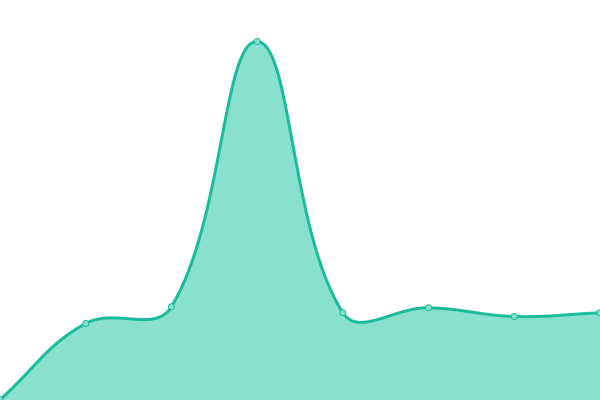 429ms
     
 | 

<a href="https://volfclub.github.io/travellings-upptime/history/0">100.00%</a>
    

|  [1](https://www.volf.club) | 🟩 Up | [1.yml](https://github.com/volfclub/travellings-upptime/commits/HEAD/history/1.yml) | 

 3019ms
     
 | 

<a href="https://volfclub.github.io/travellings-upptime/history/1">100.00%</a>
    

|  [2](https://sonic.volf.club) | 🟩 Up | [2.yml](https://github.com/volfclub/travellings-upptime/commits/HEAD/history/2.yml) | 

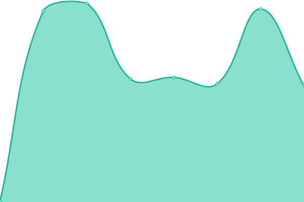 758ms
     
 | 

<a href="https://volfclub.github.io/travellings-upptime/history/2">100.00%</a>
    

|  [3](https://yltang.cn) | 🟩 Up | [3.yml](https://github.com/volfclub/travellings-upptime/commits/HEAD/history/3.yml) | 

 2067ms
     
 | 

<a href="https://volfclub.github.io/travellings-upptime/history/3">100.00%</a>
    

|  [4](https://guguga.cn) | 🟩 Up | [4.yml](https://github.com/volfclub/travellings-upptime/commits/HEAD/history/4.yml) | 

 1319ms
     
 | 

<a href="https://volfclub.github.io/travellings-upptime/history/4">100.00%</a>
    

|  [6](https://www.yamdr.cn) | 🟩 Up | [6.yml](https://github.com/volfclub/travellings-upptime/commits/HEAD/history/6.yml) | 

 1440ms
     
 | 

<a href="https://volfclub.github.io/travellings-upptime/history/6">100.00%</a>
    

|  [7](https://www.kanofans.com) | 🟩 Up | [7.yml](https://github.com/volfclub/travellings-upptime/commits/HEAD/history/7.yml) | 

 1947ms
     
 | 

<a href="https://volfclub.github.io/travellings-upptime/history/7">100.00%</a>
    

|  [8](https://ryanc.cc) | 🟩 Up | [8.yml](https://github.com/volfclub/travellings-upptime/commits/HEAD/history/8.yml) | 

 877ms
     
 | 

<a href="https://volfclub.github.io/travellings-upptime/history/8">100.00%</a>
    

|  [9](https://seija.me) | 🟥 Down | [9.yml](https://github.com/volfclub/travellings-upptime/commits/HEAD/history/9.yml) | 

 0ms
     
 | 

<a href="https://volfclub.github.io/travellings-upptime/history/9">0.00%</a>
    

|  [10](https://blog.uniartisan.com) | 🟩 Up | [10.yml](https://github.com/volfclub/travellings-upptime/commits/HEAD/history/10.yml) | 

 3738ms
     
 | 

<a href="https://volfclub.github.io/travellings-upptime/history/10">100.00%</a>
    

|  [11](https://jinqimu.github.io) | 🟩 Up | [11.yml](https://github.com/volfclub/travellings-upptime/commits/HEAD/history/11.yml) | 

 190ms
     
 | 

<a href="https://volfclub.github.io/travellings-upptime/history/11">100.00%</a>
    

|  [12](https://crowndaisy.com) | 🟩 Up | [12.yml](https://github.com/volfclub/travellings-upptime/commits/HEAD/history/12.yml) | 

 1258ms
     
 | 

<a href="https://volfclub.github.io/travellings-upptime/history/12">100.00%</a>
    

|  [13](https://heycmm.cn) | 🟥 Down | [13.yml](https://github.com/volfclub/travellings-upptime/commits/HEAD/history/13.yml) | 

 0ms
     
 | 

<a href="https://volfclub.github.io/travellings-upptime/history/13">0.04%</a>
    

|  [15](https://jinjis.cn) | 🟩 Up | [15.yml](https://github.com/volfclub/travellings-upptime/commits/HEAD/history/15.yml) | 

 2511ms
     
 | 

<a href="https://volfclub.github.io/travellings-upptime/history/15">100.00%</a>
    

|  [16](https://blog.tigerxly.com) | 🟩 Up | [16.yml](https://github.com/volfclub/travellings-upptime/commits/HEAD/history/16.yml) | 

 2241ms
     
 | 

<a href="https://volfclub.github.io/travellings-upptime/history/16">100.00%</a>
    

|  [17](http://blog.diego.plus:5800) | 🟥 Down | [17.yml](https://github.com/volfclub/travellings-upptime/commits/HEAD/history/17.yml) | 

 763ms
     
 | 

<a href="https://volfclub.github.io/travellings-upptime/history/17">35.12%</a>
    

|  [18](https://sublimerui.top) | 🟩 Up | [18.yml](https://github.com/volfclub/travellings-upptime/commits/HEAD/history/18.yml) | 

 359ms
     
 | 

<a href="https://volfclub.github.io/travellings-upptime/history/18">100.00%</a>
    

|  [19](https://cwxyr.me) | 🟩 Up | [19.yml](https://github.com/volfclub/travellings-upptime/commits/HEAD/history/19.yml) | 

 996ms
     
 | 

<a href="https://volfclub.github.io/travellings-upptime/history/19">100.00%</a>
    

|  [22](https://grimoire.cn) | 🟩 Up | [22.yml](https://github.com/volfclub/travellings-upptime/commits/HEAD/history/22.yml) | 

 2563ms
     
 | 

<a href="https://volfclub.github.io/travellings-upptime/history/22">100.00%</a>
    

|  [23](https://www.naraku.cn) | 🟩 Up | [23.yml](https://github.com/volfclub/travellings-upptime/commits/HEAD/history/23.yml) | 

 1999ms
     
 | 

<a href="https://volfclub.github.io/travellings-upptime/history/23">100.00%</a>
    

|  [24](https://www.xiyo8.cn) | 🟥 Down | [24.yml](https://github.com/volfclub/travellings-upptime/commits/HEAD/history/24.yml) | 

 0ms
     
 | 

<a href="https://volfclub.github.io/travellings-upptime/history/24">0.01%</a>
    

|  [25](https://www.wangkai88.com) | 🟩 Up | [25.yml](https://github.com/volfclub/travellings-upptime/commits/HEAD/history/25.yml) | 

 2566ms
     
 | 

<a href="https://volfclub.github.io/travellings-upptime/history/25">100.00%</a>
    

|  [26](https://blog.zeruns.tech) | 🟩 Up | [26.yml](https://github.com/volfclub/travellings-upptime/commits/HEAD/history/26.yml) | 

 1149ms
     
 | 

<a href="https://volfclub.github.io/travellings-upptime/history/26">100.00%</a>
    

|  [27](https://guqing.xyz) | 🟩 Up | [27.yml](https://github.com/volfclub/travellings-upptime/commits/HEAD/history/27.yml) | 

 1960ms
     
 | 

<a href="https://volfclub.github.io/travellings-upptime/history/27">100.00%</a>
    

|  [29](https://feiliwuyan.com) | 🟩 Up | [29.yml](https://github.com/volfclub/travellings-upptime/commits/HEAD/history/29.yml) | 

 1264ms
     
 | 

<a href="https://volfclub.github.io/travellings-upptime/history/29">100.00%</a>
    

|  [30](https://www.m78.co) | 🟩 Up | [30.yml](https://github.com/volfclub/travellings-upptime/commits/HEAD/history/30.yml) | 

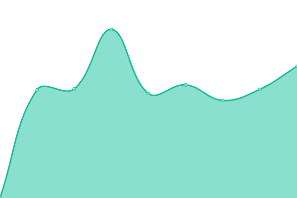 2179ms
     
 | 

<a href="https://volfclub.github.io/travellings-upptime/history/30">100.00%</a>
    

|  [31](https://icheung.net) | 🟩 Up | [31.yml](https://github.com/volfclub/travellings-upptime/commits/HEAD/history/31.yml) | 

 1242ms
     
 | 

<a href="https://volfclub.github.io/travellings-upptime/history/31">100.00%</a>
    

|  [32](https://www.sitstars.com) | 🟩 Up | [32.yml](https://github.com/volfclub/travellings-upptime/commits/HEAD/history/32.yml) | 

 1635ms
     
 | 

<a href="https://volfclub.github.io/travellings-upptime/history/32">100.00%</a>
    

|  [33](https://ionssource.cn) | 🟩 Up | [33.yml](https://github.com/volfclub/travellings-upptime/commits/HEAD/history/33.yml) | 

 1943ms
     
 | 

<a href="https://volfclub.github.io/travellings-upptime/history/33">100.00%</a>
    

|  [35](https://blog.kaygb.com) | 🟩 Up | [35.yml](https://github.com/volfclub/travellings-upptime/commits/HEAD/history/35.yml) | 

 3003ms
     
 | 

<a href="https://volfclub.github.io/travellings-upptime/history/35">100.00%</a>
    

|  [36](https://www.yunyoujun.cn) | 🟩 Up | [36.yml](https://github.com/volfclub/travellings-upptime/commits/HEAD/history/36.yml) | 

 1080ms
     
 | 

<a href="https://volfclub.github.io/travellings-upptime/history/36">100.00%</a>
    

|  [38](https://blog.guhub.cn) | 🟩 Up | [38.yml](https://github.com/volfclub/travellings-upptime/commits/HEAD/history/38.yml) | 

 719ms
     
 | 

<a href="https://volfclub.github.io/travellings-upptime/history/38">100.00%</a>
    

|  [39](https://yuaneuro.cn) | 🟩 Up | [39.yml](https://github.com/volfclub/travellings-upptime/commits/HEAD/history/39.yml) | 

 2116ms
     
 | 

<a href="https://volfclub.github.io/travellings-upptime/history/39">100.00%</a>
    

|  [41](https://krau.top) | 🟩 Up | [41.yml](https://github.com/volfclub/travellings-upptime/commits/HEAD/history/41.yml) | 

 1747ms
     
 | 

<a href="https://volfclub.github.io/travellings-upptime/history/41">100.00%</a>
    

|  [42](https://wfblog.net) | 🟩 Up | [42.yml](https://github.com/volfclub/travellings-upptime/commits/HEAD/history/42.yml) | 

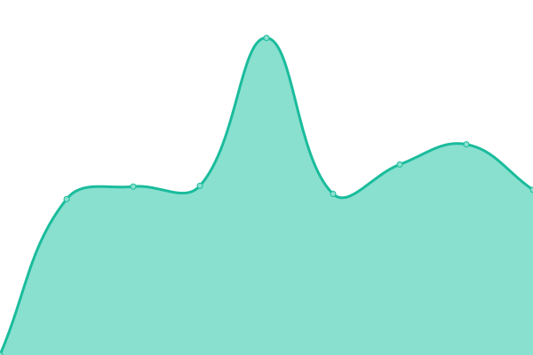 2741ms
     
 | 

<a href="https://volfclub.github.io/travellings-upptime/history/42">100.00%</a>
    

|  [45](https://blog.yegetables.cn) | 🟩 Up | [45.yml](https://github.com/volfclub/travellings-upptime/commits/HEAD/history/45.yml) | 

 1557ms
     
 | 

<a href="https://volfclub.github.io/travellings-upptime/history/45">100.00%</a>
    

|  [46](https://www.freejishu.com) | 🟥 Down | [46.yml](https://github.com/volfclub/travellings-upptime/commits/HEAD/history/46.yml) | 

 0ms
     
 | 

<a href="https://volfclub.github.io/travellings-upptime/history/46">0.06%</a>
    

|  [47](https://baka.fun) | 🟩 Up | [47.yml](https://github.com/volfclub/travellings-upptime/commits/HEAD/history/47.yml) | 

 355ms
     
 | 

<a href="https://volfclub.github.io/travellings-upptime/history/47">100.00%</a>
    

|  [48](https://idream.ink) | 🟩 Up | [48.yml](https://github.com/volfclub/travellings-upptime/commits/HEAD/history/48.yml) | 

 1731ms
     
 | 

<a href="https://volfclub.github.io/travellings-upptime/history/48">100.00%</a>
    

|  [49](https://dpii.club) | 🟩 Up | [49.yml](https://github.com/volfclub/travellings-upptime/commits/HEAD/history/49.yml) | 

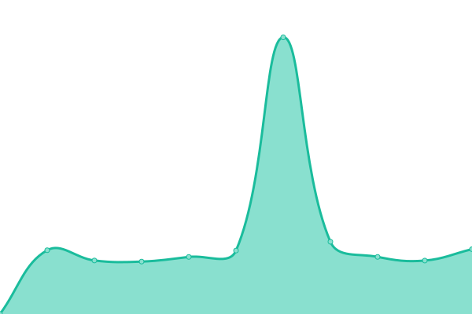 3666ms
     
 | 

<a href="https://volfclub.github.io/travellings-upptime/history/49">100.00%</a>
    

|  [50](https://core.moe) | 🟩 Up | [50.yml](https://github.com/volfclub/travellings-upptime/commits/HEAD/history/50.yml) | 

 466ms
     
 | 

<a href="https://volfclub.github.io/travellings-upptime/history/50">100.00%</a>
    

|  [53](https://www.lin03.cn) | 🟥 Down | [53.yml](https://github.com/volfclub/travellings-upptime/commits/HEAD/history/53.yml) | 

 3242ms
     
 | 

<a href="https://volfclub.github.io/travellings-upptime/history/53">0.02%</a>
    

|  [56](https://blog.tigerroot.cn) | 🟩 Up | [56.yml](https://github.com/volfclub/travellings-upptime/commits/HEAD/history/56.yml) | 

 1932ms
     
 | 

<a href="https://volfclub.github.io/travellings-upptime/history/56">100.00%</a>
    

|  [57](https://kylin.dev) | 🟩 Up | [57.yml](https://github.com/volfclub/travellings-upptime/commits/HEAD/history/57.yml) | 

 402ms
     
 | 

<a href="https://volfclub.github.io/travellings-upptime/history/57">100.00%</a>
    

|  [59](https://www.pluvet.com) | 🟩 Up | [59.yml](https://github.com/volfclub/travellings-upptime/commits/HEAD/history/59.yml) | 

 1127ms
     
 | 

<a href="https://volfclub.github.io/travellings-upptime/history/59">100.00%</a>
    

|  [61](https://www.6zgm.com) | 🟩 Up | [61.yml](https://github.com/volfclub/travellings-upptime/commits/HEAD/history/61.yml) | 

 2036ms
     
 | 

<a href="https://volfclub.github.io/travellings-upptime/history/61">100.00%</a>
    

|  [64](https://blog.ojhdt.com) | 🟩 Up | [64.yml](https://github.com/volfclub/travellings-upptime/commits/HEAD/history/64.yml) | 

 1249ms
     
 | 

<a href="https://volfclub.github.io/travellings-upptime/history/64">100.00%</a>
    

|  [65](https://moechu.cn) | 🟩 Up | [65.yml](https://github.com/volfclub/travellings-upptime/commits/HEAD/history/65.yml) | 

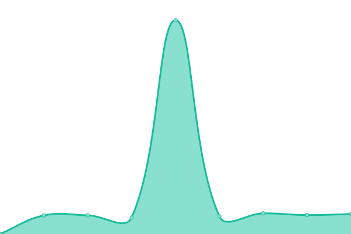 1786ms
     
 | 

<a href="https://volfclub.github.io/travellings-upptime/history/65">100.00%</a>
    

|  [66](https://www.zqcnc.cn) | 🟥 Down | [66.yml](https://github.com/volfclub/travellings-upptime/commits/HEAD/history/66.yml) | 

 0ms
     
 | 

<a href="https://volfclub.github.io/travellings-upptime/history/66">0.02%</a>
    

|  [67](https://blog.mboker.cn) | 🟩 Up | [67.yml](https://github.com/volfclub/travellings-upptime/commits/HEAD/history/67.yml) | 

 2356ms
     
 | 

<a href="https://volfclub.github.io/travellings-upptime/history/67">100.00%</a>
    

|  [70](https://www.jsxlo.com) | 🟥 Down | [70.yml](https://github.com/volfclub/travellings-upptime/commits/HEAD/history/70.yml) | 

 0ms
     
 | 

<a href="https://volfclub.github.io/travellings-upptime/history/70">0.00%</a>
    

|  [71](https://blog.iswl.vip) | 🟩 Up | [71.yml](https://github.com/volfclub/travellings-upptime/commits/HEAD/history/71.yml) | 

 1635ms
     
 | 

<a href="https://volfclub.github.io/travellings-upptime/history/71">100.00%</a>
    

|  [74](https://gupan.site) | 🟩 Up | [74.yml](https://github.com/volfclub/travellings-upptime/commits/HEAD/history/74.yml) | 

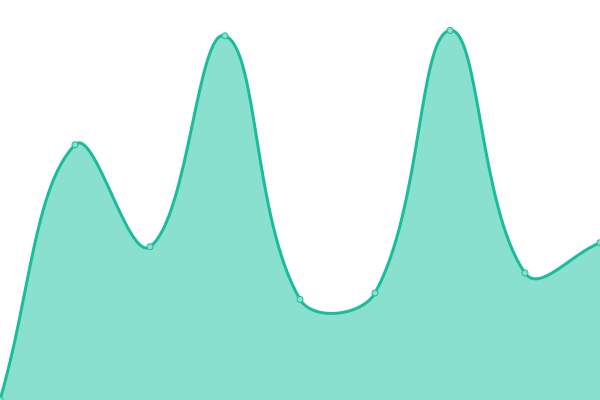 1123ms
     
 | 

<a href="https://volfclub.github.io/travellings-upptime/history/74">100.00%</a>
    

|  [75](https://www.itggg.cn) | 🟩 Up | [75.yml](https://github.com/volfclub/travellings-upptime/commits/HEAD/history/75.yml) | 

 2401ms
     
 | 

<a href="https://volfclub.github.io/travellings-upptime/history/75">100.00%</a>
    

|  [76](https://moshanghua.net) | 🟩 Up | [76.yml](https://github.com/volfclub/travellings-upptime/commits/HEAD/history/76.yml) | 

 3510ms
     
 | 

<a href="https://volfclub.github.io/travellings-upptime/history/76">100.00%</a>
    

|  [77](https://blog.imyan.ren) | 🟩 Up | [77.yml](https://github.com/volfclub/travellings-upptime/commits/HEAD/history/77.yml) | 

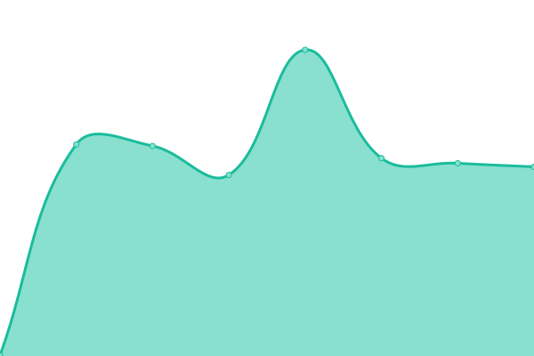 939ms
     
 | 

<a href="https://volfclub.github.io/travellings-upptime/history/77">100.00%</a>
    

|  [78](https://blog.jiehua1995.xyz) | 🟩 Up | [78.yml](https://github.com/volfclub/travellings-upptime/commits/HEAD/history/78.yml) | 

 242ms
     
 | 

<a href="https://volfclub.github.io/travellings-upptime/history/78">100.00%</a>
    

|  [79](https://you.ci) | 🟩 Up | [79.yml](https://github.com/volfclub/travellings-upptime/commits/HEAD/history/79.yml) | 

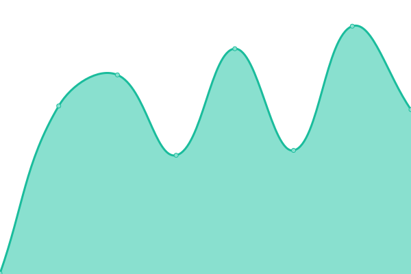 341ms
     
 | 

<a href="https://volfclub.github.io/travellings-upptime/history/79">100.00%</a>
    

|  [81](https://skywt.cn) | 🟩 Up | [81.yml](https://github.com/volfclub/travellings-upptime/commits/HEAD/history/81.yml) | 

 1417ms
     
 | 

<a href="https://volfclub.github.io/travellings-upptime/history/81">100.00%</a>
    

|  [82](https://www.lipk.org) | 🟩 Up | [82.yml](https://github.com/volfclub/travellings-upptime/commits/HEAD/history/82.yml) | 

 597ms
     
 | 

<a href="https://volfclub.github.io/travellings-upptime/history/82">100.00%</a>
    

|  [83](https://www.zkl2333.com) | 🟥 Down | [83.yml](https://github.com/volfclub/travellings-upptime/commits/HEAD/history/83.yml) | 

 1540ms
     
 | 

<a href="https://volfclub.github.io/travellings-upptime/history/83">0.01%</a>
    

|  [84](https://www.whoit.top) | 🟩 Up | [84.yml](https://github.com/volfclub/travellings-upptime/commits/HEAD/history/84.yml) | 

 3116ms
     
 | 

<a href="https://volfclub.github.io/travellings-upptime/history/84">100.00%</a>
    

|  [85](https://takuron.top) | 🟩 Up | [85.yml](https://github.com/volfclub/travellings-upptime/commits/HEAD/history/85.yml) | 

 383ms
     
 | 

<a href="https://volfclub.github.io/travellings-upptime/history/85">100.00%</a>
    

|  [87](https://www.wasabi.fun) | 🟥 Down | [87.yml](https://github.com/volfclub/travellings-upptime/commits/HEAD/history/87.yml) | 

 0ms
     
 | 

<a href="https://volfclub.github.io/travellings-upptime/history/87">0.01%</a>
    

|  [88](https://blog.luvying.com) | 🟩 Up | [88.yml](https://github.com/volfclub/travellings-upptime/commits/HEAD/history/88.yml) | 

 1611ms
     
 | 

<a href="https://volfclub.github.io/travellings-upptime/history/88">100.00%</a>
    

|  [89](https://www.fzxx.xyz) | 🟥 Down | [89.yml](https://github.com/volfclub/travellings-upptime/commits/HEAD/history/89.yml) | 

 592ms
     
 | 

<a href="https://volfclub.github.io/travellings-upptime/history/89">0.00%</a>
    

|  [90](https://noheart.cn) | 🟩 Up | [90.yml](https://github.com/volfclub/travellings-upptime/commits/HEAD/history/90.yml) | 

 1744ms
     
 | 

<a href="https://volfclub.github.io/travellings-upptime/history/90">100.00%</a>
    

|  [91](https://www.addesp.com) | 🟩 Up | [91.yml](https://github.com/volfclub/travellings-upptime/commits/HEAD/history/91.yml) | 

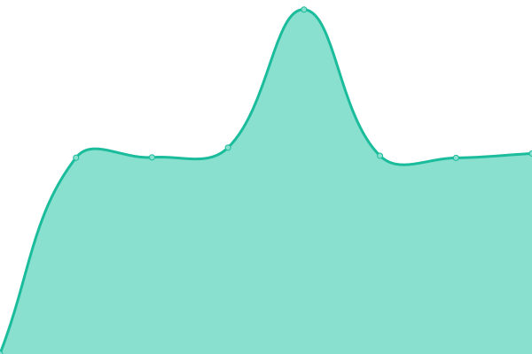 1052ms
     
 | 

<a href="https://volfclub.github.io/travellings-upptime/history/91">100.00%</a>
    

|  [92](https://blog.devyi.com) | 🟩 Up | [92.yml](https://github.com/volfclub/travellings-upptime/commits/HEAD/history/92.yml) | 

 2319ms
     
 | 

<a href="https://volfclub.github.io/travellings-upptime/history/92">100.00%</a>
    

|  [93](https://blog.mhuig.top) | 🟥 Down | [93.yml](https://github.com/volfclub/travellings-upptime/commits/HEAD/history/93.yml) | 

 1126ms
     
 | 

<a href="https://volfclub.github.io/travellings-upptime/history/93">0.00%</a>
    

|  [94](https://blog.jalenchuh.cn) | 🟩 Up | [94.yml](https://github.com/volfclub/travellings-upptime/commits/HEAD/history/94.yml) | 

 408ms
     
 | 

<a href="https://volfclub.github.io/travellings-upptime/history/94">100.00%</a>
    

|  [95](https://blog.6yfz.cn) | 🟩 Up | [95.yml](https://github.com/volfclub/travellings-upptime/commits/HEAD/history/95.yml) | 

 512ms
     
 | 

<a href="https://volfclub.github.io/travellings-upptime/history/95">100.00%</a>
    

|  [96](https://www.geekera.cn) | 🟩 Up | [96.yml](https://github.com/volfclub/travellings-upptime/commits/HEAD/history/96.yml) | 

 2974ms
     
 | 

<a href="https://volfclub.github.io/travellings-upptime/history/96">100.00%</a>
    

|  [98](https://kissbaofish.cn) | 🟥 Down | [98.yml](https://github.com/volfclub/travellings-upptime/commits/HEAD/history/98.yml) | 

 788ms
     
 | 

<a href="https://volfclub.github.io/travellings-upptime/history/98">0.00%</a>
    

|  [99](https://blog.fkun.tech) | 🟩 Up | [99.yml](https://github.com/volfclub/travellings-upptime/commits/HEAD/history/99.yml) | 

 1048ms
     
 | 

<a href="https://volfclub.github.io/travellings-upptime/history/99">100.00%</a>
    

|  [101](https://blog.chrxw.com) | 🟩 Up | [101.yml](https://github.com/volfclub/travellings-upptime/commits/HEAD/history/101.yml) | 

 957ms
     
 | 

<a href="https://volfclub.github.io/travellings-upptime/history/101">100.00%</a>
    

|  [103](https://www.tabirstrees.top) | 🟩 Up | [103.yml](https://github.com/volfclub/travellings-upptime/commits/HEAD/history/103.yml) | 

 412ms
     
 | 

<a href="https://volfclub.github.io/travellings-upptime/history/103">100.00%</a>
    

|  [105](https://jsun969.cn) | 🟩 Up | [105.yml](https://github.com/volfclub/travellings-upptime/commits/HEAD/history/105.yml) | 

 1367ms
     
 | 

<a href="https://volfclub.github.io/travellings-upptime/history/105">100.00%</a>
    

|  [106](https://www.ishells.cn) | 🟩 Up | [106.yml](https://github.com/volfclub/travellings-upptime/commits/HEAD/history/106.yml) | 

 1574ms
     
 | 

<a href="https://volfclub.github.io/travellings-upptime/history/106">100.00%</a>
    

|  [107](https://www.wztlink1013.com) | 🟩 Up | [107.yml](https://github.com/volfclub/travellings-upptime/commits/HEAD/history/107.yml) | 

 2139ms
     
 | 

<a href="https://volfclub.github.io/travellings-upptime/history/107">100.00%</a>
    

|  [108](https://zkpeace.com) | 🟩 Up | [108.yml](https://github.com/volfclub/travellings-upptime/commits/HEAD/history/108.yml) | 

 980ms
     
 | 

<a href="https://volfclub.github.io/travellings-upptime/history/108">100.00%</a>
    

|  [111](https://code016.com) | 🟩 Up | [111.yml](https://github.com/volfclub/travellings-upptime/commits/HEAD/history/111.yml) | 

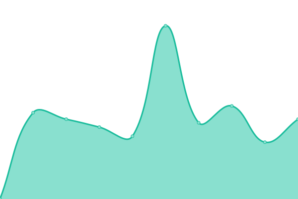 2506ms
     
 | 

<a href="https://volfclub.github.io/travellings-upptime/history/111">100.00%</a>
    

|  [112](https://jimmyqin.cn) | 🟩 Up | [112.yml](https://github.com/volfclub/travellings-upptime/commits/HEAD/history/112.yml) | 

 898ms
     
 | 

<a href="https://volfclub.github.io/travellings-upptime/history/112">100.00%</a>
    

|  [116](https://www.y2jq.com) | 🟩 Up | [116.yml](https://github.com/volfclub/travellings-upptime/commits/HEAD/history/116.yml) | 

 990ms
     
 | 

<a href="https://volfclub.github.io/travellings-upptime/history/116">100.00%</a>
    

|  [117](https://www.chirmyram.top) | 🟩 Up | [117.yml](https://github.com/volfclub/travellings-upptime/commits/HEAD/history/117.yml) | 

 4675ms
     
 | 

<a href="https://volfclub.github.io/travellings-upptime/history/117">100.00%</a>
    

|  [120](https://mzrme.com) | 🟩 Up | [120.yml](https://github.com/volfclub/travellings-upptime/commits/HEAD/history/120.yml) | 

 546ms
     
 | 

<a href="https://volfclub.github.io/travellings-upptime/history/120">100.00%</a>
    

|  [121](https://www.tanknee.cn) | 🟩 Up | [121.yml](https://github.com/volfclub/travellings-upptime/commits/HEAD/history/121.yml) | 

 518ms
     
 | 

<a href="https://volfclub.github.io/travellings-upptime/history/121">100.00%</a>
    

|  [122](https://fx7.top) | 🟩 Up | [122.yml](https://github.com/volfclub/travellings-upptime/commits/HEAD/history/122.yml) | 

 1902ms
     
 | 

<a href="https://volfclub.github.io/travellings-upptime/history/122">100.00%</a>
    

|  [123](https://blog.butanediol.me) | 🟩 Up | [123.yml](https://github.com/volfclub/travellings-upptime/commits/HEAD/history/123.yml) | 

 97ms
     
 | 

<a href="https://volfclub.github.io/travellings-upptime/history/123">100.00%</a>
    

|  [124](https://loafing.cn) | 🟩 Up | [124.yml](https://github.com/volfclub/travellings-upptime/commits/HEAD/history/124.yml) | 

 341ms
     
 | 

<a href="https://volfclub.github.io/travellings-upptime/history/124">100.00%</a>
    

|  [125](https://www.ddg.ink) | 🟥 Down | [125.yml](https://github.com/volfclub/travellings-upptime/commits/HEAD/history/125.yml) | 

 0ms
     
 | 

<a href="https://volfclub.github.io/travellings-upptime/history/125">0.01%</a>
    

|  [126](https://blog.zggsong.cn) | 🟩 Up | [126.yml](https://github.com/volfclub/travellings-upptime/commits/HEAD/history/126.yml) | 

 1851ms
     
 | 

<a href="https://volfclub.github.io/travellings-upptime/history/126">100.00%</a>
    

|  [127](https://bestzuo.cn) | 🟩 Up | [127.yml](https://github.com/volfclub/travellings-upptime/commits/HEAD/history/127.yml) | 

 2231ms
     
 | 

<a href="https://volfclub.github.io/travellings-upptime/history/127">100.00%</a>
    

|  [128](https://handsonic.top) | 🟩 Up | [128.yml](https://github.com/volfclub/travellings-upptime/commits/HEAD/history/128.yml) | 

 1469ms
     
 | 

<a href="https://volfclub.github.io/travellings-upptime/history/128">100.00%</a>
    

|  [130](https://fushaolei.github.io) | 🟩 Up | [130.yml](https://github.com/volfclub/travellings-upptime/commits/HEAD/history/130.yml) | 

 133ms
     
 | 

<a href="https://volfclub.github.io/travellings-upptime/history/130">100.00%</a>
    

|  [131](https://iktao.cn) | 🟥 Down | [131.yml](https://github.com/volfclub/travellings-upptime/commits/HEAD/history/131.yml) | 

 0ms
     
 | 

<a href="https://volfclub.github.io/travellings-upptime/history/131">0.01%</a>
    

|  [132](https://innei.ren) | 🟩 Up | [132.yml](https://github.com/volfclub/travellings-upptime/commits/HEAD/history/132.yml) | 

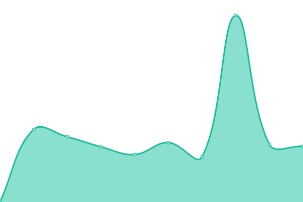 1955ms
     
 | 

<a href="https://volfclub.github.io/travellings-upptime/history/132">100.00%</a>
    

|  [133](https://dusays.com) | 🟩 Up | [133.yml](https://github.com/volfclub/travellings-upptime/commits/HEAD/history/133.yml) | 

 2429ms
     
 | 

<a href="https://volfclub.github.io/travellings-upptime/history/133">100.00%</a>
    

|  [134](https://www.wangyusong.cn) | 🟩 Up | [134.yml](https://github.com/volfclub/travellings-upptime/commits/HEAD/history/134.yml) | 

 1470ms
     
 | 

<a href="https://volfclub.github.io/travellings-upptime/history/134">100.00%</a>
    

|  [135](https://blog.zcmimi.top) | 🟩 Up | [135.yml](https://github.com/volfclub/travellings-upptime/commits/HEAD/history/135.yml) | 

 556ms
     
 | 

<a href="https://volfclub.github.io/travellings-upptime/history/135">100.00%</a>
    

|  [136](https://blog.tengfei.website) | 🟩 Up | [136.yml](https://github.com/volfclub/travellings-upptime/commits/HEAD/history/136.yml) | 

 3020ms
     
 | 

<a href="https://volfclub.github.io/travellings-upptime/history/136">100.00%</a>
    

|  [137](https://www.zk1220.com) | 🟩 Up | [137.yml](https://github.com/volfclub/travellings-upptime/commits/HEAD/history/137.yml) | 

 2350ms
     
 | 

<a href="https://volfclub.github.io/travellings-upptime/history/137">100.00%</a>
    

|  [139](https://colsrch.cn) | 🟩 Up | [139.yml](https://github.com/volfclub/travellings-upptime/commits/HEAD/history/139.yml) | 

 3253ms
     
 | 

<a href="https://volfclub.github.io/travellings-upptime/history/139">100.00%</a>
    

|  [140](https://azusemisa.top) | 🟥 Down | [140.yml](https://github.com/volfclub/travellings-upptime/commits/HEAD/history/140.yml) | 

 0ms
     
 | 

<a href="https://volfclub.github.io/travellings-upptime/history/140">0.01%</a>
    

|  [142](https://www.yilantingfeng.site) | 🟩 Up | [142.yml](https://github.com/volfclub/travellings-upptime/commits/HEAD/history/142.yml) | 

 4197ms
     
 | 

<a href="https://volfclub.github.io/travellings-upptime/history/142">100.00%</a>
    

|  [143](https://hasaik.com) | 🟩 Up | [143.yml](https://github.com/volfclub/travellings-upptime/commits/HEAD/history/143.yml) | 

 366ms
     
 | 

<a href="https://volfclub.github.io/travellings-upptime/history/143">100.00%</a>
    

|  [144](https://shoka.lostyu.me) | 🟩 Up | [144.yml](https://github.com/volfclub/travellings-upptime/commits/HEAD/history/144.yml) | 

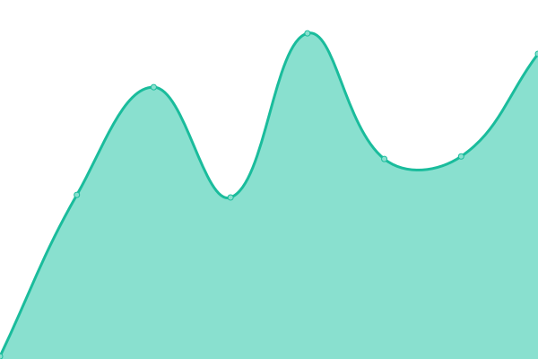 158ms
     
 | 

<a href="https://volfclub.github.io/travellings-upptime/history/144">100.00%</a>
    

|  [145](https://rain.moimo.me) | 🟩 Up | [145.yml](https://github.com/volfclub/travellings-upptime/commits/HEAD/history/145.yml) | 

 779ms
     
 | 

<a href="https://volfclub.github.io/travellings-upptime/history/145">100.00%</a>
    

|  [146](https://zigzagk.top) | 🟩 Up | [146.yml](https://github.com/volfclub/travellings-upptime/commits/HEAD/history/146.yml) | 

 2122ms
     
 | 

<a href="https://volfclub.github.io/travellings-upptime/history/146">100.00%</a>
    

|  [147](https://jsongx.com) | 🟩 Up | [147.yml](https://github.com/volfclub/travellings-upptime/commits/HEAD/history/147.yml) | 

 1568ms
     
 | 

<a href="https://volfclub.github.io/travellings-upptime/history/147">100.00%</a>
    

|  [148](https://www.kiritoghy.cn) | 🟩 Up | [148.yml](https://github.com/volfclub/travellings-upptime/commits/HEAD/history/148.yml) | 

 1453ms
     
 | 

<a href="https://volfclub.github.io/travellings-upptime/history/148">100.00%</a>
    

|  [149](https://www.cnblogs.com/borber) | 🟩 Up | [149.yml](https://github.com/volfclub/travellings-upptime/commits/HEAD/history/149.yml) | 

 2412ms
     
 | 

<a href="https://volfclub.github.io/travellings-upptime/history/149">100.00%</a>
    

|  [151](https://loafing.cn) | 🟩 Up | [151.yml](https://github.com/volfclub/travellings-upptime/commits/HEAD/history/151.yml) | 

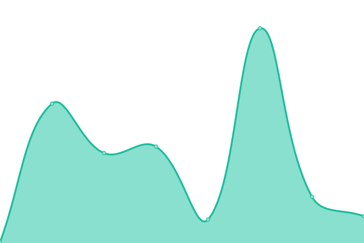 74ms
     
 | 

<a href="https://volfclub.github.io/travellings-upptime/history/151">100.00%</a>
    

|  [155](https://xd.sh.cn) | 🟩 Up | [155.yml](https://github.com/volfclub/travellings-upptime/commits/HEAD/history/155.yml) | 

 1963ms
     
 | 

<a href="https://volfclub.github.io/travellings-upptime/history/155">100.00%</a>
    

|  [156](https://realmicah.xyz) | 🟩 Up | [156.yml](https://github.com/volfclub/travellings-upptime/commits/HEAD/history/156.yml) | 

 1772ms
     
 | 

<a href="https://volfclub.github.io/travellings-upptime/history/156">100.00%</a>
    

|  [157](https://www.timochan.cn) | 🟩 Up | [157.yml](https://github.com/volfclub/travellings-upptime/commits/HEAD/history/157.yml) | 

 1800ms
     
 | 

<a href="https://volfclub.github.io/travellings-upptime/history/157">100.00%</a>
    

|  [158](https://www.coolku.cc) | 🟩 Up | [158.yml](https://github.com/volfclub/travellings-upptime/commits/HEAD/history/158.yml) | 

 2748ms
     
 | 

<a href="https://volfclub.github.io/travellings-upptime/history/158">100.00%</a>
    

|  [159](https://www.summerpond.cn) | 🟩 Up | [159.yml](https://github.com/volfclub/travellings-upptime/commits/HEAD/history/159.yml) | 

 2918ms
     
 | 

<a href="https://volfclub.github.io/travellings-upptime/history/159">100.00%</a>
    

|  [160](https://blog.fivezha.cn) | 🟩 Up | [160.yml](https://github.com/volfclub/travellings-upptime/commits/HEAD/history/160.yml) | 

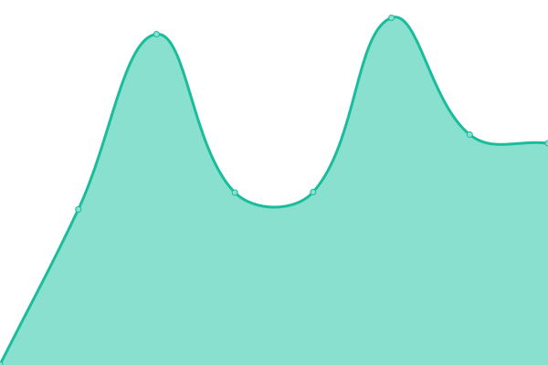 570ms
     
 | 

<a href="https://volfclub.github.io/travellings-upptime/history/160">100.00%</a>
    

|  [162](https://wnag.com.cn) | 🟩 Up | [162.yml](https://github.com/volfclub/travellings-upptime/commits/HEAD/history/162.yml) | 

 3219ms
     
 | 

<a href="https://volfclub.github.io/travellings-upptime/history/162">100.00%</a>
    

|  [163](https://www.acg19.top) | 🟩 Up | [163.yml](https://github.com/volfclub/travellings-upptime/commits/HEAD/history/163.yml) | 

 1819ms
     
 | 

<a href="https://volfclub.github.io/travellings-upptime/history/163">100.00%</a>
    

|  [164](https://www.paddylin.top) | 🟥 Down | [164.yml](https://github.com/volfclub/travellings-upptime/commits/HEAD/history/164.yml) | 

 0ms
     
 | 

<a href="https://volfclub.github.io/travellings-upptime/history/164">0.00%</a>
    

|  [165](https://kurumit3.top) | 🟩 Up | [165.yml](https://github.com/volfclub/travellings-upptime/commits/HEAD/history/165.yml) | 

 2183ms
     
 | 

<a href="https://volfclub.github.io/travellings-upptime/history/165">100.00%</a>
    

|  [166](https://blog.limecho.net) | 🟩 Up | [166.yml](https://github.com/volfclub/travellings-upptime/commits/HEAD/history/166.yml) | 

 1535ms
     
 | 

<a href="https://volfclub.github.io/travellings-upptime/history/166">100.00%</a>
    

|  [167](https://blog.pppane.com) | 🟩 Up | [167.yml](https://github.com/volfclub/travellings-upptime/commits/HEAD/history/167.yml) | 

 1494ms
     
 | 

<a href="https://volfclub.github.io/travellings-upptime/history/167">100.00%</a>
    

|  [171](https://ccccc.cyou) | 🟥 Down | [171.yml](https://github.com/volfclub/travellings-upptime/commits/HEAD/history/171.yml) | 

 0ms
     
 | 

<a href="https://volfclub.github.io/travellings-upptime/history/171">0.00%</a>
    

|  [172](https://www.funix.cn) | 🟩 Up | [172.yml](https://github.com/volfclub/travellings-upptime/commits/HEAD/history/172.yml) | 

 1556ms
     
 | 

<a href="https://volfclub.github.io/travellings-upptime/history/172">100.00%</a>
    

|  [173](https://www.codinglink.tech) | 🟩 Up | [173.yml](https://github.com/volfclub/travellings-upptime/commits/HEAD/history/173.yml) | 

 1324ms
     
 | 

<a href="https://volfclub.github.io/travellings-upptime/history/173">100.00%</a>
    

|  [174](https://www.bluesdawn.top) | 🟩 Up | [174.yml](https://github.com/volfclub/travellings-upptime/commits/HEAD/history/174.yml) | 

 3499ms
     
 | 

<a href="https://volfclub.github.io/travellings-upptime/history/174">100.00%</a>
    

|  [175](https://www.libertystore.one) | 🟥 Down | [175.yml](https://github.com/volfclub/travellings-upptime/commits/HEAD/history/175.yml) | 

 0ms
     
 | 

<a href="https://volfclub.github.io/travellings-upptime/history/175">0.01%</a>
    

|  [176](https://blog.cyfan.top) | 🟩 Up | [176.yml](https://github.com/volfclub/travellings-upptime/commits/HEAD/history/176.yml) | 

 372ms
     
 | 

<a href="https://volfclub.github.io/travellings-upptime/history/176">100.00%</a>
    

|  [178](https://blog.luzy.top) | 🟩 Up | [178.yml](https://github.com/volfclub/travellings-upptime/commits/HEAD/history/178.yml) | 

 516ms
     
 | 

<a href="https://volfclub.github.io/travellings-upptime/history/178">100.00%</a>
    

|  [179](https://senorui.top) | 🟩 Up | [179.yml](https://github.com/volfclub/travellings-upptime/commits/HEAD/history/179.yml) | 

 2027ms
     
 | 

<a href="https://volfclub.github.io/travellings-upptime/history/179">100.00%</a>
    

|  [180](https://www.szfc13.cn) | 🟩 Up | [180.yml](https://github.com/volfclub/travellings-upptime/commits/HEAD/history/180.yml) | 

 594ms
     
 | 

<a href="https://volfclub.github.io/travellings-upptime/history/180">100.00%</a>
    

|  [181](https://blog.lihaojin.cn) | 🟩 Up | [181.yml](https://github.com/volfclub/travellings-upptime/commits/HEAD/history/181.yml) | 

 3741ms
     
 | 

<a href="https://volfclub.github.io/travellings-upptime/history/181">100.00%</a>
    

|  [182](https://www.saroin.com) | 🟩 Up | [182.yml](https://github.com/volfclub/travellings-upptime/commits/HEAD/history/182.yml) | 

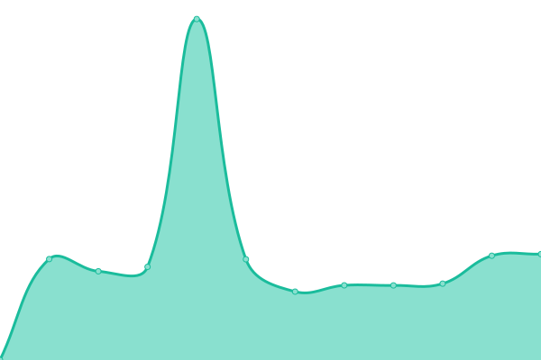 2917ms
     
 | 

<a href="https://volfclub.github.io/travellings-upptime/history/182">100.00%</a>
    

|  [183](https://zhenwu99.gitee.io) | 🟩 Up | [183.yml](https://github.com/volfclub/travellings-upptime/commits/HEAD/history/183.yml) | 

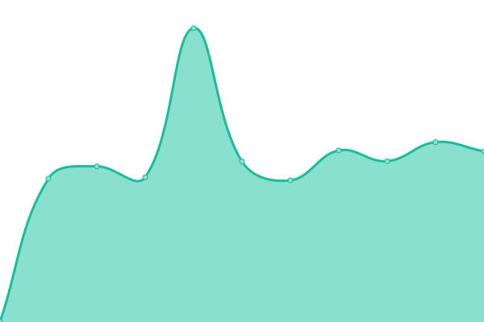 1971ms
     
 | 

<a href="https://volfclub.github.io/travellings-upptime/history/183">100.00%</a>
    

|  [186](https://johnsonlee.site) | 🟩 Up | [186.yml](https://github.com/volfclub/travellings-upptime/commits/HEAD/history/186.yml) | 

 868ms
     
 | 

<a href="https://volfclub.github.io/travellings-upptime/history/186">100.00%</a>
    

|  [187](https://www.leejean.top) | 🟩 Up | [187.yml](https://github.com/volfclub/travellings-upptime/commits/HEAD/history/187.yml) | 

 3262ms
     
 | 

<a href="https://volfclub.github.io/travellings-upptime/history/187">100.00%</a>
    

|  [189](https://www.extingstudio.com) | 🟩 Up | [189.yml](https://github.com/volfclub/travellings-upptime/commits/HEAD/history/189.yml) | 

 471ms
     
 | 

<a href="https://volfclub.github.io/travellings-upptime/history/189">100.00%</a>
    

|  [190](https://www.yunshu.site) | 🟩 Up | [190.yml](https://github.com/volfclub/travellings-upptime/commits/HEAD/history/190.yml) | 

 1922ms
     
 | 

<a href="https://volfclub.github.io/travellings-upptime/history/190">100.00%</a>
    

|  [192](https://xiaokang.me) | 🟩 Up | [192.yml](https://github.com/volfclub/travellings-upptime/commits/HEAD/history/192.yml) | 

 418ms
     
 | 

<a href="https://volfclub.github.io/travellings-upptime/history/192">100.00%</a>
    

|  [193](https://megatontech.github.io) | 🟩 Up | [193.yml](https://github.com/volfclub/travellings-upptime/commits/HEAD/history/193.yml) | 

 185ms
     
 | 

<a href="https://volfclub.github.io/travellings-upptime/history/193">100.00%</a>
    

|  [194](https://heshun.run) | 🟩 Up | [194.yml](https://github.com/volfclub/travellings-upptime/commits/HEAD/history/194.yml) | 

 1580ms
     
 | 

<a href="https://volfclub.github.io/travellings-upptime/history/194">100.00%</a>
    

|  [195](https://huiris.com) | 🟩 Up | [195.yml](https://github.com/volfclub/travellings-upptime/commits/HEAD/history/195.yml) | 

 2220ms
     
 | 

<a href="https://volfclub.github.io/travellings-upptime/history/195">100.00%</a>
    

|  [196](https://ivampiresp.com) | 🟩 Up | [196.yml](https://github.com/volfclub/travellings-upptime/commits/HEAD/history/196.yml) | 

 1518ms
     
 | 

<a href="https://volfclub.github.io/travellings-upptime/history/196">100.00%</a>
    

|  [197](https://ishya.top) | 🟩 Up | [197.yml](https://github.com/volfclub/travellings-upptime/commits/HEAD/history/197.yml) | 

 523ms
     
 | 

<a href="https://volfclub.github.io/travellings-upptime/history/197">100.00%</a>
    

|  [198](https://blog.mbrjun.cn) | 🟩 Up | [198.yml](https://github.com/volfclub/travellings-upptime/commits/HEAD/history/198.yml) | 

 2278ms
     
 | 

<a href="https://volfclub.github.io/travellings-upptime/history/198">100.00%</a>
    

|  [200](https://youdef.com) | 🟩 Up | [200.yml](https://github.com/volfclub/travellings-upptime/commits/HEAD/history/200.yml) | 

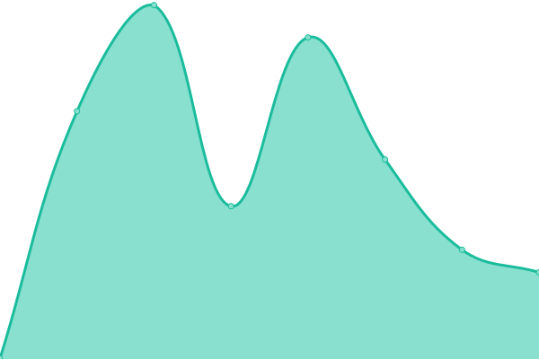 293ms
     
 | 

<a href="https://volfclub.github.io/travellings-upptime/history/200">100.00%</a>
    

|  [201](https://www.heson10.com) | 🟩 Up | [201.yml](https://github.com/volfclub/travellings-upptime/commits/HEAD/history/201.yml) | 

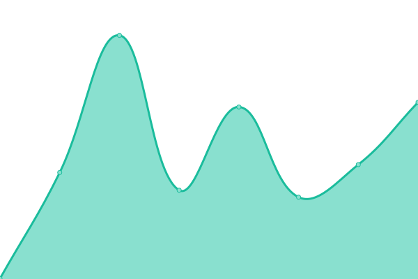 245ms
     
 | 

<a href="https://volfclub.github.io/travellings-upptime/history/201">100.00%</a>
    

|  [202](https://yunfanch.com) | 🟩 Up | [202.yml](https://github.com/volfclub/travellings-upptime/commits/HEAD/history/202.yml) | 

 1130ms
     
 | 

<a href="https://volfclub.github.io/travellings-upptime/history/202">100.00%</a>
    

|  [204](https://www.feidaoboke.com) | 🟩 Up | [204.yml](https://github.com/volfclub/travellings-upptime/commits/HEAD/history/204.yml) | 

 2044ms
     
 | 

<a href="https://volfclub.github.io/travellings-upptime/history/204">100.00%</a>
    

|  [205](https://vpsur.com) | 🟩 Up | [205.yml](https://github.com/volfclub/travellings-upptime/commits/HEAD/history/205.yml) | 

 2688ms
     
 | 

<a href="https://volfclub.github.io/travellings-upptime/history/205">100.00%</a>
    

|  [206](https://yexsi.com) | 🟩 Up | [206.yml](https://github.com/volfclub/travellings-upptime/commits/HEAD/history/206.yml) | 

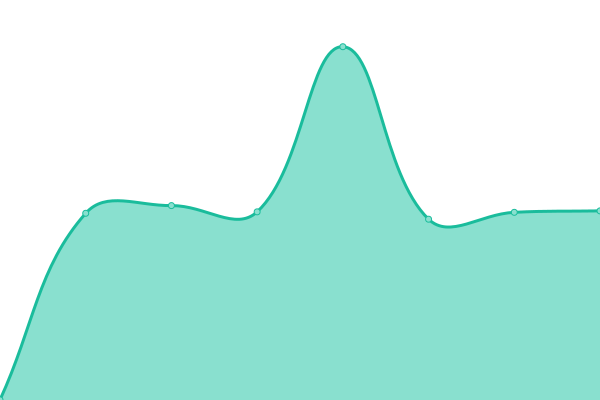 1329ms
     
 | 

<a href="https://volfclub.github.io/travellings-upptime/history/206">100.00%</a>
    

|  [208](https://vmert.com) | 🟥 Down | [208.yml](https://github.com/volfclub/travellings-upptime/commits/HEAD/history/208.yml) | 

 131ms
     
 | 

<a href="https://volfclub.github.io/travellings-upptime/history/208">0.00%</a>
    

|  [209](https://openwit.net) | 🟩 Up | [209.yml](https://github.com/volfclub/travellings-upptime/commits/HEAD/history/209.yml) | 

 7258ms
     
 | 

<a href="https://volfclub.github.io/travellings-upptime/history/209">100.00%</a>
    

|  [210](https://fiammanda.github.io) | 🟩 Up | [210.yml](https://github.com/volfclub/travellings-upptime/commits/HEAD/history/210.yml) | 

 99ms
     
 | 

<a href="https://volfclub.github.io/travellings-upptime/history/210">100.00%</a>
    

|  [211](https://www.xiangshu233.cn) | 🟩 Up | [211.yml](https://github.com/volfclub/travellings-upptime/commits/HEAD/history/211.yml) | 

 1746ms
     
 | 

<a href="https://volfclub.github.io/travellings-upptime/history/211">100.00%</a>
    

|  [212](https://7bxing.com) | 🟩 Up | [212.yml](https://github.com/volfclub/travellings-upptime/commits/HEAD/history/212.yml) | 

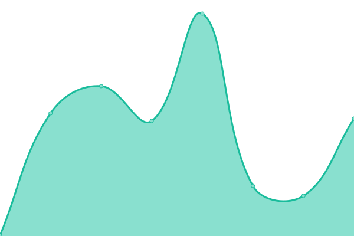 266ms
     
 | 

<a href="https://volfclub.github.io/travellings-upptime/history/212">100.00%</a>
    

|  [213](https://www.overme.cn) | 🟩 Up | [213.yml](https://github.com/volfclub/travellings-upptime/commits/HEAD/history/213.yml) | 

 1748ms
     
 | 

<a href="https://volfclub.github.io/travellings-upptime/history/213">100.00%</a>
    

|  [214](https://vinking.top) | 🟩 Up | [214.yml](https://github.com/volfclub/travellings-upptime/commits/HEAD/history/214.yml) | 

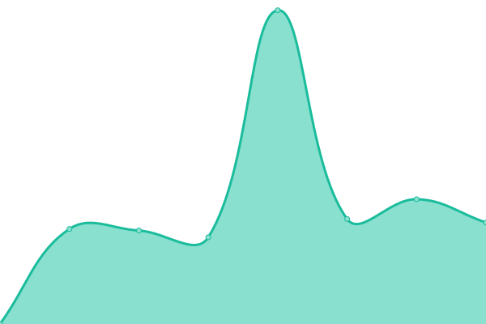 2127ms
     
 | 

<a href="https://volfclub.github.io/travellings-upptime/history/214">100.00%</a>
    

|  [215](https://www.mmcee.cn) | 🟩 Up | [215.yml](https://github.com/volfclub/travellings-upptime/commits/HEAD/history/215.yml) | 

 1892ms
     
 | 

<a href="https://volfclub.github.io/travellings-upptime/history/215">100.00%</a>
    

|  [216](https://www.wenbin.org.cn) | 🟥 Down | [216.yml](https://github.com/volfclub/travellings-upptime/commits/HEAD/history/216.yml) | 

 0ms
     
 | 

<a href="https://volfclub.github.io/travellings-upptime/history/216">0.00%</a>
    

|  [217](https://fang.blog.miri.site) | 🟥 Down | [217.yml](https://github.com/volfclub/travellings-upptime/commits/HEAD/history/217.yml) | 

 0ms
     
 | 

<a href="https://volfclub.github.io/travellings-upptime/history/217">0.01%</a>
    

|  [218](https://hiwannz.com) | 🟩 Up | [218.yml](https://github.com/volfclub/travellings-upptime/commits/HEAD/history/218.yml) | 

 1373ms
     
 | 

<a href="https://volfclub.github.io/travellings-upptime/history/218">100.00%</a>
    

|  [219](https://www.zlinblog.cn) | 🟩 Up | [219.yml](https://github.com/volfclub/travellings-upptime/commits/HEAD/history/219.yml) | 

 1360ms
     
 | 

<a href="https://volfclub.github.io/travellings-upptime/history/219">100.00%</a>
    

|  [220](https://rhythmlian.cn) | 🟥 Down | [220.yml](https://github.com/volfclub/travellings-upptime/commits/HEAD/history/220.yml) | 

 0ms
     
 | 

<a href="https://volfclub.github.io/travellings-upptime/history/220">0.01%</a>
    

|  [221](https://alpaca.plus) | 🟩 Up | [221.yml](https://github.com/volfclub/travellings-upptime/commits/HEAD/history/221.yml) | 

 2366ms
     
 | 

<a href="https://volfclub.github.io/travellings-upptime/history/221">100.00%</a>
    

|  [222](https://yingwiki.top) | 🟩 Up | [222.yml](https://github.com/volfclub/travellings-upptime/commits/HEAD/history/222.yml) | 

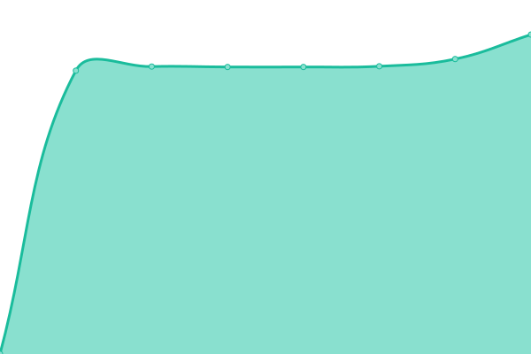 2838ms
     
 | 

<a href="https://volfclub.github.io/travellings-upptime/history/222">100.00%</a>
    

|  [223](https://qikaile.tk) | 🟩 Up | [223.yml](https://github.com/volfclub/travellings-upptime/commits/HEAD/history/223.yml) | 

 522ms
     
 | 

<a href="https://volfclub.github.io/travellings-upptime/history/223">100.00%</a>
    

|  [224](https://funs.life) | 🟩 Up | [224.yml](https://github.com/volfclub/travellings-upptime/commits/HEAD/history/224.yml) | 

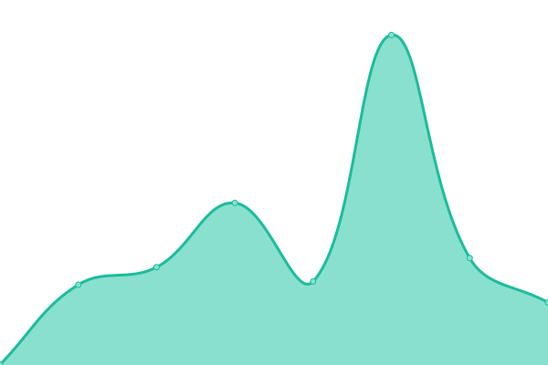 220ms
     
 | 

<a href="https://volfclub.github.io/travellings-upptime/history/224">100.00%</a>
    

|  [225](https://www.tdrme.cn) | 🟩 Up | [225.yml](https://github.com/volfclub/travellings-upptime/commits/HEAD/history/225.yml) | 

 1621ms
     
 | 

<a href="https://volfclub.github.io/travellings-upptime/history/225">100.00%</a>
    

|  [226](https://hongcyu.cn) | 🟩 Up | [226.yml](https://github.com/volfclub/travellings-upptime/commits/HEAD/history/226.yml) | 

 1379ms
     
 | 

<a href="https://volfclub.github.io/travellings-upptime/history/226">100.00%</a>
    

|  [227](https://neo00.top) | 🟩 Up | [227.yml](https://github.com/volfclub/travellings-upptime/commits/HEAD/history/227.yml) | 

 1444ms
     
 | 

<a href="https://volfclub.github.io/travellings-upptime/history/227">100.00%</a>
    

|  [229](https://blog.tomys.top) | 🟩 Up | [229.yml](https://github.com/volfclub/travellings-upptime/commits/HEAD/history/229.yml) | 

 6798ms
     
 | 

<a href="https://volfclub.github.io/travellings-upptime/history/229">100.00%</a>
    

|  [230](https://www.yidiankuaile.com) | 🟩 Up | [230.yml](https://github.com/volfclub/travellings-upptime/commits/HEAD/history/230.yml) | 

 1261ms
     
 | 

<a href="https://volfclub.github.io/travellings-upptime/history/230">100.00%</a>
    

|  [231](https://blog.angustar.com) | 🟩 Up | [231.yml](https://github.com/volfclub/travellings-upptime/commits/HEAD/history/231.yml) | 

 1506ms
     
 | 

<a href="https://volfclub.github.io/travellings-upptime/history/231">100.00%</a>
    

|  [232](https://blog.shiertx.com) | 🟩 Up | [232.yml](https://github.com/volfclub/travellings-upptime/commits/HEAD/history/232.yml) | 

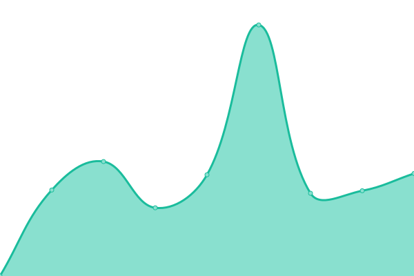 1596ms
     
 | 

<a href="https://volfclub.github.io/travellings-upptime/history/232">100.00%</a>
    

|  [233](https://blog.nekomoyi.com) | 🟩 Up | [233.yml](https://github.com/volfclub/travellings-upptime/commits/HEAD/history/233.yml) | 

 428ms
     
 | 

<a href="https://volfclub.github.io/travellings-upptime/history/233">100.00%</a>
    

|  [234](https://www.yotroy.cool) | 🟩 Up | [234.yml](https://github.com/volfclub/travellings-upptime/commits/HEAD/history/234.yml) | 

 1165ms
     
 | 

<a href="https://volfclub.github.io/travellings-upptime/history/234">100.00%</a>
    

|  [236](https://imszz.com) | 🟩 Up | [236.yml](https://github.com/volfclub/travellings-upptime/commits/HEAD/history/236.yml) | 

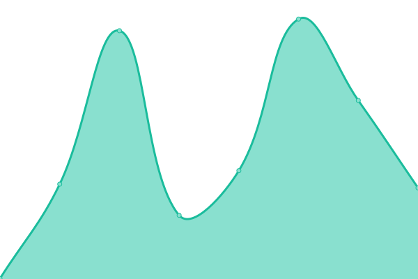 461ms
     
 | 

<a href="https://volfclub.github.io/travellings-upptime/history/236">100.00%</a>
    

|  [238](https://ender.fun) | 🟩 Up | [238.yml](https://github.com/volfclub/travellings-upptime/commits/HEAD/history/238.yml) | 

 195ms
     
 | 

<a href="https://volfclub.github.io/travellings-upptime/history/238">100.00%</a>
    

|  [239](https://www.syzhan.cn) | 🟥 Down | [239.yml](https://github.com/volfclub/travellings-upptime/commits/HEAD/history/239.yml) | 

 0ms
     
 | 

<a href="https://volfclub.github.io/travellings-upptime/history/239">0.01%</a>
    

|  [240](https://www.liuzhimin.vip) | 🟩 Up | [240.yml](https://github.com/volfclub/travellings-upptime/commits/HEAD/history/240.yml) | 

 1689ms
     
 | 

<a href="https://volfclub.github.io/travellings-upptime/history/240">100.00%</a>
    

|  [241](https://www.hin.cool) | 🟩 Up | [241.yml](https://github.com/volfclub/travellings-upptime/commits/HEAD/history/241.yml) | 

 264ms
     
 | 

<a href="https://volfclub.github.io/travellings-upptime/history/241">100.00%</a>
    

|  [242](https://www.3328bk.cn) | 🟩 Up | [242.yml](https://github.com/volfclub/travellings-upptime/commits/HEAD/history/242.yml) | 

 3850ms
     
 | 

<a href="https://volfclub.github.io/travellings-upptime/history/242">100.00%</a>
    

|  [243](https://www.ganto.cn) | 🟩 Up | [243.yml](https://github.com/volfclub/travellings-upptime/commits/HEAD/history/243.yml) | 

 1163ms
     
 | 

<a href="https://volfclub.github.io/travellings-upptime/history/243">100.00%</a>
    

|  [244](https://weidows.github.io) | 🟩 Up | [244.yml](https://github.com/volfclub/travellings-upptime/commits/HEAD/history/244.yml) | 

 255ms
     
 | 

<a href="https://volfclub.github.io/travellings-upptime/history/244">100.00%</a>
    

|  [245](https://magma.ink) | 🟩 Up | [245.yml](https://github.com/volfclub/travellings-upptime/commits/HEAD/history/245.yml) | 

 1323ms
     
 | 

<a href="https://volfclub.github.io/travellings-upptime/history/245">100.00%</a>
    

|  [246](https://yzyyz.top) | 🟩 Up | [246.yml](https://github.com/volfclub/travellings-upptime/commits/HEAD/history/246.yml) | 

 4737ms
     
 | 

<a href="https://volfclub.github.io/travellings-upptime/history/246">100.00%</a>
    

|  [247](www.idasx.com) | 🟩 Up | [247.yml](https://github.com/volfclub/travellings-upptime/commits/HEAD/history/247.yml) | 

 1804ms
     
 | 

<a href="https://volfclub.github.io/travellings-upptime/history/247">100.00%</a>
    

|  [248](https://blog.xecades.xyz) | 🟩 Up | [248.yml](https://github.com/volfclub/travellings-upptime/commits/HEAD/history/248.yml) | 

 273ms
     
 | 

<a href="https://volfclub.github.io/travellings-upptime/history/248">100.00%</a>
    

|  [249](https://blog.amoswu.cn) | 🟩 Up | [249.yml](https://github.com/volfclub/travellings-upptime/commits/HEAD/history/249.yml) | 

 2268ms
     
 | 

<a href="https://volfclub.github.io/travellings-upptime/history/249">100.00%</a>
    

|  [250](https://www.mrgod.cn) | 🟩 Up | [250.yml](https://github.com/volfclub/travellings-upptime/commits/HEAD/history/250.yml) | 

 3066ms
     
 | 

<a href="https://volfclub.github.io/travellings-upptime/history/250">100.00%</a>
    

|  [251](https://www.extlight.com) | 🟩 Up | [251.yml](https://github.com/volfclub/travellings-upptime/commits/HEAD/history/251.yml) | 

 1507ms
     
 | 

<a href="https://volfclub.github.io/travellings-upptime/history/251">100.00%</a>
    

|  [252](https://666wxy666.github.io) | 🟩 Up | [252.yml](https://github.com/volfclub/travellings-upptime/commits/HEAD/history/252.yml) | 

 182ms
     
 | 

<a href="https://volfclub.github.io/travellings-upptime/history/252">100.00%</a>
    

|  [253](https://err0r.top) | 🟩 Up | [253.yml](https://github.com/volfclub/travellings-upptime/commits/HEAD/history/253.yml) | 

 617ms
     
 | 

<a href="https://volfclub.github.io/travellings-upptime/history/253">100.00%</a>
    

|  [254](https://www.ysazw.cn) | 🟥 Down | [254.yml](https://github.com/volfclub/travellings-upptime/commits/HEAD/history/254.yml) | 

 1365ms
     
 | 

<a href="https://volfclub.github.io/travellings-upptime/history/254">4.80%</a>
    

|  [255](https://www.roaing.com) | 🟩 Up | [255.yml](https://github.com/volfclub/travellings-upptime/commits/HEAD/history/255.yml) | 

 1224ms
     
 | 

<a href="https://volfclub.github.io/travellings-upptime/history/255">100.00%</a>
    

|  [256](https://loliloli.moe) | 🟩 Up | [256.yml](https://github.com/volfclub/travellings-upptime/commits/HEAD/history/256.yml) | 

 571ms
     
 | 

<a href="https://volfclub.github.io/travellings-upptime/history/256">100.00%</a>
    

|  [257](https://blog.iucky.cn) | 🟥 Down | [257.yml](https://github.com/volfclub/travellings-upptime/commits/HEAD/history/257.yml) | 

 655ms
     
 | 

<a href="https://volfclub.github.io/travellings-upptime/history/257">35.12%</a>
    

|  [258](https://blog.7wate.com) | 🟩 Up | [258.yml](https://github.com/volfclub/travellings-upptime/commits/HEAD/history/258.yml) | 

 1912ms
     
 | 

<a href="https://volfclub.github.io/travellings-upptime/history/258">100.00%</a>
    

|  [259](https://www.wulinzeng.vip) | 🟩 Up | [259.yml](https://github.com/volfclub/travellings-upptime/commits/HEAD/history/259.yml) | 

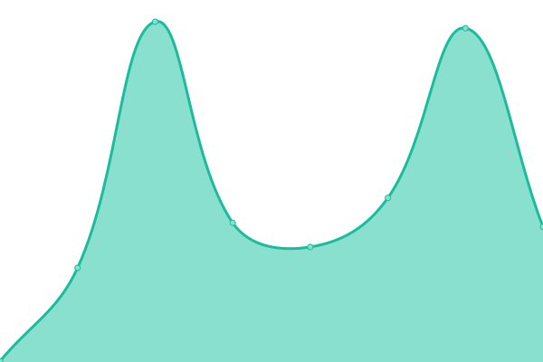 417ms
     
 | 

<a href="https://volfclub.github.io/travellings-upptime/history/259">100.00%</a>
    

|  [260](https://notes.zhangxiaocai.cn) | 🟩 Up | [260.yml](https://github.com/volfclub/travellings-upptime/commits/HEAD/history/260.yml) | 

 2165ms
     
 | 

<a href="https://volfclub.github.io/travellings-upptime/history/260">100.00%</a>
    

|  [261](https://yufan.me) | 🟩 Up | [261.yml](https://github.com/volfclub/travellings-upptime/commits/HEAD/history/261.yml) | 

 1350ms
     
 | 

<a href="https://volfclub.github.io/travellings-upptime/history/261">100.00%</a>
    

|  [262](https://www.tonylsl.top) | 🟩 Up | [262.yml](https://github.com/volfclub/travellings-upptime/commits/HEAD/history/262.yml) | 

 1966ms
     
 | 

<a href="https://volfclub.github.io/travellings-upptime/history/262">100.00%</a>
    

|  [263](https://sciadv.mcseekeri.top) | 🟥 Down | [263.yml](https://github.com/volfclub/travellings-upptime/commits/HEAD/history/263.yml) | 

 2075ms
     
 | 

<a href="https://volfclub.github.io/travellings-upptime/history/263">0.01%</a>
    

|  [264](https://misakaloli.com) | 🟩 Up | [264.yml](https://github.com/volfclub/travellings-upptime/commits/HEAD/history/264.yml) | 

 1915ms
     
 | 

<a href="https://volfclub.github.io/travellings-upptime/history/264">100.00%</a>
    

|  [265](https://blog.stevelbr.top) | 🟥 Down | [265.yml](https://github.com/volfclub/travellings-upptime/commits/HEAD/history/265.yml) | 

 389ms
     
 | 

<a href="https://volfclub.github.io/travellings-upptime/history/265">0.00%</a>
    

|  [266](https://www.fwder.cn) | 🟩 Up | [266.yml](https://github.com/volfclub/travellings-upptime/commits/HEAD/history/266.yml) | 

 2368ms
     
 | 

<a href="https://volfclub.github.io/travellings-upptime/history/266">100.00%</a>
    

|  [267](https://blog.toutop.cn) | 🟩 Up | [267.yml](https://github.com/volfclub/travellings-upptime/commits/HEAD/history/267.yml) | 

 1408ms
     
 | 

<a href="https://volfclub.github.io/travellings-upptime/history/267">100.00%</a>
    

|  [268](https://ghostsf.com) | 🟩 Up | [268.yml](https://github.com/volfclub/travellings-upptime/commits/HEAD/history/268.yml) | 

 2175ms
     
 | 

<a href="https://volfclub.github.io/travellings-upptime/history/268">100.00%</a>
    

|  [269](https://www.xiaobai666.top) | 🟩 Up | [269.yml](https://github.com/volfclub/travellings-upptime/commits/HEAD/history/269.yml) | 

 4970ms
     
 | 

<a href="https://volfclub.github.io/travellings-upptime/history/269">100.00%</a>
    

|  [270](https://www.moleft.cn) | 🟥 Down | [270.yml](https://github.com/volfclub/travellings-upptime/commits/HEAD/history/270.yml) | 

 0ms
     
 | 

<a href="https://volfclub.github.io/travellings-upptime/history/270">0.05%</a>
    

|  [271](https://crash-logs.cn) | 🟩 Up | [271.yml](https://github.com/volfclub/travellings-upptime/commits/HEAD/history/271.yml) | 

 1260ms
     
 | 

<a href="https://volfclub.github.io/travellings-upptime/history/271">100.00%</a>
    

|  [272](https://blog.moeworld.tech) | 🟩 Up | [272.yml](https://github.com/volfclub/travellings-upptime/commits/HEAD/history/272.yml) | 

 1649ms
     
 | 

<a href="https://volfclub.github.io/travellings-upptime/history/272">100.00%</a>
    

|  [273](https://blog.lzlz.site) | 🟩 Up | [273.yml](https://github.com/volfclub/travellings-upptime/commits/HEAD/history/273.yml) | 

 430ms
     
 | 

<a href="https://volfclub.github.io/travellings-upptime/history/273">100.00%</a>
    

|  [274](https://sakurai.in) | 🟩 Up | [274.yml](https://github.com/volfclub/travellings-upptime/commits/HEAD/history/274.yml) | 

 136ms
     
 | 

<a href="https://volfclub.github.io/travellings-upptime/history/274">100.00%</a>
    

|  [275](https://beelake.github.io) | 🟩 Up | [275.yml](https://github.com/volfclub/travellings-upptime/commits/HEAD/history/275.yml) | 

 140ms
     
 | 

<a href="https://volfclub.github.io/travellings-upptime/history/275">100.00%</a>
    

|  [277](https://caviar-x.top) | 🟩 Up | [277.yml](https://github.com/volfclub/travellings-upptime/commits/HEAD/history/277.yml) | 

 399ms
     
 | 

<a href="https://volfclub.github.io/travellings-upptime/history/277">100.00%</a>
    

|  [278](https://irr.ink) | 🟥 Down | [278.yml](https://github.com/volfclub/travellings-upptime/commits/HEAD/history/278.yml) | 

 192ms
     
 | 

<a href="https://volfclub.github.io/travellings-upptime/history/278">0.00%</a>
    

|  [279](https://blog.ljcbaby.top) | 🟩 Up | [279.yml](https://github.com/volfclub/travellings-upptime/commits/HEAD/history/279.yml) | 

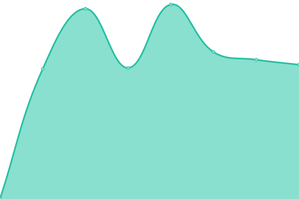 763ms
     
 | 

<a href="https://volfclub.github.io/travellings-upptime/history/279">100.00%</a>
    

|  [280](https://www.flagg.cn) | 🟩 Up | [280.yml](https://github.com/volfclub/travellings-upptime/commits/HEAD/history/280.yml) | 

 1443ms
     
 | 

<a href="https://volfclub.github.io/travellings-upptime/history/280">100.00%</a>
    

|  [281](https://www.aigeek.top) | 🟩 Up | [281.yml](https://github.com/volfclub/travellings-upptime/commits/HEAD/history/281.yml) | 

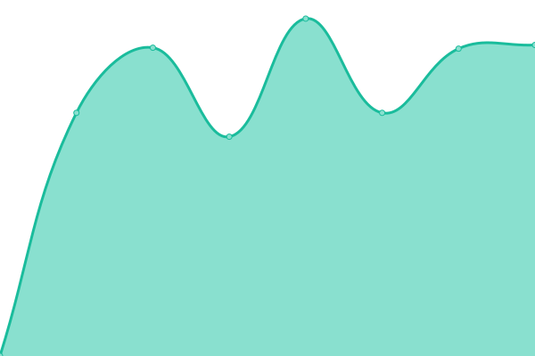 2434ms
     
 | 

<a href="https://volfclub.github.io/travellings-upptime/history/281">100.00%</a>
    

|  [282](https://foolishfox.cn) | 🟥 Down | [282.yml](https://github.com/volfclub/travellings-upptime/commits/HEAD/history/282.yml) | 

 0ms
     
 | 

<a href="https://volfclub.github.io/travellings-upptime/history/282">0.00%</a>
    

|  [283](https://jin-yuhan.github.io) | 🟩 Up | [283.yml](https://github.com/volfclub/travellings-upptime/commits/HEAD/history/283.yml) | 

 120ms
     
 | 

<a href="https://volfclub.github.io/travellings-upptime/history/283">100.00%</a>
    

|  [284](https://goopher.tk) | 🟩 Up | [284.yml](https://github.com/volfclub/travellings-upptime/commits/HEAD/history/284.yml) | 

 684ms
     
 | 

<a href="https://volfclub.github.io/travellings-upptime/history/284">100.00%</a>
    

|  [285](https://www.zouht.com) | 🟩 Up | [285.yml](https://github.com/volfclub/travellings-upptime/commits/HEAD/history/285.yml) | 

 1581ms
     
 | 

<a href="https://volfclub.github.io/travellings-upptime/history/285">100.00%</a>
    

|  [286](https://www.shuiao.top) | 🟩 Up | [286.yml](https://github.com/volfclub/travellings-upptime/commits/HEAD/history/286.yml) | 

 585ms
     
 | 

<a href="https://volfclub.github.io/travellings-upptime/history/286">100.00%</a>
    

|  [287](https://exploro.one) | 🟩 Up | [287.yml](https://github.com/volfclub/travellings-upptime/commits/HEAD/history/287.yml) | 

 128ms
     
 | 

<a href="https://volfclub.github.io/travellings-upptime/history/287">100.00%</a>
    

|  [288](https://syjun.vip) | 🟩 Up | [288.yml](https://github.com/volfclub/travellings-upptime/commits/HEAD/history/288.yml) | 

 2707ms
     
 | 

<a href="https://volfclub.github.io/travellings-upptime/history/288">100.00%</a>
    

|  [289](https://www.rsnocsi.cn) | 🟩 Up | [289.yml](https://github.com/volfclub/travellings-upptime/commits/HEAD/history/289.yml) | 

 2816ms
     
 | 

<a href="https://volfclub.github.io/travellings-upptime/history/289">100.00%</a>
    

|  [290](https://blog.bugcola.com/note) | 🟩 Up | [290.yml](https://github.com/volfclub/travellings-upptime/commits/HEAD/history/290.yml) | 

 2843ms
     
 | 

<a href="https://volfclub.github.io/travellings-upptime/history/290">100.00%</a>
    

|  [291](https://www.debuginn.cn) | 🟩 Up | [291.yml](https://github.com/volfclub/travellings-upptime/commits/HEAD/history/291.yml) | 

 1896ms
     
 | 

<a href="https://volfclub.github.io/travellings-upptime/history/291">100.00%</a>
    

|  [292](https://linzeyin.github.io) | 🟩 Up | [292.yml](https://github.com/volfclub/travellings-upptime/commits/HEAD/history/292.yml) | 

 133ms
     
 | 

<a href="https://volfclub.github.io/travellings-upptime/history/292">100.00%</a>
    

|  [293](https://blog.jerryiweb.com) | 🟩 Up | [293.yml](https://github.com/volfclub/travellings-upptime/commits/HEAD/history/293.yml) | 

 4190ms
     
 | 

<a href="https://volfclub.github.io/travellings-upptime/history/293">100.00%</a>
    

|  [294](https://www.niuwx.cn) | 🟩 Up | [294.yml](https://github.com/volfclub/travellings-upptime/commits/HEAD/history/294.yml) | 

 699ms
     
 | 

<a href="https://volfclub.github.io/travellings-upptime/history/294">100.00%</a>
    

|  [295](https://www.bangkaixin.com) | 🟩 Up | [295.yml](https://github.com/volfclub/travellings-upptime/commits/HEAD/history/295.yml) | 

 3905ms
     
 | 

<a href="https://volfclub.github.io/travellings-upptime/history/295">100.00%</a>
    

|  [296](https://hacbox.me) | 🟩 Up | [296.yml](https://github.com/volfclub/travellings-upptime/commits/HEAD/history/296.yml) | 

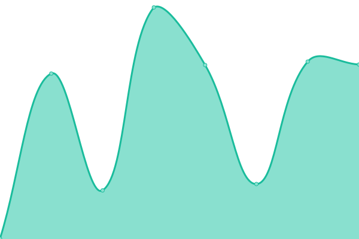 534ms
     
 | 

<a href="https://volfclub.github.io/travellings-upptime/history/296">100.00%</a>
    

|  [297](https://www.limina.top) | 🟩 Up | [297.yml](https://github.com/volfclub/travellings-upptime/commits/HEAD/history/297.yml) | 

 2037ms
     
 | 

<a href="https://volfclub.github.io/travellings-upptime/history/297">100.00%</a>
    

|  [298](https://lxh2006.tk) | 🟩 Up | [298.yml](https://github.com/volfclub/travellings-upptime/commits/HEAD/history/298.yml) | 

 626ms
     
 | 

<a href="https://volfclub.github.io/travellings-upptime/history/298">100.00%</a>
    

|  [299](https://blog.southfox.tk) | 🟩 Up | [299.yml](https://github.com/volfclub/travellings-upptime/commits/HEAD/history/299.yml) | 

 376ms
     
 | 

<a href="https://volfclub.github.io/travellings-upptime/history/299">100.00%</a>
    

|  [300](https://imfurry.com) | 🟩 Up | [300.yml](https://github.com/volfclub/travellings-upptime/commits/HEAD/history/300.yml) | 

 1617ms
     
 | 

<a href="https://volfclub.github.io/travellings-upptime/history/300">100.00%</a>
    

|  [301](https://imcys.com) | 🟩 Up | [301.yml](https://github.com/volfclub/travellings-upptime/commits/HEAD/history/301.yml) | 

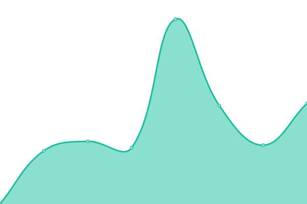 645ms
     
 | 

<a href="https://volfclub.github.io/travellings-upptime/history/301">100.00%</a>
    

|  [302](https://xiwangly.top) | 🟩 Up | [302.yml](https://github.com/volfclub/travellings-upptime/commits/HEAD/history/302.yml) | 

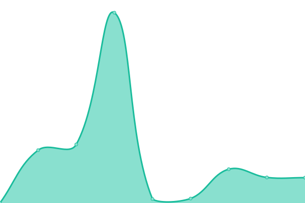 1982ms
     
 | 

<a href="https://volfclub.github.io/travellings-upptime/history/302">100.00%</a>
    

|  [303](https://blog.itsse.cn) | 🟩 Up | [303.yml](https://github.com/volfclub/travellings-upptime/commits/HEAD/history/303.yml) | 

 1748ms
     
 | 

<a href="https://volfclub.github.io/travellings-upptime/history/303">100.00%</a>
    

|  [304](https://blog.gatesx.cn) | 🟩 Up | [304.yml](https://github.com/volfclub/travellings-upptime/commits/HEAD/history/304.yml) | 

 1340ms
     
 | 

<a href="https://volfclub.github.io/travellings-upptime/history/304">100.00%</a>
    

|  [305](https://www.hzq.life) | 🟩 Up | [305.yml](https://github.com/volfclub/travellings-upptime/commits/HEAD/history/305.yml) | 

 450ms
     
 | 

<a href="https://volfclub.github.io/travellings-upptime/history/305">100.00%</a>
    

|  [306](https://cayzlh.com) | 🟩 Up | [306.yml](https://github.com/volfclub/travellings-upptime/commits/HEAD/history/306.yml) | 

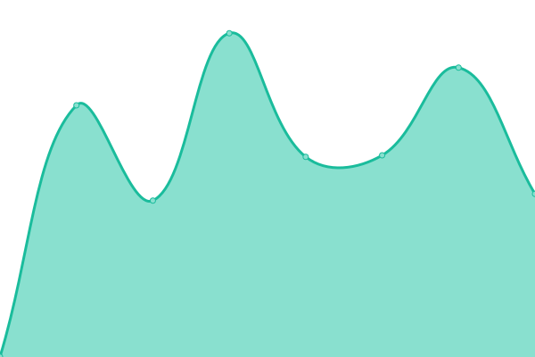 1288ms
     
 | 

<a href="https://volfclub.github.io/travellings-upptime/history/306">100.00%</a>
    

|  [307](https://blog.garryde.com) | 🟩 Up | [307.yml](https://github.com/volfclub/travellings-upptime/commits/HEAD/history/307.yml) | 

 3195ms
     
 | 

<a href="https://volfclub.github.io/travellings-upptime/history/307">100.00%</a>
    

|  [308](https://blog.thiefship.com) | 🟩 Up | [308.yml](https://github.com/volfclub/travellings-upptime/commits/HEAD/history/308.yml) | 

 1136ms
     
 | 

<a href="https://volfclub.github.io/travellings-upptime/history/308">100.00%</a>
    

|  [309](https://eritque-arcus.tech) | 🟩 Up | [309.yml](https://github.com/volfclub/travellings-upptime/commits/HEAD/history/309.yml) | 

 428ms
     
 | 

<a href="https://volfclub.github.io/travellings-upptime/history/309">100.00%</a>
    

|  [310](https://www.kirito41dd.cn) | 🟩 Up | [310.yml](https://github.com/volfclub/travellings-upptime/commits/HEAD/history/310.yml) | 

 670ms
     
 | 

<a href="https://volfclub.github.io/travellings-upptime/history/310">100.00%</a>
    

|  [311](https://blog.imzy.ink) | 🟩 Up | [311.yml](https://github.com/volfclub/travellings-upptime/commits/HEAD/history/311.yml) | 

 5246ms
     
 | 

<a href="https://volfclub.github.io/travellings-upptime/history/311">100.00%</a>
    

|  [312](https://www.jianziruw.com) | 🟩 Up | [312.yml](https://github.com/volfclub/travellings-upptime/commits/HEAD/history/312.yml) | 

 1942ms
     
 | 

<a href="https://volfclub.github.io/travellings-upptime/history/312">100.00%</a>
    

|  [313](https://www.moeor.com) | 🟥 Down | [313.yml](https://github.com/volfclub/travellings-upptime/commits/HEAD/history/313.yml) | 

 0ms
     
 | 

<a href="https://volfclub.github.io/travellings-upptime/history/313">0.09%</a>
    

|  [314](https://sangxuesheng.com) | 🟩 Up | [314.yml](https://github.com/volfclub/travellings-upptime/commits/HEAD/history/314.yml) | 

 3828ms
     
 | 

<a href="https://volfclub.github.io/travellings-upptime/history/314">100.00%</a>
    

|  [315](https://www.nfxwblog.com) | 🟩 Up | [315.yml](https://github.com/volfclub/travellings-upptime/commits/HEAD/history/315.yml) | 

 2405ms
     
 | 

<a href="https://volfclub.github.io/travellings-upptime/history/315">69.93%</a>
    

|  [316](https://muspace.top) | 🟩 Up | [316.yml](https://github.com/volfclub/travellings-upptime/commits/HEAD/history/316.yml) | 

 1353ms
     
 | 

<a href="https://volfclub.github.io/travellings-upptime/history/316">100.00%</a>
    

|  [317](https://wangdabao.js.cool) | 🟩 Up | [317.yml](https://github.com/volfclub/travellings-upptime/commits/HEAD/history/317.yml) | 

 327ms
     
 | 

<a href="https://volfclub.github.io/travellings-upptime/history/317">100.00%</a>
    

|  [318](https://xeblog.cn) | 🟩 Up | [318.yml](https://github.com/volfclub/travellings-upptime/commits/HEAD/history/318.yml) | 

 1922ms
     
 | 

<a href="https://volfclub.github.io/travellings-upptime/history/318">100.00%</a>
    

|  [319](https://blog.error.work) | 🟩 Up | [319.yml](https://github.com/volfclub/travellings-upptime/commits/HEAD/history/319.yml) | 

 2811ms
     
 | 

<a href="https://volfclub.github.io/travellings-upptime/history/319">100.00%</a>
    

|  [320](https://uyoahz.cn) | 🟩 Up | [320.yml](https://github.com/volfclub/travellings-upptime/commits/HEAD/history/320.yml) | 

 615ms
     
 | 

<a href="https://volfclub.github.io/travellings-upptime/history/320">100.00%</a>
    

|  [321](https://iamazing.cn) | 🟩 Up | [321.yml](https://github.com/volfclub/travellings-upptime/commits/HEAD/history/321.yml) | 

 1438ms
     
 | 

<a href="https://volfclub.github.io/travellings-upptime/history/321">100.00%</a>
    

|  [322](https://zisu.dev) | 🟩 Up | [322.yml](https://github.com/volfclub/travellings-upptime/commits/HEAD/history/322.yml) | 

 2286ms
     
 | 

<a href="https://volfclub.github.io/travellings-upptime/history/322">100.00%</a>
    

|  [323](https://blog.revincx.icu) | 🟩 Up | [323.yml](https://github.com/volfclub/travellings-upptime/commits/HEAD/history/323.yml) | 

 551ms
     
 | 

<a href="https://volfclub.github.io/travellings-upptime/history/323">100.00%</a>
    

|  [324](https://blog.badapple.pro) | 🟩 Up | [324.yml](https://github.com/volfclub/travellings-upptime/commits/HEAD/history/324.yml) | 

 3818ms
     
 | 

<a href="https://volfclub.github.io/travellings-upptime/history/324">100.00%</a>
    

|  [325](https://www.xuanzhi33.cn) | 🟩 Up | [325.yml](https://github.com/volfclub/travellings-upptime/commits/HEAD/history/325.yml) | 

 1035ms
     
 | 

<a href="https://volfclub.github.io/travellings-upptime/history/325">100.00%</a>
    

|  [326](https://xzy.one) | 🟩 Up | [326.yml](https://github.com/volfclub/travellings-upptime/commits/HEAD/history/326.yml) | 

 1390ms
     
 | 

<a href="https://volfclub.github.io/travellings-upptime/history/326">100.00%</a>
    

|  [327](https://www.ariels.xyz) | 🟩 Up | [327.yml](https://github.com/volfclub/travellings-upptime/commits/HEAD/history/327.yml) | 

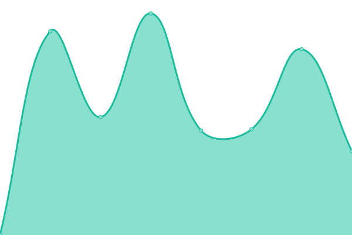 2243ms
     
 | 

<a href="https://volfclub.github.io/travellings-upptime/history/327">100.00%</a>
    

|  [328](https://www.amazingk.cn) | 🟩 Up | [328.yml](https://github.com/volfclub/travellings-upptime/commits/HEAD/history/328.yml) | 

 1454ms
     
 | 

<a href="https://volfclub.github.io/travellings-upptime/history/328">100.00%</a>
    

|  [329](https://asuko.icu) | 🟥 Down | [329.yml](https://github.com/volfclub/travellings-upptime/commits/HEAD/history/329.yml) | 

 0ms
     
 | 

<a href="https://volfclub.github.io/travellings-upptime/history/329">0.00%</a>
    

|  [330](https://www.godapex.com) | 🟩 Up | [330.yml](https://github.com/volfclub/travellings-upptime/commits/HEAD/history/330.yml) | 

 1098ms
     
 | 

<a href="https://volfclub.github.io/travellings-upptime/history/330">100.00%</a>
    

|  [331](https://blog.gztime.cc) | 🟩 Up | [331.yml](https://github.com/volfclub/travellings-upptime/commits/HEAD/history/331.yml) | 

 2156ms
     
 | 

<a href="https://volfclub.github.io/travellings-upptime/history/331">100.00%</a>
    

|  [332](https://tir.cool) | 🟩 Up | [332.yml](https://github.com/volfclub/travellings-upptime/commits/HEAD/history/332.yml) | 

 237ms
     
 | 

<a href="https://volfclub.github.io/travellings-upptime/history/332">100.00%</a>
    

|  [333](https://sakurasep.club) | 🟩 Up | [333.yml](https://github.com/volfclub/travellings-upptime/commits/HEAD/history/333.yml) | 

 5755ms
     
 | 

<a href="https://volfclub.github.io/travellings-upptime/history/333">100.00%</a>
    

|  [334](https://ihkk.net) | 🟩 Up | [334.yml](https://github.com/volfclub/travellings-upptime/commits/HEAD/history/334.yml) | 

 3849ms
     
 | 

<a href="https://volfclub.github.io/travellings-upptime/history/334">100.00%</a>
    

|  [336](https://bbing.com.cn) | 🟩 Up | [336.yml](https://github.com/volfclub/travellings-upptime/commits/HEAD/history/336.yml) | 

 589ms
     
 | 

<a href="https://volfclub.github.io/travellings-upptime/history/336">100.00%</a>
    

|  [337](https://lewky.cn) | 🟩 Up | [337.yml](https://github.com/volfclub/travellings-upptime/commits/HEAD/history/337.yml) | 

 655ms
     
 | 

<a href="https://volfclub.github.io/travellings-upptime/history/337">100.00%</a>
    

|  [338](https://cusalt.com) | 🟥 Down | [338.yml](https://github.com/volfclub/travellings-upptime/commits/HEAD/history/338.yml) | 

 0ms
     
 | 

<a href="https://volfclub.github.io/travellings-upptime/history/338">0.00%</a>
    

|  [339](https://www.wenchong.space) | 🟩 Up | [339.yml](https://github.com/volfclub/travellings-upptime/commits/HEAD/history/339.yml) | 

 1396ms
     
 | 

<a href="https://volfclub.github.io/travellings-upptime/history/339">100.00%</a>
    

|  [340](https://www.cxl2020mc.top) | 🟩 Up | [340.yml](https://github.com/volfclub/travellings-upptime/commits/HEAD/history/340.yml) | 

 1988ms
     
 | 

<a href="https://volfclub.github.io/travellings-upptime/history/340">100.00%</a>
    

|  [341](https://www.kawashiros.club) | 🟩 Up | [341.yml](https://github.com/volfclub/travellings-upptime/commits/HEAD/history/341.yml) | 

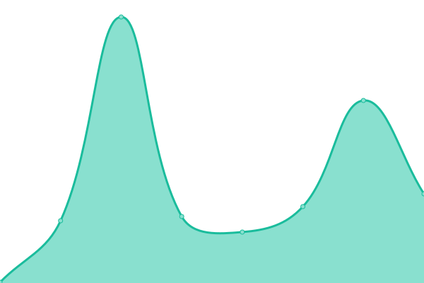 127ms
     
 | 

<a href="https://volfclub.github.io/travellings-upptime/history/341">100.00%</a>
    

|  [342](https://blog.laugh12321.cn) | 🟩 Up | [342.yml](https://github.com/volfclub/travellings-upptime/commits/HEAD/history/342.yml) | 

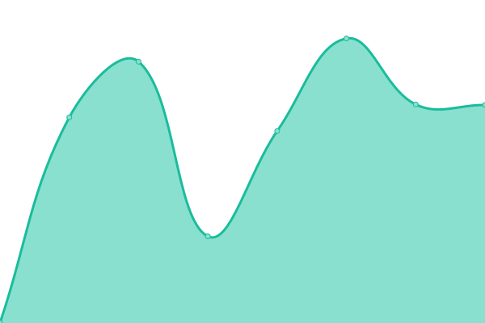 654ms
     
 | 

<a href="https://volfclub.github.io/travellings-upptime/history/342">100.00%</a>
    

|  [343](https://xiaolii.com) | 🟩 Up | [343.yml](https://github.com/volfclub/travellings-upptime/commits/HEAD/history/343.yml) | 

 2639ms
     
 | 

<a href="https://volfclub.github.io/travellings-upptime/history/343">100.00%</a>
    

|  [344](https://www.996workers.icu) | 🟩 Up | [344.yml](https://github.com/volfclub/travellings-upptime/commits/HEAD/history/344.yml) | 

 1190ms
     
 | 

<a href="https://volfclub.github.io/travellings-upptime/history/344">100.00%</a>
    

|  [345](https://blog.moyok.xyz) | 🟩 Up | [345.yml](https://github.com/volfclub/travellings-upptime/commits/HEAD/history/345.yml) | 

 1647ms
     
 | 

<a href="https://volfclub.github.io/travellings-upptime/history/345">100.00%</a>
    

|  [346](https://www.hicool.icu) | 🟩 Up | [346.yml](https://github.com/volfclub/travellings-upptime/commits/HEAD/history/346.yml) | 

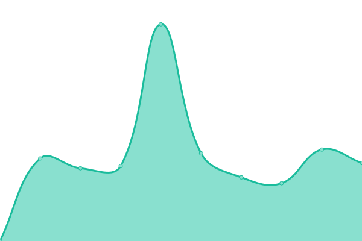 5760ms
     
 | 

<a href="https://volfclub.github.io/travellings-upptime/history/346">100.00%</a>
    

|  [347](https://blog.adworld.top) | 🟩 Up | [347.yml](https://github.com/volfclub/travellings-upptime/commits/HEAD/history/347.yml) | 

 2869ms
     
 | 

<a href="https://volfclub.github.io/travellings-upptime/history/347">100.00%</a>
    

|  [348](https://blog.libw.cc) | 🟩 Up | [348.yml](https://github.com/volfclub/travellings-upptime/commits/HEAD/history/348.yml) | 

 3505ms
     
 | 

<a href="https://volfclub.github.io/travellings-upptime/history/348">100.00%</a>
    

|  [349](https://blog.icecliffs.cn) | 🟩 Up | [349.yml](https://github.com/volfclub/travellings-upptime/commits/HEAD/history/349.yml) | 

 5034ms
     
 | 

<a href="https://volfclub.github.io/travellings-upptime/history/349">100.00%</a>
    

|  [350](https://here.sy) | 🟩 Up | [350.yml](https://github.com/volfclub/travellings-upptime/commits/HEAD/history/350.yml) | 

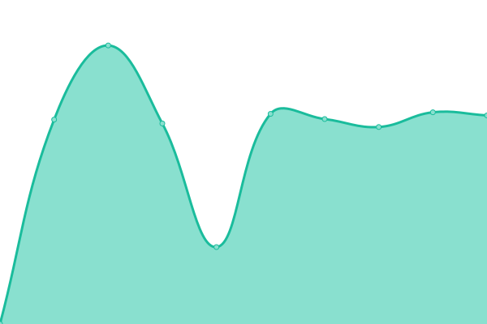 2137ms
     
 | 

<a href="https://volfclub.github.io/travellings-upptime/history/350">100.00%</a>
    

|  [351](https://shuxhan.com) | 🟩 Up | [351.yml](https://github.com/volfclub/travellings-upptime/commits/HEAD/history/351.yml) | 

 1374ms
     
 | 

<a href="https://volfclub.github.io/travellings-upptime/history/351">100.00%</a>
    

|  [352](https://jokerdig.com) | 🟩 Up | [352.yml](https://github.com/volfclub/travellings-upptime/commits/HEAD/history/352.yml) | 

 172ms
     
 | 

<a href="https://volfclub.github.io/travellings-upptime/history/352">100.00%</a>
    

|  [353](https://www.morcat.cn) | 🟩 Up | [353.yml](https://github.com/volfclub/travellings-upptime/commits/HEAD/history/353.yml) | 

 1650ms
     
 | 

<a href="https://volfclub.github.io/travellings-upptime/history/353">100.00%</a>
    

|  [354](https://ldo.one) | 🟩 Up | [354.yml](https://github.com/volfclub/travellings-upptime/commits/HEAD/history/354.yml) | 

 339ms
     
 | 

<a href="https://volfclub.github.io/travellings-upptime/history/354">100.00%</a>
    

|  [355](https://katcloud.cn) | 🟩 Up | [355.yml](https://github.com/volfclub/travellings-upptime/commits/HEAD/history/355.yml) | 

 1817ms
     
 | 

<a href="https://volfclub.github.io/travellings-upptime/history/355">100.00%</a>
    

|  [356](https://wangquanguo.life) | 🟩 Up | [356.yml](https://github.com/volfclub/travellings-upptime/commits/HEAD/history/356.yml) | 

 2290ms
     
 | 

<a href="https://volfclub.github.io/travellings-upptime/history/356">100.00%</a>
    

|  [357](https://blog.lovem.fun) | 🟩 Up | [357.yml](https://github.com/volfclub/travellings-upptime/commits/HEAD/history/357.yml) | 

 2013ms
     
 | 

<a href="https://volfclub.github.io/travellings-upptime/history/357">100.00%</a>
    

|  [358](https://imxxz.cn) | 🟩 Up | [358.yml](https://github.com/volfclub/travellings-upptime/commits/HEAD/history/358.yml) | 

 1409ms
     
 | 

<a href="https://volfclub.github.io/travellings-upptime/history/358">100.00%</a>
    

|  [359](https://blog.y7n05h.xyz) | 🟩 Up | [359.yml](https://github.com/volfclub/travellings-upptime/commits/HEAD/history/359.yml) | 

 201ms
     
 | 

<a href="https://volfclub.github.io/travellings-upptime/history/359">100.00%</a>
    

|  [360](https://www.chenmx.net) | 🟩 Up | [360.yml](https://github.com/volfclub/travellings-upptime/commits/HEAD/history/360.yml) | 

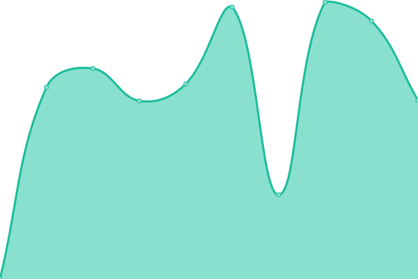 3054ms
     
 | 

<a href="https://volfclub.github.io/travellings-upptime/history/360">100.00%</a>
    

|  [361](https://www.rz.sb) | 🟩 Up | [361.yml](https://github.com/volfclub/travellings-upptime/commits/HEAD/history/361.yml) | 

 1993ms
     
 | 

<a href="https://volfclub.github.io/travellings-upptime/history/361">100.00%</a>
    

|  [362](https://chuxjian.asia) | 🟩 Up | [362.yml](https://github.com/volfclub/travellings-upptime/commits/HEAD/history/362.yml) | 

 1259ms
     
 | 

<a href="https://volfclub.github.io/travellings-upptime/history/362">100.00%</a>
    

|  [363](https://www.cbxg.icu) | 🟩 Up | [363.yml](https://github.com/volfclub/travellings-upptime/commits/HEAD/history/363.yml) | 

 2352ms
     
 | 

<a href="https://volfclub.github.io/travellings-upptime/history/363">100.00%</a>
    

|  [364](https://wiki.eryajf.net) | 🟩 Up | [364.yml](https://github.com/volfclub/travellings-upptime/commits/HEAD/history/364.yml) | 

 4372ms
     
 | 

<a href="https://volfclub.github.io/travellings-upptime/history/364">100.00%</a>
    

|  [365](https://back2me.cn) | 🟩 Up | [365.yml](https://github.com/volfclub/travellings-upptime/commits/HEAD/history/365.yml) | 

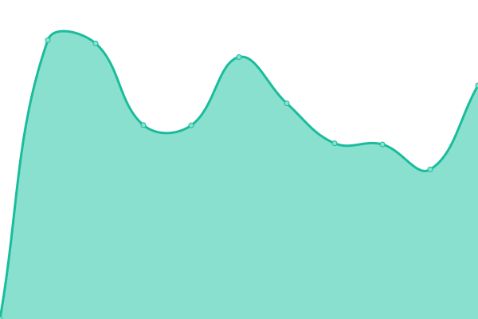 5132ms
     
 | 

<a href="https://volfclub.github.io/travellings-upptime/history/365">100.00%</a>
    

|  [366](https://totoro.site) | 🟩 Up | [366.yml](https://github.com/volfclub/travellings-upptime/commits/HEAD/history/366.yml) | 

 2016ms
     
 | 

<a href="https://volfclub.github.io/travellings-upptime/history/366">100.00%</a>
    

|  [367](https://blog.thun888.xyz) | 🟩 Up | [367.yml](https://github.com/volfclub/travellings-upptime/commits/HEAD/history/367.yml) | 

 1191ms
     
 | 

<a href="https://volfclub.github.io/travellings-upptime/history/367">100.00%</a>
    

|  [368](https://blog.skihome.xyz) | 🟩 Up | [368.yml](https://github.com/volfclub/travellings-upptime/commits/HEAD/history/368.yml) | 

 536ms
     
 | 

<a href="https://volfclub.github.io/travellings-upptime/history/368">100.00%</a>
    

|  [369](https://cairbin.top) | 🟩 Up | [369.yml](https://github.com/volfclub/travellings-upptime/commits/HEAD/history/369.yml) | 

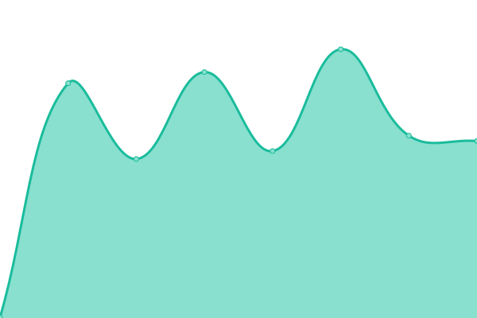 1218ms
     
 | 

<a href="https://volfclub.github.io/travellings-upptime/history/369">100.00%</a>
    

|  [370](https://blog.lxscloud.top) | 🟩 Up | [370.yml](https://github.com/volfclub/travellings-upptime/commits/HEAD/history/370.yml) | 

 1597ms
     
 | 

<a href="https://volfclub.github.io/travellings-upptime/history/370">100.00%</a>
    

|  [371](https://zhaobanxian.top) | 🟩 Up | [371.yml](https://github.com/volfclub/travellings-upptime/commits/HEAD/history/371.yml) | 

 2165ms
     
 | 

<a href="https://volfclub.github.io/travellings-upptime/history/371">100.00%</a>
    

|  [372](https://lemonx.cn) | 🟥 Down | [372.yml](https://github.com/volfclub/travellings-upptime/commits/HEAD/history/372.yml) | 

 0ms
     
 | 

<a href="https://volfclub.github.io/travellings-upptime/history/372">0.01%</a>
    

|  [373](https://cry33.com) | 🟩 Up | [373.yml](https://github.com/volfclub/travellings-upptime/commits/HEAD/history/373.yml) | 

 2012ms
     
 | 

<a href="https://volfclub.github.io/travellings-upptime/history/373">100.00%</a>
    

|  [374](https://rssblog.cn) | 🟩 Up | [374.yml](https://github.com/volfclub/travellings-upptime/commits/HEAD/history/374.yml) | 

 670ms
     
 | 

<a href="https://volfclub.github.io/travellings-upptime/history/374">100.00%</a>
    

<!--end: status pages-->

[**Visit our status website →**](https://volfclub.github.io/travellings-upptime)

## 📄 License

- Powered by: [Upptime](https://github.com/upptime/upptime)
- Code: [MIT](./LICENSE) © [逊狼](volf.club)
- Data in the `./history` directory: [Open Database License](https://opendatacommons.org/licenses/odbl/1-0/)
